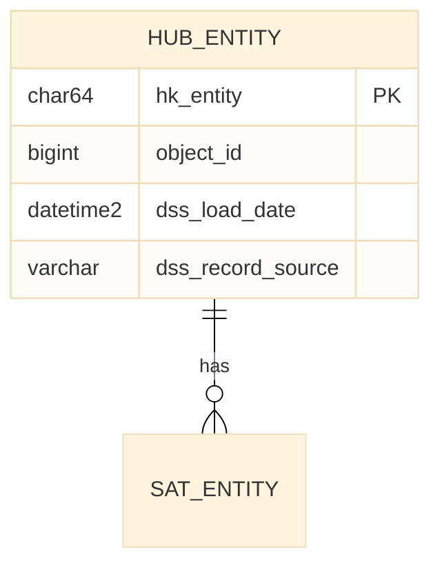

# Copilot Instructions - Data Vault 2.1 dbt Project

## Project Overview
Multi-tenant Data Vault 2.1 on Azure SQL using dbt Core with `automate_dv` package. Single codebase deploys to isolated tenant databases via dbt targets.

## Architecture Flow
```
PostgreSQL → Synapse Pipeline → ADLS Parquet → External Table (stg.ext_*) → Staging View (stg.stg_*) → Hub/Sat/Link
```

## Schema Naming Convention

| Layer | Folder | Schema | Usage |
|-------|--------|--------|-------|
| Staging | `staging/` | `stg` | All sources |
| Raw Vault (common) | `raw_vault/_common/` | `vault` | Cross-source objects |
| Raw Vault (source) | `raw_vault/<concept>/` | `vault_<concept>` | Source-specific objects |
| Business Vault | `business_vault/` | `vault` | PITs, Bridges |
| Mart (common) | `mart/_common/` | `mart` | Shared dimensions |
| Mart (domain) | `mart/<concept>/` | `mart_<concept>` | Domain-specific views |

**Pattern:** `_common` → base schema, `<concept>` → `<base>_<concept>`

## Critical Constraints (Azure SQL Basic Tier)
- **Always set** `as_columnstore: false` in incremental models
- **Never hardcode** database names - use `{{ target.database }}` in sources.yml
- **Authentication:** Azure CLI only (`authentication: cli`) - no passwords in profiles

## dbt Commands
```bash
source .venv/bin/activate
dbt run                              # Dev (Vault DB)
dbt run --target werkportal          # Prod tenant
dbt run-operation stage_external_sources  # Create/update external tables
```

## Naming Conventions
| Object | Pattern | Example |
|--------|---------|---------|
| External Table | `stg.ext_<concept>_<entity>` | `stg.ext_werkportal_company` |
| Staging View | `stg.<concept>_<entity>` | `stg.werkportal_company` |
| Hub | `vault_<concept>.hub_<entity>` | `vault_werkportal.hub_company` |
| Satellite | `vault_<concept>.sat_<entity>` | `vault_werkportal.sat_company` |
| Link | `vault_<concept>.link_<e1>_<e2>` | `vault_werkportal.link_company_country` |
| Common Hub | `vault.hub_<entity>` | `vault.hub_company` (merged) |
| Hash Key | `hk_<entity>` | `hk_company` |
| Hash Diff | `hd_<entity>` | `hd_company` |
| Metadata | `dss_*` prefix | `dss_load_date`, `dss_record_source` |

## Hash Calculation (SQL Server Native)
Do NOT use automate_dv hash macros - they're incompatible with SQL Server. Use:
```sql
CONVERT(CHAR(64), HASHBYTES('SHA2_256', ISNULL(CAST(column AS NVARCHAR(MAX)), '')), 2)
```
See [werkportal_company.sql](models/staging/werkportal_company.sql) for the pattern.

## Adding a New Source System (Concept)
1. **Create folder:** `models/raw_vault/<concept>/hubs/`, `satellites/`, `links/`
2. **Add config to dbt_project.yml:**
   ```yaml
   raw_vault:
     <concept>:
       +schema: vault_<concept>
       +materialized: incremental
       +incremental_strategy: append
       +as_columnstore: false
   ```
3. **Create staging:** Add external table to `sources.yml`, create `<concept>_<entity>.sql`
4. **Create vault objects:** Hub, Satellite, Link in the new folder
5. **Deploy:** `dbt run-operation stage_external_sources && dbt run --select raw_vault.<concept>`

## Adding a New Entity (to existing concept)
1. **External Table:** Add to [sources.yml](models/staging/sources.yml) with full column definitions
2. **Staging View:** Create `models/staging/<concept>_<entity>.sql` with hash calculations
3. **Hub:** Create `models/raw_vault/<concept>/hubs/hub_<entity>.sql`
4. **Satellite:** Create `models/raw_vault/<concept>/satellites/sat_<entity>.sql`
5. **Deploy:** `dbt run-operation stage_external_sources && dbt run --select <concept>_<entity> hub_<entity> sat_<entity>`

## Project Structure
```
models/
├── staging/                    → stg
├── raw_vault/
│   ├── _common/                → vault (cross-source)
│   │   ├── hubs/
│   │   ├── satellites/
│   │   └── links/
│   ├── werkportal/             → vault_werkportal
│   │   ├── hubs/
│   │   ├── satellites/
│   │   └── links/
│   └── adventureworks/         → vault_adventureworks
├── business_vault/             → vault
└── mart/
    ├── _common/                → mart (shared dims)
    └── project/                → mart_project
```

## Key Files
- [dbt_project.yml](dbt_project.yml) - Model configs, schema assignments
- [models/staging/sources.yml](models/staging/sources.yml) - External table definitions (dbt-external-tables)
- [macros/generate_schema_name.sql](macros/generate_schema_name.sql) - Strips default schema prefix
- [docs/DEVELOPER.md](docs/DEVELOPER.md) - Full developer guide
- [docs/MODEL_ARCHITECTURE.md](docs/MODEL_ARCHITECTURE.md) - Data model documentation

## Multi-Tenant Targets
| Target | Database | Usage |
|--------|----------|-------|
| `dev` | Vault | Shared development |
| `werkportal` | Vault_Werkportal | Production |
| `ewb` | Vault_EWB | Production (planned) |

## Common Pitfalls
- Schema creates as `dv_stg` instead of `stg` → Check `generate_schema_name` macro
- External table errors → Run `dbt run-operation stage_external_sources` first
- Cross-database error → Replace hardcoded DB with `{{ target.database }}`
- Object in wrong schema → Check folder structure matches dbt_project.yml config

## Mermaid ER-Diagramme

**⚠️ Nach jeder Model-Änderung müssen die ER-Diagramme aktualisiert werden!**

| Modell-Ordner | Diagramm |
|---------------|----------|
| `models/raw_vault/werkportal/` | `design/raw-vault/werkportal/er-diagram.mmd` |
| `models/raw_vault/adventureworks/` | `design/raw-vault/adventureworks/er-diagram.mmd` |
| `models/raw_vault/_common/` | `design/raw-vault/_common/er-diagram.mmd` |

### Format


### Regeln
- **Theme:** `base` (neutral, keine bunten Farben)
- **Dateiendung:** `.mmd`
- **Attribute:** `type name [PK|FK]` (keine Kommentare nach PK/FK)
- **Relationships:** Einfache Labels ohne Anführungszeichen

## Testing & Development Tools

### Database Access
- **Verwende `mssql_connect`** für Datenbankzugriff (nicht pyodbc oder Azure CLI)
- Server: `sql-datavault-weu-001.database.windows.net`
- Database: `Vault`
- Nach Connect: `mssql_run_query` für SQL-Abfragen

### UI Testing
- **Verwende Playwright MCP Tools** für Browser-Tests:
  - `mcp_playwright_browser_navigate` - Seite öffnen
  - `mcp_playwright_browser_snapshot` - Aktuelle Seite analysieren
  - `mcp_playwright_browser_click` - Element klicken
  - `mcp_playwright_browser_type` - Text eingeben
  - `mcp_playwright_browser_fill_form` - Formulare ausfüllen
- Dev Login: `admin@example.com` / `dev`
- App URL: `http://localhost:3000`

### MDS Bootstrap Testing
1. Drop alle MDS-Objekte (mssql_run_query)
2. `dbt run-operation bootstrap_mds --target local`
3. Verifiziere Tabellen (mssql_run_query)
4. Teste UI mit Playwright
