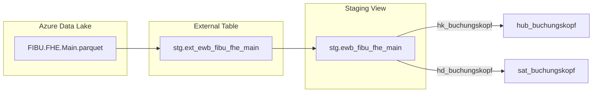
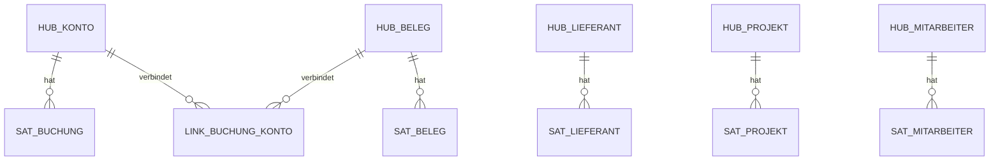

# Design-Dokumentation Skill

## Wann verwenden?
Trigger-Phrasen:
- "Design aktualisieren", "Update design docs"
- "Architektur-Diagramm", "ER-Diagramm"
- "Vault visualisieren", "Vault model diagram"
- "Staging Datenfluss"
- "Mermaid aktualisieren"

## Ordnerstruktur
```
design/
├── staging/
│   ├── _template.md              ← Staging Template
│   ├── adventureworks/            ← Referenzbeispiele
│   └── ewb/                      ← EWB Staging-Doku (hier erstellen!)
│       ├── ewb_fibu_fhe_main.md
│       └── ewb_kred_kbl_main.md
├── raw-vault/
│   ├── _template_hub.md          ← Hub Template
│   ├── _template_link.md         ← Link Template
│   ├── adventureworks/            ← Referenzbeispiele
│   │   └── 01_analyse.md         ← Analyse-Vorlage (5 Schritte)
│   └── ewb/                      ← EWB Vault-Doku (hier erstellen!)
│       ├── 01_analyse.md
│       └── vault-model.mmd
└── data-flow/
    └── end_to_end.md             ← Gesamtarchitektur
```

## Templates

### Staging Design (nach `design/staging/_template.md`)
Lies das Template: `design/staging/_template.md`
Erstelle pro EWB Staging-Entity ein Dokument mit:
- Quellsystem + Parquet-Pfad
- Business Key + Hash Key Definitionen
- Mermaid Flowchart (Datenfluss)
- Spalten-Tabelle (Name, Typ, Kategorie)



### Hub Design (nach `design/raw-vault/_template_hub.md`)
Lies das Template: `design/raw-vault/_template_hub.md`
Erstelle pro Hub ein Dokument mit:
- Business Key Herkunft
- Mermaid ER-Diagramm (Hub-Sat Beziehung)
- Spalten-Definition
- Abhängigkeiten

```mermaid
erDiagram
    HUB_FIBU_FHE {
        CHAR64 hk_buchungskopf PK
        INT RECNUM BK
        DATETIME2 dss_load_date
        VARCHAR50 dss_record_source
    }
    SAT_FIBU_FHE {
        CHAR64 hk_buchungskopf FK
        CHAR64 hashdiff
        INT JOURNR
        VARCHAR50 TEXT
        DATETIME2 dss_load_date
        CHAR1 dss_is_current
    }
    HUB_FIBU_FHE ||--o{ SAT_FIBU_FHE : "hat"
```

### Vault-Gesamtmodell (vault-model.mmd)
Pflege ein Gesamt-ER-Diagramm aller EWB Vault-Objekte:


### Analyse-Dokument (nach `design/raw-vault/adventureworks/01_analyse.md`)
Erstelle `design/raw-vault/ewb/01_analyse.md` mit den 5 Analyse-Schritten:
1. **Quellsystem-Analyse:** Abacus Module, Parquet-Inventar
2. **Business Key Identifikation:** RECNUM, KNR, NPR etc. pro Modul
3. **Beziehungs-Analyse:** Welche Tabellen referenzieren einander?
4. **Satellite-Schnitt:** Nach Änderungsfrequenz gruppieren
5. **Vault-Modell:** Gesamt-ER-Diagramm

## Mermaid-Konventionen
- Theme: `base`
- ER-Diagramme für Vault-Beziehungen
- Flowcharts für Datenflüsse (LR Ausrichtung)
- Dateien: `.mmd` für standalone, eingebettet in `.md` für Dokumentation
- EWB-Prefix: Alle Objekte mit `ewb_` oder `EWB_` kennzeichnen
