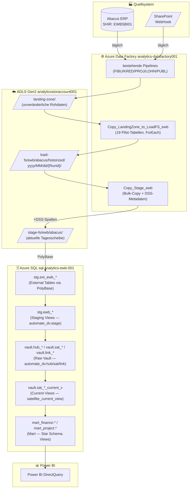
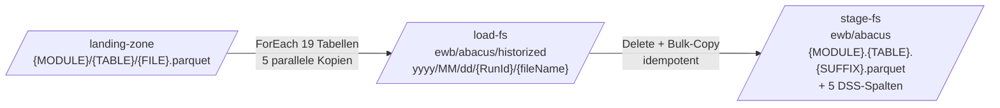
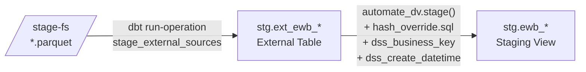
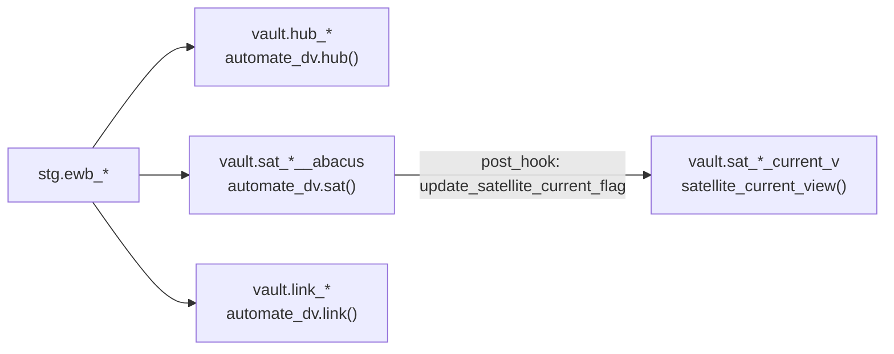
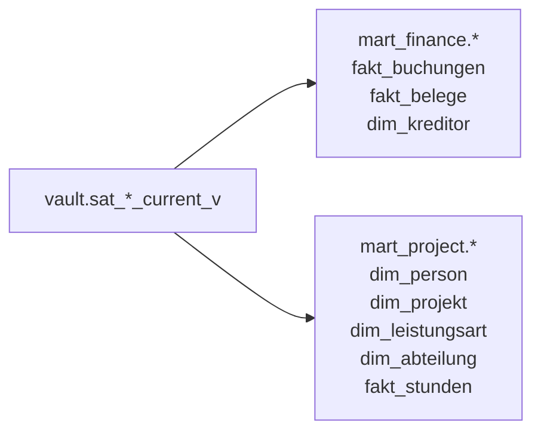

# End-to-End Datenfluss — EWB Analytics Platform

**Stand:** 31. März 2026 | **Architektur:** Data Vault 2.1 auf Azure SQL

---

## Gesamtarchitektur

---

## Schicht-Details

### 1. Quellsysteme → ADLS landing-zone

| Pipeline | Quell-Module | Ziel-Pfad | Frequenz |
|---|---|---|---|
| `FIBU_GL_daily` | FIBU/GL (E22–E26) | `landing-zone/FIBU/GL/` | Täglich |
| `FIBU_daily` | FIBU/FHE | `landing-zone/FIBU/FHE/` | Täglich |
| `KRED` | KRED (KBL, KVL, KBS u.a.) | `landing-zone/KRED/` | Täglich |
| `PROJ` | PROJ (NPO, NTC, NSA, NTR, PST, PRT) | `landing-zone/PROJ/` | Täglich |
| `LOHN` | LOHN (LEN, LTC) | `landing-zone/LOHN/` | Täglich |
| `PUBL` | PUBL (ADR) | `landing-zone/PUBL/` | Täglich |
| `Manual Data Sharepoint_daily` | SharePoint (8 JSON-Dateien) | `landing-zone/Sharepoint/` | Täglich (WebHook) |

### 2. landing-zone → stage-fs (zwei neue ADF-Pipelines)

**Pipeline 1: `Copy_LandingZone_to_LoadFS_ewb`**
- Historisierter Pfad: `load-fs/ewb/abacus/historized/{Datum}/{RunId}/`
- 19 Pilot-Tabellen, 5 parallele Kopien

**Pipeline 2: `Copy_Stage_ewb`**
- Löscht staging-Ordner, kopiert vollständigen Run-Snapshot
- Fügt automatisch 5 DSS-Metadatenspalten hinzu:

| DSS-Spalte | Inhalt |
|---|---|
| `dss_record_source` | `ewb/abacus` |
| `dss_load_date` | Ladedatum (`yyyy-MM-dd`) |
| `dss_run_id` | Eindeutige ADF Run-ID |
| `dss_stage_timestamp` | UTC-Zeitstempel der Stage-Ausführung |
| `dss_source_file_name` | Ursprünglicher Dateiname in `load-fs` |

### 3. stage-fs → Staging Views (dbt + automate_dv)

**Hash-Konfiguration:**
- Algorithm: `SHA2_256` → `CHAR(64)` (hex-encoded via `sqlserver__cast_binary` Override)
- String-Typ: `NVARCHAR` (Unicode-safe via `sqlserver__type_string` Override)
- Null-Placeholder: `'-1'` | Concat-Separator: `'||'` | Casing: `DISABLED`

### 4. Staging → Raw Vault (automate_dv Macros)

Alle Vault-Objekte: `materialized='incremental'`, `incremental_strategy='append'`, `as_columnstore=false`

### 5. Raw Vault → Mart (Star Schema)

---

## dbt-Targets

| Target | Datenbank | Verwendung |
|---|---|---|
| `ewb-dev` | `datavault-dev` | Entwicklung (aktiv) |
| `ewb-test` | `datavault-test` | Tests / CI |
| `ewb` | `datavault` | Produktion |

Server: `sql-analytics-ewb-001.database.windows.net`

---

## Orchestrierung (Soll-Zustand)

| Schritt | Status | Detail |
|---|---|---|
| ADF-Pipelines täglich | ✅ Aktiv | Rohdaten → stage-fs |
| dbt run (manuell) | ✅ Möglich | `dbt run --target ewb-dev` |
| GitHub Actions Workflow | 🔄 Geplant | ADF Web Activity → `repository_dispatch` |
| ADF Tages-Trigger | 🔄 Geplant | Parameter `cw_load_date` + `cw_runId` |

---

## Kritische Pfade & bekannte Issues

| Thema | Detail |
|---|---|
| FIBU.GL Folder-Scan | E22–E26 als 5 Jahresscheiben in einem Folder. ADF-Bug (Hierarchie verloren) gefixt am 31.3.2026 (commit `9a46c031`): PreserveHierarchy + leerer fileName |
| RECNUM-Duplikate | RECNUM in FIBU.GL ist unique pro Jahresscheibe, nicht über alle 5. ~67k Duplikate in datavault-dev (known issue) |
| Auto-Pause | Azure SQL Serverless pausiert nach 60 min Inaktivität. Erste Abfrage nach Pause: ~30s Warmup |
| Synapse-Bugs | (1) `Projekt.Stunden`: `PROJNR=LOHNNR` Join falsch (2.5% Match), DV korrigiert. (2) `CODE=RECNUM` statt `CODE=NUMBER` in Leistungsart-Join |
| dim_kreditor Granularität | DV: 3.159 (hub-Granularität, DISTINCT). Synapse Finance.Kunden: 93.288 (alle KBL-Zeilen, no DISTINCT). DV-Wert ist korrekt. |
