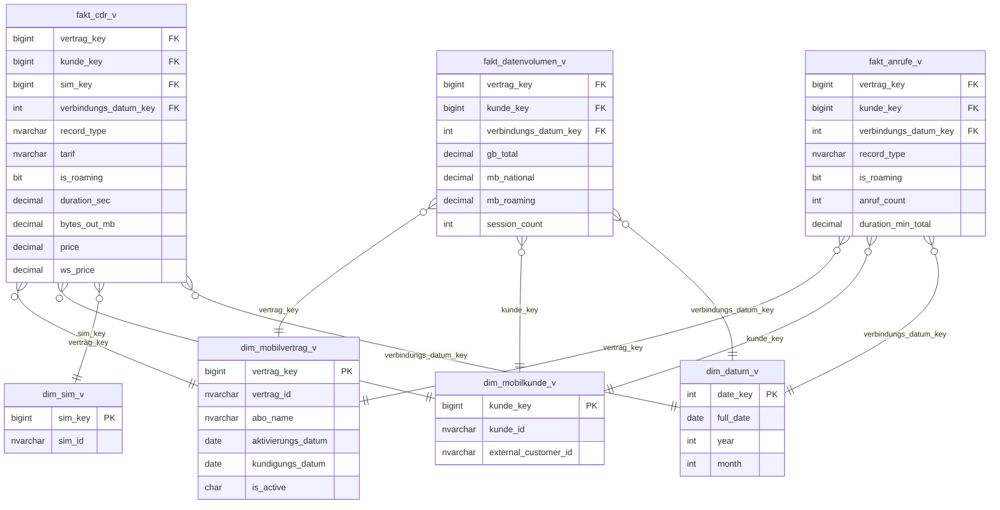

# CDR-Reporting Mobile — Implementierungsplan

**Erstellt:** 22. April 2026  
**Status:** ✅ Phase A–D abgeschlossen — Full Load (9.44M Rows) + alle Vault-Bugs behoben. ADF Delta Load ausstehend (§12).  
**Letztes Update:** 5. Mai 2026  
**Scope:** Mobile-Telefonie CDR-Daten von Compax (RSN — Rii Seez Net)  
**Nicht im Scope:** Lambda Vault (Real-Time), Festnetz-CDR (später)

---

## 1. Fachlicher Kontext

### Quellsystem
**Compax** ist das Billing-/Provisioning-System für die EWB Mobile/MVNO-Services. Datenlieferant ist **Rii Seez Net (RSN)** als Netzbetreiber/Provider.

### Datenlieferung (bereits aktiv)
- **ADF Pipeline `Copy_CRD_Test`** (Test-Pipeline, noch kein Trigger)
  - Source: SFTP `10.40.101.10` (`ppmc_ewb`), Pfad `/services/` + `/cdrs/`
  - Sink: ADLS `load-fs/ewb/cdr/{services,udrs}/` als `.txt`
  - Additional Columns auf Source: `dss_load_date = @pipeline().TriggerTime`, `dss_record_source = ewb_compax` + 3 weitere DSS-Metadaten
- **Downstream:** Parquet-Konvertierung → `stage-fs/ewb/cdr/{services,udrs}/`

### Zwei Datensätze

| Dataset | Frequenz | Volumen (aktuell) | Business Key | Inhalt |
|---------|----------|-------------------|--------------|--------|
| **services** (Stammdaten) | 1×/Tag (07:00) | 650'112 Zeilen / 5'879 Verträge / 4'475 Kunden / 5'967 SIM-Karten | `vertrags_nummer` + `abo_option_name` | Abos, Optionen, SIM-Karten, Rufnummern, Aktivierungs-/Kündigungsdaten |
| **udrs** (Usage Events) | alle 10 min (~150/Tag) | ~135'000 Events/Tag (geschätzt; `id` ~2.7 Mrd → riesige Historie) | `id` | Einzelverbindungsnachweise (Voice, Data, SMS, Forwarding, Roaming) |

### Fachlicher Join
```
udrs.contract_id  ↔  services.vertrags_nummer   ← primärer Link (Format: 300xxxxxx)
udrs.iccid        ↔  services.icc               ← SIM-Verifikation
```

---

## 2. Inhaltsanalyse

### 2.1 Services (Stammdaten)

**Top-Abos/Optionen:**

| Abo/Option | Zeilen | Typ |
|---|---:|---|
| Mobile M | 155'368 | Haupt-Abo |
| Mobile S | 149'813 | Haupt-Abo |
| Mobile S 2018 | 122'958 | Haupt-Abo (Legacy) |
| Mobile GM | 36'396 | Haupt-Abo (Gemeinde) |
| 1GB Roaming Zone 2/3 | 31'700 | Option |
| Mobile GS | 25'211 | Haupt-Abo (Gemeinde) |
| Mobile Business M | 24'638 | Haupt-Abo |
| 5GB Roaming Zone 2/3 | 23'798 | Option |
| 100min Roaming Zone 2/3 | 16'690 | Option |
| Mobile Data 50 (Gemeinde) | 13'636 | Option |

- **85.5% Haupt-Abos** (`ist_option=0`), 14.5% Zusatz-Optionen
- **Kundenstruktur:** ~1.3 Verträge pro Kunde → einzelne Kunden mit mehreren Verträgen
- **SIM-Wechsel:** SIM-Kardinalität > Verträge → einzelne Verträge mit SIM-Wechsel in der Historie
- **Datumsbereiche:** aktivierungs_datum bis 9999-12-31 (Sentinel "offen/unbekannt"); kundigungs_datum enthält zukünftige Kündigungen

**Kunden-IDs:**
- `customer_id`: 6-stellig numerisch (z.B. 704253, 708583) — Compax-interne ID
- `external_customer_id`: teils numerisch, teils `CXL_xxxxx` (Compax-Legacy) — möglicher Join zu Abacus-Kunden (noch zu klären)

### 2.2 UDRs (Usage Events)

**Ereignis-Typen** (aus Sample-Daten):

| record_type | Bedeutung |
|---|---|
| MOC | Mobile Originated Call (ausgehender Anruf) |
| MTC | Mobile Terminated Call (eingehender Anruf) |
| FORW | Call Forwarding (Rufumleitung) |
| DATA | Datenverbindung (GPRS/LTE-Session) |
| SMS | Kurznachricht |

**Metriken:**
- `duration` — Gesprächsdauer in Sekunden
- `bytes_in` / `bytes_out` — Datenvolumen (Bytes)
- `price` / `ws_price` — Endkundenpreis vs. Wholesale-Preis
- `tarif` — Freitext-Tarif (z.B. "Voice MO in National (CH + FL) to National (CH + FL)")
- `r_mcc_mnc` — Roaming-Kennzeichnung (Mobile Country Code / Network Code)

**Identifier:**
- `a` — A-Rufnummer (Anrufer)
- `b` — B-Rufnummer (Angerufener)
- `imsi` — SIM-Netz-Identifikation (228-02 = Sunrise-Infrastruktur CH)
- `iccid` — Physikalische SIM-Karte

⚠️ **Performance-Hinweis:** External-Table Full-Scan über UDRs läuft >60 Min auch für einfache `COUNT(*)`. Native Azure SQL Table (PSA-Pattern) erforderlich.

---

## 3. Naming-Anpassung (Roger-Feedback)

### 3.1 Wunsch von Roger
> "Staging bitte die Namensgebung folgendermassen anpassen: `rsn_mobile_cdr_Main` + `rsn_mobile_services_main` — so können wir später Festnetz-CDRs unterscheiden. Thema betrifft unseren Provider Rii Seez Net, daher `rsn` statt `ewb`."

### 3.2 Abgleich mit unserer Konvention

Aktuelle Konvention: `<concept>_<modul>_<tabelle>_<suffix>` (z.B. `ewb_fibu_fhe_main`)

**Mapping:**

| Position | Aktuell | Neu (Roger) |
|----------|---------|-------------|
| concept | `ewb` (Kunde) | `rsn` (Provider) |
| modul | `cdr` | `mobile` |
| tabelle | `services` / `udrs` | `services` / `cdr` |
| suffix | `main` | `main` |

→ **Konvention bleibt gewahrt** (4-teiliger Name). Semantik ändert sich:
- `concept = rsn` = Quellsystem-Prefix (analog `ewb` für Abacus)
- `modul = mobile` = Fachbereich (künftig `festnetz` möglich)

### 3.3 Neue Namen

| Objekt | Alt (wegwerfen) | Neu |
|--------|-----------------|-----|
| External Table Stammdaten | `ext_ewb_cdr_services` | `ext_rsn_mobile_services_main` |
| External Table Events | `ext_ewb_cdr_udrs` | `ext_rsn_mobile_cdr_main` |
| Staging View Stammdaten | — (noch nicht erstellt) | `rsn_mobile_services_main` |
| Staging View Events | — (noch nicht erstellt) | `rsn_mobile_cdr_main` |
| PSA Events (native Table) | — | `psa_rsn_mobile_cdr_main` |
| ADLS Folder | `ewb/cdr/services/` + `ewb/cdr/udrs/` | ⚠️ **Folders in ADLS bleiben** — umbenennen wäre ADF-/SFTP-Rework; External Table Location wird unverändert übernommen |
| dss_record_source | `ewb_compax` (ADF) | `rsn_compax` — ⚠️ ADF-Pipeline muss ebenfalls angepasst werden |

### 3.4 Entscheidung nötig (offen für Meeting)

- [ ] **ADLS-Folder umbenennen?** Aktuell `load-fs/ewb/cdr/*` → logisch korrekter wäre `load-fs/rsn/mobile/*`. Aufwand: ADF-Pipeline + DataFlow + Stage-Converter anpassen. **Empfehlung: später** — jetzt nur DV-Schicht konsistent benennen, Lake-Layout später migrieren.
- [ ] **`dss_record_source` Wert:** `rsn_compax`, `compax_mobile` oder `ewb_compax`?

---

## 4. Architektur-Entscheidungen

### 4.0 Schema-Konzept: `vault` vs. `vault_telecom`

**Entscheid (2026-04-26):** CDR-Objekte werden auf zwei Schemas verteilt:

| Schema | dbt-Ordner | Objekte | Begründung |
|--------|-----------|---------|------------|
| `vault` | `raw_vault/_common/` | `hub_vertrag`, `hub_kunde`, Satellites, `link_vertrag_kunde` | Source-agnostische Business-Konzepte — offen für weitere Quellen (Abacus, CRM) |
| `vault_telecom` | `raw_vault/telecom/` | `hub_sim`, `link_vertrag_sim`, `link_cdr_event_tl`, `sat_cdr_event__compax`, Referenztabellen | Telekom-spezifisch — kein Pendant in anderen Quellsystemen. Scope: RSN Mobile + künftig RSN Festnetz |

**Warum nicht alles in `_common`?**  
`hub_sim` (ICCID) ist ein rein telekommunikationsspezifisches Objekt ohne Pendant in Abacus oder anderen EWB-Quellen. Transaction-Links und CDR-Events gehören ebenfalls in die Telecom-Domäne.

**Warum nicht alles in `vault_telecom`?**  
`hub_vertrag` und `hub_kunde` sind universelle Business-Konzepte. Zukünftige Quellen (Abacus-Kunden via `external_customer_id`, Festnetz-Verträge) liefern in dieselben Hubs. Die Trennung erfolgt via `dss_record_source` und separaten Satellites pro Quelle.

---

### 4.1 hub_msisdn — Entscheid: **Hub erforderlich** (Begründung aktualisiert 2026-05-03)

**Datenanalyse auf `stg.ext_rsn_mobile_services_main` (datavault-dev, 2026-04-26):**

| Metrik | Wert | Interpretation |
|--------|------|----------------|
| Total Rows | 650'112 | |
| Distinct `vertrags_nummer` | 5'879 | |
| Distinct `rufnummer` (non-null) | 5'930 | Mehr Rufnummern als Verträge |
| Ratio rufnummer / vertrag | **1.0087** | Nicht 1:1 |
| Verträge mit > 1 Rufnummer | **83 (1.4%)** | SIM-Wechsel in der Historie |
| Max. Rufnummern pro Vertrag | **5** | z.B. Vertrag `300203001` |
| Rufnummern auf > 1 Vertrag | **33 (0.6%)** | Legacy-/Schmutz-Daten (s. u.) |
| Max. Verträge pro Rufnummer | **4** | z.B. `+41772611708` → 4 Verträge |
| NULL-Quote | **0.62%** | Akzeptabel |

**Aktualisierte Einordnung (Meeting 2026-05-03):**  
EWB/RSN hat bestätigt: Geschäftsregel ist **1 Vertrag = 1 Rufnummer**. Die 33 Rufnummern auf mehreren Verträgen im Snapshot sind **Legacy-/Schmutz-Daten** aus alten Migrationen — kein echter M:N. In Zukunft wird dieser Zustand nicht mehr eintreten.

**Entscheid: `hub_msisdn` wird trotzdem implementiert** (Schema: `vault_telecom`)

Begründung (auf Basis Meeting-Erkenntnisse):

1. **ICC ändert sich, Rufnummer bleibt:** Wenn ein SIM-Tausch erfolgt (`icc` / ICCID ändert sich), bleibt die Rufnummer (MSISDN) für den Kunden unverändert. Die Rufnummer ist die **öffentliche, stabile Identität** — der Hub ist das Anker-Objekt für diese Identität.
2. **Navigationspfad:** Support-Use-Case "Rufnummer 079… ruft an — welcher Kunde?" erfordert Navigation Rufnummer → Vertrag → Kunde. Ohne Hub ist dieser Pfad nicht zuverlässig abbildbar.
3. **Kardinalität über Zeit:** Obwohl aktuell 1:1, kann eine Rufnummer historisch auf mehreren Verträgen gewesen sein (Nummer-Portierung, SIM-Tausch, Altdaten). Der Link `link_vertrag_msisdn` speichert diese Zeitreihe korrekt.

`rufnummer` wird **nicht** als Payload in `sat_vertrag_optionen_ma__compax` aufgenommen (eigener Hub + Link).

**Wo bleibt `rufnummer` in den Staging-Daten?**  
Die Services-Datei liefert `rufnummer` pro Zeile (= pro Vertrag × Abo-Option). Im Staging wird `rufnummer` für Hash-Key `hk_msisdn` verwendet. Der Link `link_vertrag_msisdn` wird aus Services geladen (nur Zeilen mit `ist_option = '0'`, da Rufnummer nur am Haupt-Abo hängt).

---


**Warum:** External-Table Scan ist für UDRs-Volumen zu langsam (>60 Min für Aggregate).

**Pattern** (analog `psa_ewb_fibu_gl`):
```sql
-- psa_rsn_mobile_cdr_main.sql (native Table, incremental)
{{ config(
    materialized='incremental',
    incremental_strategy='delete+insert',
    unique_key=['id', 'dss_source_file_name'],
    as_columnstore=false
) }}

SELECT *, GETDATE() AS dss_create_datetime
FROM {{ source('staging', 'ext_rsn_mobile_cdr_main') }}
```

→ Staging View `rsn_mobile_cdr_main` liest dann aus PSA, nicht direkt aus External Table.

### 4.2 Services als direkte Staging-View

Volumen klein (650k) → kein PSA nötig, direkt View auf External Table.

### 4.3 Kein Lambda Vault (vorerst)

Laut User-Vorgabe: Lambda Vault erst im nächsten Schritt. Die 10-Minuten-Lieferung der UDRs wird vorerst als Batch behandelt — dbt-Lauf im definierten Intervall (z.B. stündlich oder täglich).

### 4.4 bytes_in ist immer leer — nur bytes_out ist Kernmetrik (Meeting 2026-05-03)

**Bestätigung aus Meeting:** `bytes_in` ist aus Systemgründen immer leer. `bytes_out` repräsentiert das **Datenvolumen aus Kundensicht** (was der Kunde gesendet und empfangen hat). 

**Konsequenz für Modell und Mart:**
- `bytes_in` bleibt im Payload von `sat_cdr_event__compax` (Raw-Daten vollständig halten), wird aber als "immer leer" dokumentiert
- **Mart-Metrik** (Abschnitt 6.3): Korrektur — statt `bytes_in + bytes_out` gilt: `bytes_out` allein ist das massgebliche Datenvolumen
- Hashdiff-Einfluss: keiner (Transaction Satellite = non-historized, kein hashdiff)

### 4.5 Delete-Erkennung bei Services — Effectivity Satellite (Meeting 2026-05-03)

**Anforderung:** Das tägliche Services-File ist ein **Vollabzug der aktiven Verträge**. Wenn ein Kunde kündigt, verschwindet er aus dem nächsten Export — er kommt nicht mehr vor. Die `dss_is_current = 'Y'` im Satellite würde fälschlicherweise bestehen bleiben.

**Beispiel:**
```
2026-05-01: Export enthält Vertrag 300201001 (aktiv, kündigungs_datum = 9999-12-31)
            → sat_vertrag_optionen_ma__compax: dss_is_current = 'Y'
2026-05-05: Kündigung → kündigungs_datum = 2026-05-04 eingetragen
            → sat_vertrag_optionen_ma__compax: neue Version, dss_is_current = 'Y'
2026-05-10: Vertrag nicht mehr im Export (verschwunden)
            → KEIN neuer Satellite-Record → dss_is_current bleibt 'Y' ← FALSCH
```

**DV2.1-Lösung: Effectivity Satellite** `sat_vertrag_eff__compax`  
Nach jedem Lauf: Hub-Keys des heutigen Exports mit Hub-Keys des Satellite-Bestands vergleichen → für fehlende Keys einen Tombstone-Record schreiben.

| Spalte | Typ | Beschreibung |
|--------|-----|-------------|
| `hk_vertrag` | CHAR(64) | FK → hub_vertrag |
| `dss_load_date` | DATETIME2 | Ladezeitpunkt |
| `is_active` | CHAR(1) | 'Y' = im heutigen Export vorhanden, 'N' = verschwunden (Tombstone) |
| `dss_record_source` | NVARCHAR | |

**Priorität:** Phase D (gemeinsam mit anderen Satellites), **vor** Mart-Implementierung.

> **Hinweis:** Das `kündigungs_datum` im MA-Satellite deckt die *angekündigte* Kündigung. Der Effectivity Satellite deckt das *tatsächliche Verschwinden* aus dem Quellsystem — beide Informationen sind wertvoll.

### 4.6 Initial Load Historisierung (Meeting 2026-05-03)

**Anforderung:** "Bei der Beladung muss auf die Historisierung im Initialload aufgepasst werden."

Das Services-File enthält beim Erstladen bereits historische Einträge:
- Aktive Verträge (kündigungs_datum = 9999-12-31)
- Bereits gekündigte Verträge mit gesetztem kündigungs_datum (rückwärtige Historie)

**Ladeprinzip:**
1. **Alle Einträge laden** (inkl. bereits gekündigter) — Raw Vault behält immer alle Rohdaten
2. `kündigungs_datum` im Payload steuert die fachliche "Ist aktiv"-Logik im Mart
3. Effectivity Satellite: beim Erstlauf gibt es keine "Vergangenheit" → kein Tombstone-Record beim Initial Load, erst ab dem zweiten Lauf wird verglichen
4. **Sentinel-Wert 9999-12-31** bei kündigungs_datum = offenes Vertragsende → im Mart als `NULL` oder `CAST(NULL AS DATE)` behandeln

---

## 5. Data Vault Modellierung

> **Legende:** PK = Primärschlüssel, FK = Fremdschlüssel, CDK = Child Dependent Key, BK = Business Key  
> DSS-Spalten (`dss_*`) sind Pflichtfelder auf jedem DV-Objekt und werden nicht in jeder Tabelle einzeln aufgeführt (stehen am Schluss jedes Objekts).

---

### 5.1 Hubs

#### `hub_vertrag` *(Schema: `vault`)*
Zentrales Objekt — bindet Stammdaten (services) und Events (udrs). Source-agnostisch: künftige Festnetz-Verträge liefern ebenfalls in diesen Hub.

| Spalte | Typ | PK | Quelle | Beschreibung |
|--------|-----|----|--------|--------------|
| `hk_vertrag` | CHAR(64) | ✅ | Hash(`vertrag_id`) | Hash Key |
| `vertrag_id` | NVARCHAR(4000) | | services.`vertrags_nummer` / udrs.`contract_id` | Business Key — im Staging als `vertrag_id` aliasiert |
| `dss_business_key` | NVARCHAR | | `CONCAT_WS('||','default','default', vertrag_id)` | Normierter BK |
| `dss_load_date` | DATETIME2 | | ADF TriggerTime | Ladezeitpunkt |
| `dss_create_datetime` | DATETIME2 | | GETDATE() | Erstellungszeitpunkt |
| `dss_record_source` | NVARCHAR | | ADF configured | Quelle |

> **Feeds:** `rsn_mobile_services_main` (täglich) + `rsn_mobile_cdr_main` (alle 10 min via `contract_id`)  
> **Staging-Mapping:** `vertrags_nummer` → `vertrag_id` (services); `contract_id` → `vertrag_id` (cdr)

---

#### `hub_kunde` *(Schema: `vault`)*
Source-agnostischer Kunden-Hub. Compax liefert aktuell als einzige Quelle. Weitere Quellen (Abacus via `external_customer_id`, CRM) liefern in denselben Hub mit eigenem `dss_record_source`.

| Spalte | Typ | PK | Quelle | Beschreibung |
|--------|-----|----|--------|--------------|
| `hk_kunde` | CHAR(64) | ✅ | Hash(`kunde_id`) | Hash Key |
| `kunde_id` | NVARCHAR(4000) | | services.`customer_id` | Business Key — im Staging als `kunde_id` aliasiert |
| `dss_business_key` | NVARCHAR | | `CONCAT_WS('||','default','default', kunde_id)` | |
| `dss_load_date` | DATETIME2 | | | |
| `dss_create_datetime` | DATETIME2 | | | |
| `dss_record_source` | NVARCHAR | | | |

> **Staging-Mapping:** `customer_id` → `kunde_id`  
> **Zukünftig:** Abacus-Kunden (`ADRESSNR` → `kunde_id`, `dss_record_source='ewb_abacus'`) → Same-As Link wenn `external_customer_id = ADRESSNR`

---

#### `hub_sim` *(Schema: `vault_telecom`)*
SIM-Karte — ICCID ist global eindeutig (Industriestandard). Verbindet services (`icc`) und udrs (`iccid`).

| Spalte | Typ | PK | Quelle | Beschreibung |
|--------|-----|----|--------|--------------|
| `hk_sim` | CHAR(64) | ✅ | Hash(`icc`) | Hash Key |
| `icc` | NVARCHAR(4000) | | services.icc / udrs.iccid | Business Key (= ICCID, SIM-global-ID) |
| `dss_business_key` | NVARCHAR | | `CONCAT_WS('||','default','default', icc)` | |
| `dss_load_date` | DATETIME2 | | | |
| `dss_create_datetime` | DATETIME2 | | | |
| `dss_record_source` | NVARCHAR | | | |

---

---

> **`hub_msisdn` (Schema: `vault_telecom`)** — BK: `rufnummer` (E.164). M:N mit `hub_vertrag` durch Datenanalyse bestätigt. Siehe Abschnitt 4.1.

| Spalte | Typ | PK | Quelle | Beschreibung |
|--------|-----|----|--------|--------------|
| `hk_msisdn` | CHAR(64) | ✅ | Hash(`rufnummer`) | Hash Key |
| `rufnummer` | NVARCHAR(4000) | | services.rufnummer | Business Key (MSISDN / E.164) |
| `dss_business_key` | NVARCHAR | | `CONCAT_WS('||','default','default', rufnummer)` | |
| `dss_load_date` | DATETIME2 | | | |
| `dss_create_datetime` | DATETIME2 | | | |
| `dss_record_source` | NVARCHAR | | | |

---

### 5.2 Satellites

#### `sat_kunde__compax` *(Schema: `vault`)*
Attribute des Kunden aus Compax. Enthält `external_customer_id` für späteren Abacus-Join.

| Spalte | Typ | PK | Payload | Beschreibung |
|--------|-----|----|---------|--------------|
| `hk_kunde` | CHAR(64) | ✅ (Teil 1) | FK | Fremdschlüssel zu hub_kunde |
| `dss_load_date` | DATETIME2 | ✅ (Teil 2) | | Ladezeitpunkt |
| `hd_kunde` | CHAR(64) | | Hash Diff | Änderungserkennung |
| `external_customer_id` | NVARCHAR(4000) | | ✅ | Externe ID (Abacus-Kundennr.?) |
| `dss_create_datetime` | DATETIME2 | | | |
| `dss_record_source` | NVARCHAR | | | |
| `dss_is_current` | CHAR(1) | | | 'Y'/'N' via post_hook |
| `dss_end_date` | DATETIME2 | | | NULL = aktuell, via post_hook |

> **Hash Diff Spalten:** `external_customer_id`

---

#### `sat_vertrag_optionen_ma__compax` *(Schema: `vault`, Multi-Active Satellite)*
Abo-Optionen pro Vertrag. Jeder Vertrag hat 1..n Einträge (Haupt-Abo + Optionen). CDK = `abo_option_name`.

| Spalte | Typ | PK | Rolle | Beschreibung |
|--------|-----|----|-------|--------------|
| `hk_vertrag` | CHAR(64) | ✅ (Teil 1) | FK | Fremdschlüssel zu hub_vertrag |
| `dss_load_date` | DATETIME2 | ✅ (Teil 2) | | Ladezeitpunkt |
| `abo_option_name` | NVARCHAR(4000) | ✅ (Teil 3) | **CDK** | z.B. "Mobile M", "5GB Roaming Zone 2/3" |
| `hd_vertrag_optionen_ma` | CHAR(64) | | Hash Diff | Änderungserkennung |
| `rufnummer` | NVARCHAR(4000) | | Payload | MSISDN — nur beim Haupt-Abo (ist_option=0) befüllt |
| `ist_option` | NVARCHAR(4000) | | Payload | 0 = Haupt-Abo, 1 = Zusatzoption |
| `aktivierungs_datum` | NVARCHAR(4000) | | Payload | Aktivierungsdatum der Option |
| `kundigungs_datum` | NVARCHAR(4000) | | Payload | Kündigungsdatum (9999-12-31 = offen) |
| `mlz_datum` | NVARCHAR(4000) | | Payload | Mindestlaufzeit-Ende |
| `dss_create_datetime` | DATETIME2 | | | |
| `dss_record_source` | NVARCHAR | | | |

> **Hash Diff Spalten:** `aktivierungs_datum`, `ist_option`, `kundigungs_datum`, `mlz_datum` (alphabetisch sortiert durch automate_dv)  
> **Haupt-Abo erkennen:** `WHERE ist_option = '0'` — Rufnummer und SIM bleiben beim Haupt-Abo stabil

---

#### `sat_sim__compax` *(optional, vorerst nicht implementiert)*
Aktuell keine zusätzlichen SIM-Attribute in den Quelldaten. Entfällt bis weitere SIM-Stammdaten verfügbar sind.

---

### 5.3 Links

#### `link_vertrag_kunde` *(Schema: `vault`)*
Beziehung zwischen Vertrag und Kunde aus Stammdaten-Datei. Pro Vertrag genau 1 Kunde.

| Spalte | Typ | PK | Beschreibung |
|--------|-----|----|--------------|
| `hk_link_vertrag_kunde` | CHAR(64) | ✅ | Hash(`vertrag_id`, `kunde_id`) |
| `hk_vertrag` | CHAR(64) | | FK → hub_vertrag |
| `hk_kunde` | CHAR(64) | | FK → hub_kunde |
| `dss_load_date` | DATETIME2 | | |
| `dss_record_source` | NVARCHAR | | |

> **Quelle:** `rsn_mobile_services_main`

---

#### `link_vertrag_sim` *(Schema: `vault_telecom`, Cross-Schema: vault.hub_vertrag ↔ vault_telecom.hub_sim)*
Beziehung zwischen Vertrag und SIM-Karte. Ermöglicht SIM-Wechsel-Historie.

| Spalte | Typ | PK | Beschreibung |
|--------|-----|----|--------------|
| `hk_link_vertrag_sim` | CHAR(64) | ✅ | Hash(`vertrag_id`, `icc`) |
| `hk_vertrag` | CHAR(64) | | FK → hub_vertrag |
| `hk_sim` | CHAR(64) | | FK → hub_sim |
| `dss_load_date` | DATETIME2 | | |
| `dss_record_source` | NVARCHAR | | |

> **Quelle:** `rsn_mobile_services_main`

---

#### `link_vertrag_msisdn` *(Schema: `vault_telecom`, Cross-Schema: vault.hub_vertrag ↔ vault_telecom.hub_msisdn)*
M:N durch Datenanalyse bestätigt (33 Rufnummern auf > 1 Vertrag gleichzeitig).

| Spalte | Typ | PK | Beschreibung |
|--------|-----|----|--------------|
| `hk_link_vertrag_msisdn` | CHAR(64) | ✅ | Hash(`vertrag_id`, `rufnummer`) |
| `hk_vertrag` | CHAR(64) | | FK → vault.hub_vertrag |
| `hk_msisdn` | CHAR(64) | | FK → vault_telecom.hub_msisdn |
| `dss_load_date` | DATETIME2 | | |
| `dss_record_source` | NVARCHAR | | |

> **Quelle:** `rsn_mobile_services_main`

---

#### `link_cdr_event_tl` *(Transaction Link)*
Transaction Link für CDR-Ereignisse. Verbindet den Vertrag mit der SIM-Karte pro Event.

| Spalte | Typ | PK | Beschreibung |
|--------|-----|----|--------------|
| `hk_link_cdr_event_tl` | CHAR(64) | ✅ | Hash(`id`, `vertrag_id`, `icc`) |
| `hk_vertrag` | CHAR(64) | | FK → hub_vertrag (via `contract_id` → `vertrag_id`) |
| `hk_sim` | CHAR(64) | | FK → hub_sim (via `iccid` → `icc`) |
| `dss_load_date` | DATETIME2 | | |
| `dss_record_source` | NVARCHAR | | |

> **Quelle:** `rsn_mobile_cdr_main` (PSA-Tabelle)

---

### 5.4 Transaction Satellite (Non-Historized)

#### `sat_cdr_event__compax` *(Schema: `vault_telecom`, Non-Historized)*
CDR-Events sind **unveränderliche Fakten** — keine Hash Diff, kein SCD2. Einmal geladen, nie geändert.

| Spalte | Typ | PK | Beschreibung |
|--------|-----|----|--------------|
| `hk_link_cdr_event_tl` | CHAR(64) | ✅ (Teil 1) | FK → link_cdr_event_tl |
| `dss_load_date` | DATETIME2 | ✅ (Teil 2) | Ladezeitpunkt |
| `id` | NVARCHAR(4000) | | CDR-Event-ID (Compax intern, ~2.7 Mrd) |
| `signaling_start` | NVARCHAR(4000) | | Beginn Signalisierung |
| `connection_start` | NVARCHAR(4000) | | Verbindungsbeginn |
| `duration` | NVARCHAR(4000) | | Gesprächsdauer (Sekunden) |
| `a` | NVARCHAR(4000) | | A-Rufnummer (Anrufer) |
| `b` | NVARCHAR(4000) | | B-Rufnummer (Angerufener) |
| `pai` | NVARCHAR(4000) | | P-Asserted-Identity |
| `imsi` | NVARCHAR(4000) | | SIM-Netz-ID (228-02 = Sunrise CH) |
| `iccid` | NVARCHAR(4000) | | SIM-Karten-ID (Verifikation) |
| `privacy` | NVARCHAR(4000) | | Datenschutz-Flag |
| `display_name` | NVARCHAR(4000) | | Anzeigename |
| `diversion_reason` | NVARCHAR(4000) | | Umleitungsgrund (FORW-Events) |
| `p_chrg_v` | NVARCHAR(4000) | | P-Charging-Vector |
| `p_ch_o` | NVARCHAR(4000) | | P-Charging-Originating |
| `result_code` | NVARCHAR(4000) | | Ergebniscode |
| `result_status` | NVARCHAR(4000) | | Ergebnisstatus |
| `call_type` | NVARCHAR(4000) | | Anruftyp |
| `record_type` | NVARCHAR(4000) | | MOC / MTC / FORW / DATA / SMS |
| `service_type` | NVARCHAR(4000) | | z.B. "GPR" (Daten), Voice, SMS |
| `bytes_in` | NVARCHAR(4000) | | Empfangene Bytes (**Kernmetrik**) |
| `bytes_out` | NVARCHAR(4000) | | Gesendete Bytes (**Kernmetrik**) |
| `data_packet` | NVARCHAR(4000) | | Datenpaket-Info |
| `r_mcc_mnc` | NVARCHAR(4000) | | Roaming MCC/MNC (leer = national) |
| `price` | NVARCHAR(4000) | | Endkundenpreis |
| `ws_price` | NVARCHAR(4000) | | Wholesale-Preis |
| `tarif` | NVARCHAR(4000) | | Freitext-Tarif (**Mart-Gruppierung**) |
| `tap3` | NVARCHAR(4000) | | TAP3 Roaming-Record-Referenz |
| `dss_create_datetime` | DATETIME2 | | |
| `dss_record_source` | NVARCHAR | | |

> ⚠️ **Kein Hash Diff** — Events ändern sich nie (Non-Historized). Kein `dss_is_current` / `dss_end_date`.  
> **Mart-Metriken:** ~~`bytes_in`~~ (immer leer), `bytes_out` → GB-Volumen (Kundenperspektive); `duration` → Gesprächsminuten; `price` / `ws_price` → Erlös/Kosten-Vergleich

---

### 5.5 Reference Tables (Lookup)

| Reference | Business Key | Werte-Quelle | Beschreibung |
|-----------|-------------|--------------|--------------|
| `ref_abo_option_v` | `abo_option_name` | Distinct aus services | Normierte Abo/Optionen-Liste (z.B. "Mobile M", "5GB Roaming") |
| `ref_tarif_v` | `tarif` | Distinct aus udrs | Freitext-Tarife normiert (z.B. "Voice MO in National (CH+FL)") |
| `ref_roaming_zone_v` | `mcc_mnc` | Manuell (Seed) | MCC/MNC → Zone-Mapping (CH=national, Zone 1/2/3) |

---

### 5.6 Übersicht: Datenfluss Services → DV-Objekte

```
rsn_mobile_services_main (1 Zeile = 1 Vertrag × 1 Option)
│  Staging aliasiert: vertrags_nummer → vertrag_id, customer_id → kunde_id
│
│  [vault._common]
├─► hub_vertrag        (BK: vertrag_id)
├─► hub_kunde          (BK: kunde_id)
├─► sat_kunde__compax              → external_customer_id
├─► sat_vertrag_optionen_ma__compax   → CDK: abo_option_name, Payload: ist_option, datum-Felder
├─► link_vertrag_kunde    (vertrag_id ↔ kunde_id)
│
│  [vault_telecom]
├─► hub_sim            (BK: icc)
├─► hub_msisdn         (BK: rufnummer) — M:N bestätigt, kein optionales Objekt mehr
├─► link_vertrag_sim      (vertrag_id ↔ icc)
└─► link_vertrag_msisdn   (vertrag_id ↔ rufnummer)
```

### 5.7 Übersicht: Datenfluss CDR Events → DV-Objekte

```
rsn_mobile_cdr_main (PSA, 1 Zeile = 1 CDR-Event)
│  Staging aliasiert: contract_id → vertrag_id, iccid → icc
│
│  [vault._common]
├─► hub_vertrag  (BK: vertrag_id — bereits durch services bekannt)
│
│  [vault_telecom]
├─► hub_sim      (BK: icc — bereits durch services bekannt)
├─► link_cdr_event_tl    (vertrag_id ↔ icc ↔ id)
└─► sat_cdr_event__compax  → alle Event-Metriken (non-historized)
```

---

## 6. Mart-Schicht

### 6.1 Dimensionen

| Dimension | Quelle | Zweck |
|-----------|--------|-------|
| `dim_mobilvertrag_v` | hub_vertrag + sat_vertrag_optionen_ma__compax | Vertragsperspektive |
| `dim_mobilkunde_v` | hub_kunde + sat_kunde__compax | Kundenperspektive |
| `dim_sim_v` | hub_sim | SIM-Perspektive |
| `dim_tarif_v` | ref_tarif_v | Tarif-Dimension |
| `dim_datum_v` | (bereits vorhanden) | Zeit |

### 6.2 Fakten

| Fakt | Quelle | Grain | Kernmetriken |
|------|--------|-------|-------------|
| `fakt_cdr_v` | sat_cdr_event__compax | 1 Zeile = 1 CDR-Event | ~~bytes_in~~ (leer), **bytes_out**, duration, price, ws_price |
| `fakt_datenvolumen_v` (aggregiert) | fakt_cdr_v | Vertrag × Tag | gb_total, gb_national, gb_roaming |
| `fakt_anrufe_v` (aggregiert) | fakt_cdr_v | Vertrag × Tag | count_mo, count_mt, duration_total |

### 6.3 Zentrale Business-Metrik (Reporting-Ziel)

Aus Meeting-Prep:
```sql
-- Tarif-Empfehlung: lohnt sich Flat oder Daten-Tarif?
SELECT
    k.customer_id,
    s.abo_option_name,
    SUM(c.bytes_out) / 1024.0/1024.0/1024.0 AS total_gb,  -- bytes_in ist immer leer
    CASE WHEN total_gb > 10 THEN 'Flat lohnt sich' ELSE 'Daten-Tarif' END AS empfehlung
FROM mart.fakt_datenvolumen_v
...
```

---

## 7. Offene Fragen

### Fachlich
- [x] **customer_id ↔ Abacus:** → **Entscheid (2026-05-05):** `external_customer_id` = Abacus-Kundennummer. **Link herstellen** via `link_person_kunde` (Same-As-Link `hub_person.hk_person ↔ hub_kunde.hk_kunde`, WHERE `sat_kunde.external_customer_id = hub_person.ADRESSNR`). Ermöglicht Navigation CDR → Compax-Kunde → Abacus-Person → FIBU/Projekt. Geplant als Phase F-1 (nach Mart).
- [x] **Tarif-Schwellwerte:** → **Entscheid (2026-05-05):** Werden in **Power BI** definiert — keine dbt-Logik nötig. `tarif` bleibt degenerate dimension in `fakt_cdr_v`.
- [x] **Auswertungszeitraum:** → **Entscheid (2026-05-05):** **Rollierend 30 Tage** für Rohdaten (atomarer Grain). Ältere Daten aggregiert. Retention-Architektur siehe §13.8.
- [x] **bytes_in / bytes_out Richtung:** ~~Aus Kundensicht oder Netzwerksicht?~~ → **Beantwortet (2026-05-03):** `bytes_in` ist immer leer. `bytes_out` = Datenvolumen aus Kundensicht (gesendet + empfangen). Nur `bytes_out` als Mart-Metrik verwenden.
- [x] **Rufnummer-Portabilität / M:N:** ~~Wird MSISDN-Wechsel in services abgebildet?~~ → **Beantwortet (2026-05-03):** 1 Vertrag = 1 Rufnummer (Geschäftsregel). M:N-Befund in Daten sind Legacy-Altdaten. hub_msisdn bleibt dennoch (ICCID ändert sich, Rufnummer bleibt = stabiler Anker; Navigationspfad Rufnummer → Vertrag → Kunde). Siehe Abschnitt 4.1.
- [x] **Delete-Erkennung:** → **Beantwortet (2026-05-03):** Effectivity Satellite `sat_vertrag_eff__compax` erforderlich. Kunden verschwinden nach Kündigung aus dem Export. Siehe Abschnitt 4.5.

### Technisch
- [x] **ADLS-Folder umbenennen** (`ewb/cdr/*` → `rsn/mobile/*`)? → **Entscheid (2026-05-05):** Vorerst **so lassen**. Lake-Layout-Migration später.
- [x] **dss_record_source Wert** → **Entscheid (2026-05-05):** Vorerst **so lassen** (`rsn_compax`). Kein Breaking Change jetzt.
- [x] **Vollständigkeit UDRs:** Gibt es Sequenznummer/Gaps-Erkennung für verpasste Dateien? → **Entscheid (2026-05-05):** Fürs erste **ignorieren**. Möglicher Ansatz später: Timestamp-Lücken im PSA erkennen (`GROUP BY DATE(dss_load_date)` → fehlende Tage). Kein Blocker.
- [x] **Retention:** → **Entscheid (2026-05-05):** **Hybride Retention-Strategie** (Rolling 30 days Raw + aggregierte History). Detailplan siehe §13.8.

### Projekt
- [ ] **Schulungsprojekt Marco:** Separate Branches / Pair-Programming?
- [ ] **Test-Pipeline `Copy_CRD_Test`:** Wann wird sie produktiv geschedulet?

---

## 8. Umsetzungsschritte (Reihenfolge)

### Phase A — Umbenennung bestehender External Tables
1. External Tables droppen: `stg.ext_ewb_cdr_services`, `stg.ext_ewb_cdr_udrs` (dev + test)
2. `sources.yml`: Beide Einträge umbenennen auf `ext_rsn_mobile_services_main` + `ext_rsn_mobile_cdr_main`
3. `stage_external_sources` redeploy auf dev + test
4. Validieren: SELECT auf neue Namen funktioniert

### Phase B — ADF Pipeline Anpassung
> **⚠️ BLOCKER: Erfordert Azure-Zugang. dss_record_source Bug aktiv (liefert Timestamp statt 'rsn_compax').**  
> Staging-Layer überschreibt `dss_record_source` mit `'rsn_compax'` (derived column) — temporärer Workaround aktiv.

1. `Copy_CRD_Test` umbenennen auf `Copy_RSN_Mobile_Test` (oder separate Pipelines `Copy_RSN_Mobile_Services` + `Copy_RSN_Mobile_CDR`)
2. `dss_record_source` auf `rsn_compax` umstellen (Additional Columns Bug fixen)
3. Neue Testläufe triggern, Parquets validieren

### Phase C — Staging
1. `rsn_mobile_services_main.sql` (View auf External Table via `automate_dv.stage()`)
2. `psa_rsn_mobile_cdr_main.sql` (native Incremental Table)
3. `rsn_mobile_cdr_main.sql` (View auf PSA via `automate_dv.stage()`)
4. `_staging__models.yml` Einträge
5. Entity-Designer JSONs (`rsn_mobile_services_main.json`, `rsn_mobile_cdr_main.json`)
6. Deploy + Tests

### Phase D — Raw Vault
1. Hubs: `hub_vertrag`, `hub_kunde`, `hub_sim`, `hub_msisdn`
2. Reguläre Satellites: `sat_kunde__compax`
3. MA-Satellite: `sat_vertrag_optionen_ma__compax`
4. **Effectivity Satellite: `sat_vertrag_eff__compax`** ← NEU (2026-05-03), Delete-Erkennung
5. Links: `link_vertrag_kunde`, `link_vertrag_sim`, `link_vertrag_msisdn`, `link_cdr_event_tl`
6. Non-historized Transaction Satellite: `sat_cdr_event__compax`
7. Current Views (`*_current_v`) für alle SCD2-Satellites
8. Reference Tables: `ref_tarif_v`, `ref_abo_option_v`
9. ER-Diagramm aktualisieren (`design/raw-vault/_common/er-cdr.mmd` + `er-diagram.mmd`)

### Phase E — Mart
1. Mart-Schema `mart_telecom` in `dbt_project.yml` konfigurieren
2. Dimensionen: `dim_mobilvertrag_v`, `dim_mobilkunde_v`, `dim_sim_v`, `dim_tarif_v`
3. Basis-Fakt: `fakt_cdr_v`
4. Aggregate: `fakt_datenvolumen_v`, `fakt_anrufe_v`
5. ER-Diagramm Mart (`design/mart/er-mart-mobile.mmd`)
6. Power BI Dashboard-Anbindung

### Phase F (später, out-of-scope)
- Lambda Vault Pattern für Near-Real-Time Reporting
- Festnetz-CDR-Integration (`rsn_festnetz_*`)
- Integration Abacus-Kunden (`hub_person` ↔ `hub_mobilkunde` via external_customer_id)

---

## 9. Abhängigkeiten & Risiken

| Risiko | Auswirkung | Mitigation |
|--------|------------|-----------|
| UDRs-Volumen größer als geschätzt | PSA-Tabelle bläht sich auf | Partitionierung/Archivierung nach 12 Monaten |
| `dss_record_source` Bug in ADF | falsche Metadaten | vor Phase C prüfen + fixen |
| Rufnummer-Portabilität | Hub-Wahl falsch | vor Phase D klären mit Roger |
| `external_customer_id` ≠ Abacus | keine Integration möglich | optional — kein Blocker für MVP |
| ADF-Pipeline noch Test-Only (kein Trigger) | keine neuen Daten | Roger/Marco müssen Trigger konfigurieren |

---

## 10. Erfolgskriterien

- [x] `ext_rsn_mobile_services_main` + `ext_rsn_mobile_cdr_main` existieren auf dev + test
- [x] Staging Views deployt, Tests grün
- [x] Raw Vault komplett modelliert auf datavault-dev (14 Modelle PASS, Full Load 9.44M Rows)
- [x] Validierungs-Findings (siehe §11) behoben: D1 current_v, E2 MA-Sat, F2 Kunde-Sat
- [x] Current Views liefern korrekt aktive Stammdaten (636.930 aktive Verträge in `sat_vertrag_eff_current_v`)
- [ ] ADF Delta-Load implementiert (siehe §12)
- [ ] Mart-Metrik "Datenvolumen pro Vertrag/Monat" funktioniert end-to-end
- [ ] Power BI kann auf `mart_telecom.fakt_datenvolumen_v` zugreifen
- [x] ER-Diagramme aktualisiert

---

## 11. Full Load Ergebnisse + Test Suite (2026-05-04)

### 11.1 Full Load Run

**Run-ID:** `cdr_full_load_ewb-dev_20260503_222518`  
**Dauer:** 76 Min (Step 2 PSA: 11 Min, Step 3 Vault: 64 Min)  
**Source:** `ewb/cdr/udrs/merged/data_<GUID>.parquet` (MergeFiles ADF Output, 9'440'966 Rows)  
**Ergebnis:** PASS=15, ERROR=0, SKIP=0

**Slowest Models:**
| Modell | Dauer |
|--------|------:|
| `sat_cdr_event__compax` | 1756s (~29 Min) |
| `link_cdr_event_tl` | 938s (~16 Min) |
| `sat_vertrag_optionen_ma__compax` | 350s |
| `sat_kunde__compax` | 154s |

**Final Row Counts (datavault-dev, post Full Load):**

| Tabelle | Rows |
|---|---:|
| `stg.psa_rsn_mobile_cdr_main` | 9'440'966 |
| `vault_telecom.link_cdr_event_tl` | 9'439'748 |
| `vault_telecom.sat_cdr_event__compax` | 9'439'748 |
| `vault.sat_vertrag_eff__compax` | 650'112 |
| `vault.sat_vertrag_optionen_ma__compax` | 7'507 |
| `vault.sat_kunde__compax` | 5'177 |
| `vault.link_vertrag_kunde` | 6'009 |
| `vault.hub_vertrag` | 5'879 |
| `vault_telecom.link_vertrag_sim` | 5'986 |
| `vault_telecom.link_vertrag_msisdn` | 5'969 |
| `vault_telecom.hub_sim` | 5'966 |
| `vault_telecom.hub_msisdn` | 5'930 |
| `vault.hub_kunde` | 4'475 |

**Delta PSA → Vault:** 1'218 Records werden im Staging→Vault verworfen (9'440'966 → 9'439'748). Hypothese: CDRs ohne valide Business-Key-Komponenten (NULL in `id`/`contract_id`/`iccid`). Separat untersuchen.

### 11.2 Test Suite Ergebnisse

Tests A–G aus `plan.md` (SQL-only gegen datavault-dev). B und C übersprungen (benötigen dbt-Run).

| Test | Beschreibung | Ergebnis | Status |
|------|--------------|----------|--------|
| A1 | PSA Total = 9'440'966 | exakt | ✅ PASS |
| A2 | PSA `(id, dss_source_file_name)` duplikatfrei | 0 (1M-Sample, full timeout) | ✅ PASS |
| A3 | TL = Sat (1:1) | diff=0 | ✅ PASS |
| A4 | Sat ohne Link-Parent | 0 | ✅ PASS |
| A5 | hk_vertrag → hub_vertrag fehlend | 0 | ✅ PASS |
| A6 | hk_sim → hub_sim fehlend | 22 | ⚠️ DOKU (0,0002%) |
| A7 | Hubs duplikatfrei | alle 0 | ✅ PASS |
| D1 | `sat_vertrag_eff_current_v` aktive Verträge | **636.930** | ✅ **PASS** (nach Fix) |
| D2 | Verträge mit > 1 eff-Sat-Records | 804/592/576 max | ✅ Open/Close aktiv |
| D3 | Gekündigt nicht in current_v | 0 | ✅ PASS (nach Fix) |
| E1 | > 1 aktive Option pro Vertrag | 1.023 Mehrfach-Optionen | ✅ PASS (nach Fix) |
| E2 | MA Sat Eindeutigkeit (hk+CDK+ldts) | **0 Duplikate** | ✅ **PASS** (nach Fix) |
| F1 | sat_kunde_current_v = hub_kunde | 4'475 = 4'475 | ✅ PASS |
| F2 | sat_kunde Hashdiff-Eindeutigkeit | **0 Duplikate** | ✅ **PASS** (nach Fix) |
| G1 | Transaction Sat 1:1 mit Link | 0 dups | ✅ PASS |
| G2 | CDR-Volumen pro Tag | 239 Tage lückenlos (2024-10-15 → 2025-06-10), avg 39'496/Tag | ✅ PASS |

### 11.3 Findings & Fixes

#### Finding 1 — `sat_vertrag_eff_current_v` filtert leer → ✅ BEHOBEN (2026-05-05)

**Problem:** View filterte `WHERE CAST(kundigungs_datum AS DATE) = '9999-12-31'`, aber die Quelle nutzt diesen Sentinel nicht. Aktive Verträge tragen `kundigungs_datum = ''` (leerer String). → 0 aktive Verträge angezeigt.

**Fix (commit 402841d):** Filter auf `WHERE kundigungs_datum IS NULL OR kundigungs_datum = ''`  
**Ergebnis:** 636.930 aktive Verträge korrekt angezeigt.

#### Finding 2 — MA Sat Duplikate → ✅ BEHOBEN (2026-05-05)

**Problem:** Identische (Vertrag, Option)-Kombinationen aus verschiedenen Tages-Snapshots im Merged-Parquet lieferten N Zeilen mit gleicher oder unterschiedlicher Payload. `automate_dv.ma_sat()` verwendet `RANK()` → bei gleicher `dss_load_date` bekommen alle N Zeilen `RANK=1` → alle werden inserted.

**Fix (commit 741bd4b):** Neues Dedup-Modell `rsn_mobile_services_optionen_dedup` mit  
`ROW_NUMBER() OVER (PARTITION BY hk_vertrag, abo_option_name ORDER BY dss_load_date DESC)` — exakt 1 Zeile pro (Vertrag, Option), aktuellste Version.  
**Ergebnis:** 0 Duplikate, 6.902 Rows / 5.879 distinct Verträge.

> **Hinweis Delta-Load:** Bei inkrementellem Load (1 Datei pro Tag, max. 1 Zeile pro Option) greift der Dedup als No-Op.

#### Finding 3 — `sat_kunde__compax` Hashdiff-Duplikate → ✅ BEHOBEN (2026-05-05)

**Problem:** `rsn_mobile_services_main` liefert N Zeilen pro Kunde (1 pro Vertrag). `automate_dv.sat()` verwendet `RANK()` → bei gleicher `dss_load_date` bekommen alle N Zeilen `RANK=1` → alle werden inserted → 52 Duplikate.

**Fix (commit 402841d):** Neues Dedup-Modell `rsn_mobile_services_kunde_dedup` mit  
`ROW_NUMBER() OVER (PARTITION BY hk_kunde, hd_kunde ORDER BY dss_load_date)` — exakt 1 Zeile pro (Kunde, Hashdiff).  
**Ergebnis:** 0 Duplikate, 4.503 Rows / 4.475 distinct Kunden (28 SCD2-History-Rows korrekt).

### 11.4 Strukturelle Beobachtungen (Nicht-Findings)

- **A6 — 22 SIM-FK ohne Hub:** CDRs für SIMs ohne aktiven `services`-Eintrag. Akzeptabel (gekündigte SIMs vor Initial-Load). Dokumentiert.
- **D2 — bis zu 804 eff-Sat-Records pro Vertrag:** Auffällig hoch. Bei täglichem Load über 2 Jahre theoretisch möglich, aber sollte verifiziert werden, dass `eff_sat()` tatsächliche Open/Close-Änderungen erkennt und nicht bei jedem Load eine neue Zeile erzeugt. Optional: nach Finding 1 erneut prüfen.

---

## 12. ADF Delta Load — Inkrementelle CDR-Verarbeitung

**Status:** Initial Load abgeschlossen. Delta-Logik noch nicht implementiert.

### 12.1 Architektur

```
┌──────────────────────────────────────────────────────────────────┐
│ Stufe 1: SFTP Delta Copy (NEU — Pipeline Copy_CDR_Data_Delta)    │
│   GetMetadata SFTP /udrs/                                        │
│       ↓                                                           │
│   Lookup: EXEC stg.usp_get_loaded_cdr_filenames                  │
│       ↓                                                           │
│   Filter: SFTP-Files NOT IN loaded_files                         │
│       ↓                                                           │
│   ForEach (parallel) → Copy SFTP → ADLS ewb/cdr/udrs/incoming/  │
│                        (1 Datei pro SFTP-File, kein MergeFiles)  │
└──────────────────────────────────────────────────────────────────┘
┌──────────────────────────────────────────────────────────────────┐
│ Stufe 2: dbt Pipeline (bestehend)                                │
│   ext_rsn_mobile_cdr_main LOCATION = ewb/cdr/udrs/incoming/      │
│       ↓                                                           │
│   psa_rsn_mobile_cdr_main (delete+insert per filename, idemp.)   │
│       ↓                                                           │
│   Vault Layer (incremental, hash-basiert)                        │
└──────────────────────────────────────────────────────────────────┘
```

### 12.2 Schlüssel-Entscheidungen

1. **Kein MergeFiles im Delta-Mode** — sonst geht der filename-basierte PSA-Filter verloren. Initial-Load durfte mergen (1 Riesen-File mit GUID-Name); Delta-Mode muss 1 ADLS-File pro SFTP-File ablegen.
2. **Folder `ewb/cdr/udrs/incoming/`** statt `merged/` — semantisch klar getrennt. Initial-File `merged/data_<GUID>.parquet` bleibt als historische Referenz; alle dort enthaltenen Records sind bereits im PSA.
3. **UDP `stg.usp_get_loaded_cdr_filenames`** liefert die "Bereits-geladen-Liste". SQL-only, keine ADLS-Marker, keine Race-Conditions.
4. **`sources.yml` Migration:** Nach Initial-Load LOCATION von `merged/` auf `incoming/` umstellen. Voraussetzung: erster Delta-Lauf hat bereits Files in `incoming/` abgelegt (sonst leerer Ordner → External-Table-Fehler).

### 12.3 UDP Definition

```sql
CREATE PROCEDURE stg.usp_get_loaded_cdr_filenames AS
BEGIN
    SET NOCOUNT ON;
    SELECT DISTINCT dss_source_file_name AS name
    FROM stg.psa_rsn_mobile_cdr_main
    WHERE dss_source_file_name IS NOT NULL;
END
```
- Rückgabespalte `name` → konsistent mit ADF `item().name`
- Linked Service: bestehender Azure SQL Linked Service (Target je Datenbank)

### 12.4 ADF Filter-Expression

```
@not(contains(string(activity('Lookup_LoadedFiles').output.value), item().name))
```

### 12.5 Edge Cases

- **SFTP-File wird ersetzt (gleicher Name, neuer Inhalt):** Filter überspringt es → alter Stand bleibt. **Risiko.** Mitigation: Compax-Konvention verifizieren (Filename enthält Timestamp → unique).
- **Hub_vertrag enthält Vertrag, der in `services` fehlt (alte CDRs):** Bereits heute der Fall (siehe A6). Hub wird über CDR-Staging mit-erzeugt. Akzeptabel.
- **Pipeline-Fail mitten in ForEach:** Erfolgreich kopierte Files sind in PSA-Liste (über `dss_source_file_name`) — bei Re-Run werden sie übersprungen. **Idempotent.** ✅

### 12.6 Umsetzungsschritte

| Step | Beschreibung | Abhängigkeit |
|------|--------------|--------------|
| **delta-1** | UDP `stg.usp_get_loaded_cdr_filenames` auf datavault-dev anlegen | — |
| **delta-2** | ADF Pipeline `Copy_CDR_Data_Delta` erstellen (GetMeta → Lookup → Filter → ForEach → ADLS `incoming/`) | — |
| **delta-3** | `sources.yml` LOCATION für `ext_rsn_mobile_cdr_main`: `merged/` → `incoming/` | delta-1, delta-2 |
| **delta-4** | Erste Delta-Beladung testen: ADF triggern → `stage_external_sources` → `dbt run --select psa_rsn_mobile_cdr_main+` → Counts validieren | delta-3 |
| **delta-5** | ADF-Schedule definieren (täglich/stündlich, abh. SFTP-Lieferrhythmus) | delta-4 |
| **delta-6** | Alte Pipeline `Copy_CDR_Data` (MergeFiles) als Initial-Load-Tool dokumentieren / disablen | delta-4 |
| **delta-7** | UDP + Pipeline auf `datavault-test` und `datavault` (Prod) deployen | delta-4 |

### 12.7 Out-of-Scope

- ADF → dbt Trigger (load_status Tabelle) — separater Plan in `plan.md`
- 2-stufige CSV→Parquet Architektur — nicht mehr nötig (MergeFiles für Initial OK; Delta liefert direkt Parquet pro SFTP-File)

---

## 13. Mart-Layer `mart_telecom` (Phase E)

**Status:** 🔲 Geplant — Phase D (Raw Vault) abgeschlossen, Phase E noch nicht begonnen.  
**Letztes Update:** 5. Mai 2026

### 13.1 Übersicht

| Layer | Schema | Ordner |
|-------|--------|--------|
| Mart Telecom | `mart_telecom` | `models/mart/telecom/` |

**Star-Schema-Kern:**
```
dim_datum_v (existing)
       │
       │ date_key
       ▼
fakt_cdr_v ──── vertrag_key ──► dim_mobilvertrag_v
      │
      ├────── kunde_key ───────► dim_mobilkunde_v
      │
      └────── sim_key ──────────► dim_sim_v
```

`fakt_datenvolumen_v` und `fakt_anrufe_v` aggregieren über `fakt_cdr_v`.

---

### 13.2 Konfiguration

**`dbt_project.yml` — Ergänzung:**
```yaml
mart:
  # ... bestehende Einträge ...
  # ===== TELECOM (Schema: mart_telecom) =====
  mobile:
    +schema: mart_telecom
```

---

### 13.3 Dimensionen

#### `dim_mobilvertrag_v` *(Schema: `mart_telecom`)*

Vertrags-Dimension mit aktuellem Haupt-Abo. Kombiniert `hub_vertrag`, `sat_vertrag_eff_current_v` und aktuellem Haupt-Abo aus `sat_vertrag_optionen_ma__compax`.

| Spalte | Typ | Beschreibung |
|--------|-----|--------------|
| `vertrag_key` | BIGINT | `surrogate_key(vertrag_id)` |
| `vertrag_id` | NVARCHAR(255) | Business Key (vertrags_nummer) |
| `vertrag_code` | NVARCHAR(255) | = vertrag_id |
| `vertrag_name` | NVARCHAR(255) | abo_name (Haupt-Abo, fallback = vertrag_id) |
| `abo_name` | NVARCHAR(255) | Haupt-Abo-Name (`ist_option='0'`, neueste Version) |
| `aktivierungs_datum` | DATE | `TRY_CAST(aktivierungs_datum AS DATE)` |
| `kundigungs_datum` | DATE | `NULL` wenn `''` oder `9999-12-31`, sonst `TRY_CAST` |
| `is_active` | CHAR(1) | `'Y'`/`'N'` aus `sat_vertrag_eff_current_v` |
| `dss_load_date` | DATETIME2 | Ladezeitpunkt |
| `dss_record_source` | NVARCHAR(255) | Quelle |

**Vault-Lineage:**  
`hub_vertrag` → `sat_vertrag_eff_current_v` (is_active)  
`hub_vertrag` → `sat_vertrag_optionen_ma__compax` WHERE `ist_option='0'` (ROW_NUMBER DESC für neueste)

---

#### `dim_mobilkunde_v` *(Schema: `mart_telecom`)*

Kunden-Dimension aus Compax. Enthält `external_customer_id` für spätere Abacus-Integration.

| Spalte | Typ | Beschreibung |
|--------|-----|--------------|
| `kunde_key` | BIGINT | `surrogate_key(kunde_id)` |
| `kunde_id` | NVARCHAR(255) | Business Key (customer_id, 6-stellig) |
| `kunde_code` | NVARCHAR(255) | = kunde_id |
| `kunde_name` | NVARCHAR(255) | `'UNKNOWN'` (keine Namen in Compax-Daten) |
| `external_customer_id` | NVARCHAR(255) | Compax-externe ID (mgl. Abacus-Kundennr.) |
| `dss_load_date` | DATETIME2 | |
| `dss_record_source` | NVARCHAR(255) | |

**Vault-Lineage:** `hub_kunde` + `sat_kunde_current_v`

---

#### `dim_sim_v` *(Schema: `mart_telecom`)*

SIM-Karten-Dimension. Aktuell nur ICCID — erweiterbar wenn SIM-Attribute verfügbar.

| Spalte | Typ | Beschreibung |
|--------|-----|--------------|
| `sim_key` | BIGINT | `surrogate_key(icc)` |
| `sim_id` | NVARCHAR(255) | ICCID (Business Key) |
| `sim_code` | NVARCHAR(255) | = icc |
| `sim_name` | NVARCHAR(255) | = icc |
| `dss_load_date` | DATETIME2 | |
| `dss_record_source` | NVARCHAR(255) | |

**Vault-Lineage:** `hub_sim` (Schema: `vault_telecom`)

---

### 13.4 Fakten

#### `fakt_cdr_v` — Atomarer CDR-Grain *(Schema: `mart_telecom`)*

Grain: **1 Zeile = 1 CDR-Event** (aus `sat_cdr_event__compax`).

| Spalte | Typ | Rolle | Beschreibung |
|--------|-----|-------|--------------|
| `vertrag_key` | BIGINT | FK | → `dim_mobilvertrag_v` |
| `kunde_key` | BIGINT | FK | → `dim_mobilkunde_v` (via `link_vertrag_kunde`) |
| `sim_key` | BIGINT | FK | → `dim_sim_v` |
| `verbindungs_datum_key` | INT | FK | → `dim_datum_v` (Format: yyyyMMdd) |
| `record_type` | NVARCHAR(10) | Deg. Dim | MOC / MTC / FORW / DATA / SMS |
| `tarif` | NVARCHAR(255) | Deg. Dim | Freitext-Tarif (z.B. "Voice MO in National (CH+FL)") |
| `is_roaming` | BIT | Deg. Dim | `1` wenn `r_mcc_mnc` gesetzt, sonst `0` |
| `event_id` | NVARCHAR(255) | Deg. Dim | CDR-Event-ID (`id`, Compax-intern) |
| `duration_sec` | DECIMAL(18,2) | Messgrösse | Gesprächsdauer Sekunden |
| `bytes_out_mb` | DECIMAL(18,4) | Messgrösse | Datenvolumen MB (`bytes_out / 1024 / 1024`) |
| `price` | DECIMAL(18,4) | Messgrösse | Endkundenpreis |
| `ws_price` | DECIMAL(18,4) | Messgrösse | Wholesale-Preis |
| `dss_load_date` | DATETIME2 | Metadata | |
| `dss_record_source` | NVARCHAR(255) | Metadata | |

**Vault-Lineage:**  
`link_cdr_event_tl` → `sat_cdr_event__compax` (alle Metriken)  
`link_cdr_event_tl.hk_vertrag` → `hub_vertrag.vertrag_id` → `surrogate_key`  
`hub_vertrag` → `link_vertrag_kunde` → `hub_kunde.kunde_id` → `surrogate_key`  
`link_cdr_event_tl.hk_sim` → `hub_sim.icc` → `surrogate_key`

> ⚠️ `bytes_in` wird **nicht** in den Mart übernommen (immer leer, §4.4).

---

#### `fakt_datenvolumen_v` — Datenvolumen pro Vertrag × Tag *(Schema: `mart_telecom`)*

Grain: **Vertrag × Datum** (nur DATA-Events).

| Spalte | Typ | Rolle | Beschreibung |
|--------|-----|-------|--------------|
| `vertrag_key` | BIGINT | FK | → `dim_mobilvertrag_v` |
| `kunde_key` | BIGINT | FK | → `dim_mobilkunde_v` |
| `verbindungs_datum_key` | INT | FK | → `dim_datum_v` |
| `session_count` | INT | Messgrösse | Anzahl DATA-Sessions |
| `mb_total` | DECIMAL(18,4) | Messgrösse | Gesamtvolumen MB |
| `gb_total` | DECIMAL(18,4) | Messgrösse | Gesamtvolumen GB |
| `mb_national` | DECIMAL(18,4) | Messgrösse | MB ohne Roaming |
| `mb_roaming` | DECIMAL(18,4) | Messgrösse | MB im Roaming |

**Quelle:** `fakt_cdr_v WHERE record_type = 'DATA'`

**Business-Metrik Beispiel (aus §6.3):**
```sql
SELECT vertrag_key, SUM(gb_total) AS total_gb_monat
FROM mart_telecom.fakt_datenvolumen_v
WHERE verbindungs_datum_key BETWEEN 20250101 AND 20250131
GROUP BY vertrag_key
```

---

#### `fakt_anrufe_v` — Anrufe/SMS pro Vertrag × Tag *(Schema: `mart_telecom`)*

Grain: **Vertrag × Datum × record_type × is_roaming** (nur Voice/SMS-Events).

| Spalte | Typ | Rolle | Beschreibung |
|--------|-----|-------|--------------|
| `vertrag_key` | BIGINT | FK | → `dim_mobilvertrag_v` |
| `kunde_key` | BIGINT | FK | → `dim_mobilkunde_v` |
| `verbindungs_datum_key` | INT | FK | → `dim_datum_v` |
| `record_type` | NVARCHAR(10) | Deg. Dim | MOC / MTC / FORW / SMS |
| `is_roaming` | BIT | Deg. Dim | 1/0 |
| `anruf_count` | INT | Messgrösse | Anzahl Ereignisse |
| `duration_sec_total` | DECIMAL(18,2) | Messgrösse | Gesamtdauer Sekunden |
| `duration_min_total` | DECIMAL(18,4) | Messgrösse | Gesamtdauer Minuten |

**Quelle:** `fakt_cdr_v WHERE record_type IN ('MOC','MTC','FORW','SMS')`

---

### 13.5 ER-Diagramm

Datei: `design/mart/er-mart-mobile.mmd`



---

### 13.6 Umsetzungsschritte (Phase E)

| Step | Objekt | Vault-Quellen | Bemerkung |
|------|--------|---------------|-----------|
| E-0 | `dbt_project.yml` | — | `mart.telecom: +schema: mart_telecom` |
| E-1 | `dim_mobilvertrag_v` | hub_vertrag, sat_vertrag_eff_current_v, sat_vertrag_optionen_ma__compax | CTE ROW_NUMBER für Haupt-Abo |
| E-2 | `dim_mobilkunde_v` | hub_kunde, sat_kunde_current_v | |
| E-3 | `dim_sim_v` | hub_sim | Cross-schema: vault_telecom |
| E-4 | `fakt_cdr_v` | link_cdr_event_tl, sat_cdr_event__compax, hub_vertrag, hub_kunde, link_vertrag_kunde, hub_sim | 9.4M Rows → View auf TL+Sat |
| E-5 | `fakt_datenvolumen_v` | fakt_cdr_v | Aggregation WHERE record_type='DATA' |
| E-6 | `fakt_anrufe_v` | fakt_cdr_v | Aggregation WHERE record_type IN (...) |
| E-7 | `_mobile__models.yml` | — | YAML-Doku für alle 6 Modelle |
| E-8 | `er-mart-mobile.mmd` | — | ER-Diagramm (s. §13.5) |

### 13.7 Offene Fragen (Mart)

- [x] `dim_tarif_v` — **Entscheid (2026-05-05):** `tarif` bleibt **degenerate dimension** in `fakt_cdr_v`. Schwellwerte werden in Power BI definiert — kein dbt-Modell nötig.
- [ ] Performance `fakt_cdr_v` — 9.4M Rows als View: akzeptable Query-Dauer für Power BI? Ggf. `__base`-Pattern (materialized Table) nötig. → Nach Retention (§13.8) nur noch ~4M Rows (30 Tage).
- [x] `dim_mobilvertrag_v` — **Entscheid (2026-05-05):** Alle Verträge (aktiv + historisch), `is_active` als Attribut.
- [ ] Mart-Schema Deployment: `datavault-dev` → `datavault-test` → `datavault` Prod-Reihenfolge.

---

### 13.8 Retention-Strategie — Rolling 30 Tage + aggregierte History

**Entscheid (2026-05-05):** Letzte 30 Tage Rohdaten auf Eventgrain, ältere Daten nur noch aggregiert (Vertrag × Tag). Ziel: Speicherreduktion PSA + Vault bei vollständiger historischer Auswertbarkeit auf Tages-Granularität.

#### Prinzip

```
        Raw Events (atomarer Grain)          Aggregierte History (Tages-Grain)
┌──────────────────────────────────────┐ ┌─────────────────────────────────────┐
│ PSA + Vault (letzte 30 Tage)         │ │ fakt_datenvolumen_v (incremental)   │
│ sat_cdr_event__compax                │ │ fakt_anrufe_v (incremental)         │
│ link_cdr_event_tl                    │ │ Vertrag × Tag × record_type         │
│ → fakt_cdr_v (Drill-Down möglich)   │ │ → immer vollständig, nie gelöscht   │
└──────────────────────────────────────┘ └─────────────────────────────────────┘
          täglich +1 Tag / -1 Tag                  täglich +1 Tag, kein Delete
```

#### Layerweise Umsetzung

| Layer | Objekt | Strategie | Detail |
|-------|--------|-----------|--------|
| PSA | `psa_rsn_mobile_cdr_main` | Rolling Delete | `DELETE WHERE dss_load_date < DATEADD(day, -30, GETDATE())` — täglich als dbt `post-hook` oder SQL Agent Job |
| Vault | `sat_cdr_event__compax` | Rolling Delete | Identische Bedingung — `dss_load_date < -30 Tage` |
| Vault | `link_cdr_event_tl` | Rolling Delete | Identische Bedingung — Referenzintegrität zu Sat bleibt gewahrt (beide gemeinsam löschen) |
| Vault | Hubs, Stammdaten-Sat | **Kein Delete** | hub_vertrag, sat_vertrag_optionen_ma etc. sind Stammdaten — keine Retention |
| Mart | `fakt_cdr_v` | View (auto) | Zeigt automatisch nur noch 30 Tage, da Vault-Quellen 30 Tage halten |
| Mart | `fakt_datenvolumen_v` | **Incremental Table** | `materialized='incremental'`, täglich Vortag aggregieren → kein Delete, History bleibt |
| Mart | `fakt_anrufe_v` | **Incremental Table** | Identisches Pattern |

#### Kritischer Pfad (Reihenfolge)

```
1. fakt_datenvolumen_v (incremental Table) deployen → historische Aggregation
2. fakt_anrufe_v (incremental Table) deployen
3. Initial-Befüllung: alle historischen Events aggregieren (einmalig full-refresh)
4. Vault Purge aktivieren: Rolling Delete ab T+30 Tage
5. PSA Purge aktivieren: Rolling Delete ab T+30 Tage
   ⚠️ Purge ERST nach Schritt 3 aktivieren — sonst gehen Aggregationen verloren!
```

#### Incremental-Pattern für fakt_datenvolumen_v

```sql
{{ config(
    materialized='incremental',
    unique_key=['vertrag_key', 'verbindungs_datum_key'],
    incremental_strategy='merge',
    as_columnstore=false
) }}

SELECT
    vertrag_key, kunde_key,
    verbindungs_datum_key,
    COUNT(*)                              AS session_count,
    SUM(bytes_out_mb) / 1024.0           AS gb_total,
    ...
FROM {{ ref('fakt_cdr_v') }}
WHERE record_type = 'DATA'

  -- Nur neue Tage verarbeiten (gestern)
  AND verbindungs_datum_key >= {{ run_started_at.strftime('%Y%m%d') | int - 1 }}

GROUP BY vertrag_key, kunde_key, verbindungs_datum_key
```

> **Merge-Key:** `(vertrag_key, verbindungs_datum_key)` — idempotent, Re-Runs sicher.

#### Purge-Implementierung (dbt post-hook)

Möglichkeit A — dbt `post-hook` auf `psa_rsn_mobile_cdr_main`:
```sql
DELETE FROM {{ this }}
WHERE CAST(dss_load_date AS DATE) < CAST(DATEADD(day, -30, GETDATE()) AS DATE)
```

Möglichkeit B — SQL Agent Job (ausserhalb dbt): 
```sql
-- Job: täglich nach dbt-Run
DELETE FROM stg.psa_rsn_mobile_cdr_main   WHERE CAST(dss_load_date AS DATE) < CAST(DATEADD(day, -30, GETDATE()) AS DATE)
DELETE FROM vault_telecom.sat_cdr_event__compax WHERE CAST(dss_load_date AS DATE) < CAST(DATEADD(day, -30, GETDATE()) AS DATE)
DELETE FROM vault_telecom.link_cdr_event_tl    WHERE CAST(dss_load_date AS DATE) < CAST(DATEADD(day, -30, GETDATE()) AS DATE)
```

**Empfehlung:** Möglichkeit B (SQL Agent) — sauberer, unabhängig von dbt-Run-Dauer.

#### Speicherabschätzung

| Objekt | Vor Retention | Nach Retention (30 Tage) |
|--------|--------------|--------------------------|
| `psa_rsn_mobile_cdr_main` | 9.4M rows (8 Monate) | ~4M rows (30 Tage × 135k/Tag) |
| `sat_cdr_event__compax` | 9.4M rows | ~4M rows |
| `link_cdr_event_tl` | 9.4M rows | ~4M rows |
| `fakt_datenvolumen_v` (table) | — | ~176k rows (5.9k Verträge × 30+ Tage, stetig wachsend) |
| `fakt_anrufe_v` (table) | — | ~350k rows (inkl. record_type Split) |

> **Wachstum fakt_datenvolumen_v:** +5.9k Zeilen/Tag → ~2.1M Zeilen/Jahr. Langfristig vertretbar.

#### Umsetzungsschritte Retention

| Step | Beschreibung |
|------|--------------|
| R-1 | `fakt_datenvolumen_v` als `materialized='incremental'` (statt view) implementieren |
| R-2 | `fakt_anrufe_v` als `materialized='incremental'` implementieren |
| R-3 | Initial Full-Refresh ausführen: alle 9.4M Events in Aggregate überführen |
| R-4 | SQL Agent Job / dbt post-hook für Rolling Delete (PSA + Vault) einrichten |
| R-5 | Delete-Logik auf dev testen, danach prod |
| R-6 | `fakt_cdr_v` bleibt View — liefert automatisch nur noch letzte 30 Tage |
