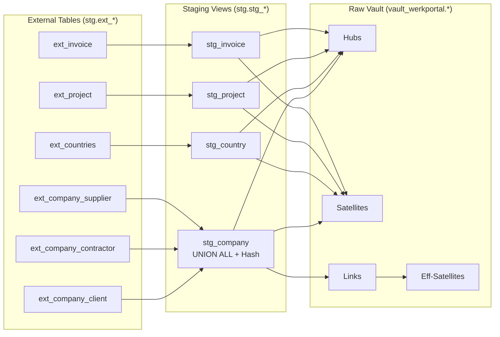

# Raw Vault Design - Werkportal

> Schema: `vault_werkportal`

## Entity-Relationship Diagramm

```mermaid
erDiagram
    %% ============================================
    %% HUBS - Business Keys
    %% ============================================
    
    HUB_COMPANY {
        char64 hk_company PK "SHA256(object_id + source_table)"
        bigint object_id BK "Business Key"
        varchar source_table BK "wp_company_client/contractor/supplier"
        datetime2 dss_load_date
        varchar dss_record_source
    }
    
    HUB_COUNTRY {
        char64 hk_country PK "SHA256(object_id)"
        bigint object_id BK "Business Key"
        datetime2 dss_load_date
        varchar dss_record_source
    }
    
    HUB_PROJECT {
        char64 hk_project PK "SHA256(object_id)"
        bigint object_id BK "Business Key"
        datetime2 dss_load_date
        varchar dss_record_source
    }
    
    HUB_INVOICE {
        char64 hk_invoice PK "SHA256(object_id)"
        bigint object_id BK "Business Key"
        datetime2 dss_load_date
        varchar dss_record_source
    }

    %% ============================================
    %% SATELLITES - Descriptive Attributes
    %% ============================================
    
    SAT_COMPANY {
        char64 hk_company PK_FK
        datetime2 dss_load_date PK
        char64 hd_company "Hash Diff"
        varchar name
        varchar subscription
        varchar org_type
        varchar uid
        varchar description
        varchar street
        varchar citycode
        varchar city
        varchar province
        varchar state
        varchar country
        varchar website
        varchar email
        varchar phone
        char1 dss_is_current "Y/N"
        datetime2 dss_end_date
    }
    
    SAT_COMPANY_CLIENT_EXT {
        char64 hk_company PK_FK
        datetime2 dss_load_date PK
        char64 hd_company_client_ext "Hash Diff"
        datetime2 freistellungsbescheinigung "Nur fuer Clients"
        char1 dss_is_current "Y/N"
        datetime2 dss_end_date
    }
    
    SAT_COUNTRY {
        char64 hk_country PK_FK
        datetime2 dss_load_date PK
        char64 hd_country "Hash Diff"
        varchar name
        char1 dss_is_current "Y/N"
        datetime2 dss_end_date
    }
    
    SAT_PROJECT {
        char64 hk_project PK_FK
        datetime2 dss_load_date PK
        char64 hd_project "Hash Diff"
        varchar name
        varchar state
        datetime2 begin
        varchar location
        decimal price
        decimal commission
        datetime2 end_date
        datetime2 work_begin
        varchar author_email
        text description
        char1 dss_is_current "Y/N"
        datetime2 dss_end_date
    }
    
    SAT_INVOICE {
        char64 hk_invoice PK_FK
        datetime2 dss_load_date PK
        char64 hd_invoice "Hash Diff"
        varchar name
        varchar state
        decimal gross
        int invoicing_period_year
        datetime2 invoice_date
        datetime2 date_payed
        decimal advance_payment
        decimal sum_goal
        decimal sum_payed
        decimal hours_worked
        char1 dss_is_current "Y/N"
        datetime2 dss_end_date
    }

    %% ============================================
    %% LINKS - Relationships
    %% ============================================
    
    LINK_COMPANY_COUNTRY {
        char64 hk_link_company_country PK
        char64 hk_company FK
        char64 hk_country FK
        datetime2 dss_load_date
        varchar dss_record_source
    }
    
    LINK_COMPANY_ROLE {
        char64 hk_link_company_role PK
        char64 hk_company FK
        char64 hk_role FK
        varchar role_code "CLIENT/CONTRACTOR/SUPPLIER"
        datetime2 dss_load_date
        varchar dss_record_source
    }

    %% ============================================
    %% EFFECTIVITY SATELLITE - Relationship History
    %% ============================================
    
    EFF_SAT_COMPANY_COUNTRY {
        char64 hk_link_company_country PK_FK
        datetime2 dss_start_date PK
        char64 hk_company FK
        char64 hk_country FK
        datetime2 dss_end_date "NULL = aktiv"
        char1 dss_is_active "Y/N"
        varchar dss_record_source
    }

    %% ============================================
    %% REFERENCE DATA
    %% ============================================
    
    REF_ROLE {
        varchar role_code PK "CLIENT/CONTRACTOR/SUPPLIER"
        varchar role_name
        varchar role_description
    }

    %% ============================================
    %% RELATIONSHIPS
    %% ============================================
    
    %% Hub to Satellite (1:N - historisiert)
    HUB_COMPANY ||--o{ SAT_COMPANY : "has attributes"
    HUB_COMPANY ||--o| SAT_COMPANY_CLIENT_EXT : "has client attrs"
    HUB_COUNTRY ||--o{ SAT_COUNTRY : "has attributes"
    HUB_PROJECT ||--o{ SAT_PROJECT : "has attributes"
    HUB_INVOICE ||--o{ SAT_INVOICE : "has attributes"
    
    %% Hub to Link
    HUB_COMPANY ||--o{ LINK_COMPANY_COUNTRY : "located in"
    HUB_COUNTRY ||--o{ LINK_COMPANY_COUNTRY : "contains"
    HUB_COMPANY ||--o{ LINK_COMPANY_ROLE : "has role"
    REF_ROLE ||--o{ LINK_COMPANY_ROLE : "defines"
    
    %% Link to Effectivity Satellite
    LINK_COMPANY_COUNTRY ||--o{ EFF_SAT_COMPANY_COUNTRY : "validity period"
```

## Objekt-Übersicht

| Typ | Objekt | Beschreibung |
|-----|--------|--------------|
| **Hub** | `hub_company` | Unternehmen (Client, Contractor, Supplier) |
| **Hub** | `hub_country` | Länder |
| **Hub** | `hub_project` | Projekte |
| **Hub** | `hub_invoice` | Rechnungen |
| **Satellite** | `sat_company` | Gemeinsame Unternehmens-Attribute |
| **Satellite** | `sat_company_client_ext` | Client-spezifische Attribute (Freistellungsbescheinigung) |
| **Satellite** | `sat_country` | Länder-Attribute |
| **Satellite** | `sat_project` | Projekt-Attribute |
| **Satellite** | `sat_invoice` | Rechnungs-Attribute |
| **Link** | `link_company_country` | Unternehmen → Land |
| **Link** | `link_company_role` | Unternehmen → Rolle |
| **Eff-Sat** | `eff_sat_company_country` | Gültigkeitszeiträume Company-Country |
| **Reference** | `ref_role` | Rollen-Stammdaten (Seed) |

## Datenfluss



## Hash Key Berechnung

```sql
-- hub_company: Composite Key (object_id nicht global unique)
CONVERT(CHAR(64), HASHBYTES('SHA2_256', 
    CONCAT(
        ISNULL(CAST(object_id AS NVARCHAR(MAX)), ''),
        '^^',
        ISNULL(source_table, '')
    )
), 2) AS hk_company

-- Andere Hubs: Simple Key
CONVERT(CHAR(64), HASHBYTES('SHA2_256', 
    ISNULL(CAST(object_id AS NVARCHAR(MAX)), '')
), 2) AS hk_<entity>
```

## DV 2.1 Features

- ✅ **Ghost Records** - Zero/Error Keys für fehlende Daten
- ✅ **Current Flag** - `dss_is_current` für aktuellen Stand
- ✅ **End-Dating** - `dss_end_date` für Historisierung
- ✅ **Effectivity Satellite** - Gültigkeitszeiträume für Links
- ⬜ **PIT Table** - Point-in-Time für Zeitreisen (in business_vault)

## Implementierungsstatus

| Objekt | dbt Model | Status |
|--------|-----------|--------|
| `hub_company` | `raw_vault/werkportal/hubs/hub_company.sql` | ✅ Done |
| `hub_country` | `raw_vault/werkportal/hubs/hub_country.sql` | ✅ Done |
| `hub_project` | `raw_vault/werkportal/hubs/hub_project.sql` | ✅ Done |
| `hub_invoice` | `raw_vault/werkportal/hubs/hub_invoice.sql` | ✅ Done |
| `sat_company` | `raw_vault/werkportal/satellites/sat_company.sql` | ✅ Done |
| `sat_company_client_ext` | `raw_vault/werkportal/satellites/sat_company_client_ext.sql` | ✅ Done |
| `sat_country` | `raw_vault/werkportal/satellites/sat_country.sql` | ✅ Done |
| `sat_project` | `raw_vault/werkportal/satellites/sat_project.sql` | ✅ Done |
| `sat_invoice` | `raw_vault/werkportal/satellites/sat_invoice.sql` | ✅ Done |
| `link_company_country` | `raw_vault/werkportal/links/link_company_country.sql` | ✅ Done |
| `link_company_role` | `raw_vault/werkportal/links/link_company_role.sql` | ✅ Done |
| `eff_sat_company_country` | `raw_vault/werkportal/satellites/eff_sat_company_country.sql` | ✅ Done |
