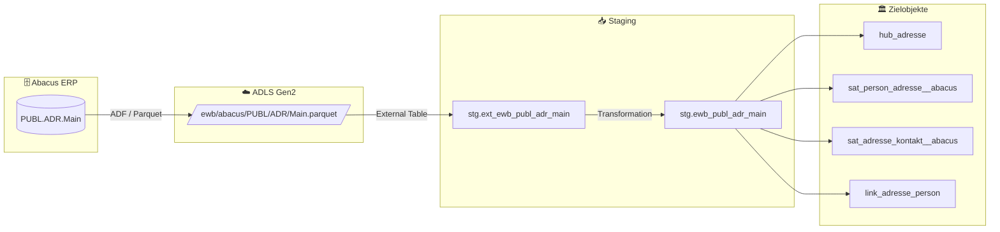

# Staging: adr_main

## Modell & Quelle

- **Modell:** `ewb_publ_adr_main`
- **Quelle:** `PUBL.ADR.Main`
- **Source Model:** `ext_ewb_publ_adr_main`
- **Parquet:** `ewb/abacus/PUBL/ADR/Main.parquet`
- **External Table:** `stg.ext_ewb_publ_adr_main`
- **Staging View:** `stg.ewb_publ_adr_main`
- **Pattern:** automate_dv.stage() mit Multi-Satellite-Split

## Datenfluss

## Business Key(s)

- `INR`
- Normalisierung auf `inr = CAST(CAST(INR AS BIGINT) AS NVARCHAR(MAX))` für Cross-Source-Kompatibilität mit IDMS
- `dss_business_key` wird aus `INR` gebildet

## Abgeleitete Spalten

- `dss_record_source = 'ewb_abacus'`
- `dss_load_date = COALESCE(TRY_CAST(dss_load_date AS DATETIME2), GETDATE())`
- `dss_create_datetime = GETDATE()`
- `inr = CAST(CAST(INR AS BIGINT) AS NVARCHAR(MAX))`
- `dss_business_key = CONCAT_WS(...)` mit `INR`

## Hash Keys & Hash Diffs

| Name | Eingabespalten | Zweck / Ziel |
|------|-----------------|--------------|
| `hk_adresse` | `inr` | `hub_adresse` |
| `hk_person` | `LOHNNR` | FK-Hash zu `hub_person` |
| `hk_link_adresse_person` | `inr`, `LOHNNR` | `link_adresse_person` |
| `hd_person_adresse` | `NAME`, `VORNAME` | `sat_person_adresse__abacus` |
| `hd_adresse_kontakt` | `ORT`, `PLZ`, `STREET` | `sat_adresse_kontakt__abacus` |

## Payload-Spalten

### `sat_person_adresse__abacus` (2)

`NAME`, `VORNAME`

### `sat_adresse_kontakt__abacus` (3)

`ORT`, `PLZ`, `STREET`

## Zielobjekte

- `hub_adresse` — Hub aus `hk_adresse` (BK `INR`)
- `sat_person_adresse__abacus` — Satellite aus `hd_person_adresse`
- `sat_adresse_kontakt__abacus` — Satellite aus `hd_adresse_kontakt`
- `link_adresse_person` — Link aus `hk_link_adresse_person` zu `hub_person`

## Besonderheiten

- `INR` ist in Abacus `DECIMAL(38,18)` und wird vor dem Hashing auf BIGINT-String normalisiert.
- Escaped Source Column: `timestamp_landing-zone`.
- Ein Staging-Modell speist zwei Satellites mit getrennten Hashdiffs.
