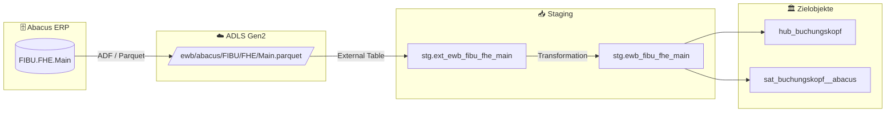

# Staging: fibu_fhe_main

## Modell & Quelle

- **Modell:** `ewb_fibu_fhe_main`
- **Quelle:** `FIBU.FHE.Main`
- **Source Model:** `ext_ewb_fibu_fhe_main`
- **Parquet:** `ewb/abacus/FIBU/FHE/Main.parquet`
- **External Table:** `stg.ext_ewb_fibu_fhe_main`
- **Staging View:** `stg.ewb_fibu_fhe_main`
- **Pattern:** automate_dv.stage()

## Datenfluss

## Business Key(s)

- `RECNUM`
- `dss_business_key` wird aus `RECNUM` gebildet

## Abgeleitete Spalten

- `dss_record_source = 'ewb_abacus'`
- `dss_load_date = COALESCE(TRY_CAST(dss_load_date AS DATETIME2), GETDATE())`
- `dss_create_datetime = GETDATE()`
- `dss_business_key = CONCAT_WS(...)` mit `RECNUM`

## Hash Keys & Hash Diffs

| Name | Eingabespalten | Zweck / Ziel |
|------|-----------------|--------------|
| `hk_buchungskopf` | `RECNUM` | `hub_buchungskopf` |
| `hd_buchungskopf` | `BOTTOM`, `CREDAT`, `CREUSER`, `ENTERPRISE`, `FONTID`, `GUID`, `ID`, `ID_ASCII`, `IDTYP_ASCII`, `INDENT`, `LEVEL`, `MUTDAT`, `MUTUSER`, `PLAN`, `REF_ID`, `REF_LEVEL`, `REF_TYP`, `TYP`, `VARIANTE`, `ZUONR` | `sat_buchungskopf__abacus` |

## Payload-Spalten

### `sat_buchungskopf__abacus` (20)

`BOTTOM`, `CREDAT`, `CREUSER`, `ENTERPRISE`, `FONTID`, `GUID`, `ID`, `ID_ASCII`, `IDTYP_ASCII`, `INDENT`, `LEVEL`, `MUTDAT`, `MUTUSER`, `PLAN`, `REF_ID`, `REF_LEVEL`, `REF_TYP`, `TYP`, `VARIANTE`, `ZUONR`

## Zielobjekte

- `hub_buchungskopf` — Hub aus `hk_buchungskopf` (BK `RECNUM`)
- `sat_buchungskopf__abacus` — Satellite aus `hd_buchungskopf`

## Besonderheiten

- Escaped Source Columns: `PLAN`, `LEVEL`, `BEFORE`, `AFTER`, `timestamp_landing-zone`.
- Die reservierten Keywords werden via `_escape` in `derived_columns` behandelt.
