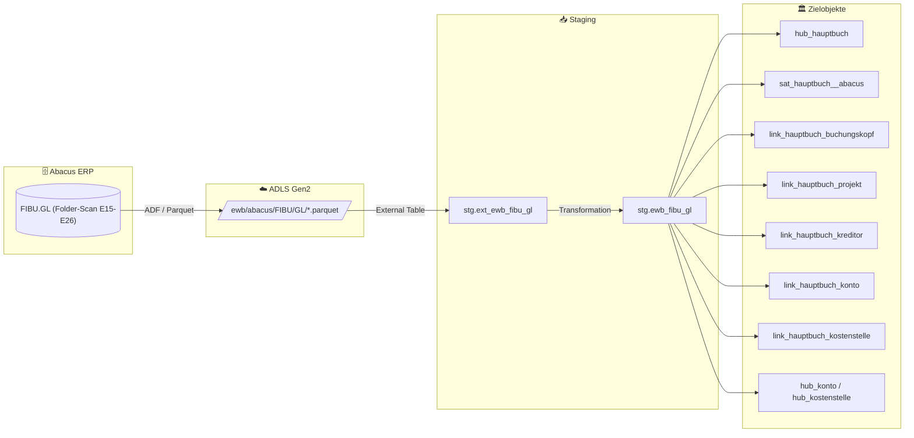

# Staging: fibu_gl

## Modell & Quelle

- **Modell:** `ewb_fibu_gl`
- **Quelle:** `FIBU.GL (Folder-Scan E15-E26)`
- **Source Model:** `psa_ewb_fibu_gl_rolling`
- **Parquet:** `ewb/abacus/FIBU/GL/*.parquet`
- **External Table:** `stg.ext_ewb_fibu_gl`
- **Staging View:** `stg.ewb_fibu_gl`
- **Pattern:** automate_dv.stage() auf Rolling-PSA-Modell

## Datenfluss

## Business Key(s)

- Composite BK: `RECNUM` + `dss_source_file_name`
- `RECNUM` ist nur innerhalb einer Jahresscheibe eindeutig; die Dateimetadaten machen den Key global eindeutig.
- `dss_business_key` wird aus `RECNUM` und `dss_source_file_name` gebildet

## Abgeleitete Spalten

- `dss_record_source = 'ewb_abacus'`
- `dss_load_date = COALESCE(TRY_CAST(dss_load_date AS DATETIME2), GETDATE())`
- `dss_create_datetime = GETDATE()`
- `dss_business_key = CONCAT_WS(...)` mit `RECNUM` und `dss_source_file_name`

## Hash Keys & Hash Diffs

| Name | Eingabespalten | Zweck / Ziel |
|------|-----------------|--------------|
| `hk_hauptbuch` | `RECNUM`, `dss_source_file_name` | `hub_hauptbuch` |
| `hk_buchungskopf` | `DKBELEGNUMMER` | FK-Hash zu `hub_buchungskopf` |
| `hk_kreditor` | `DKKUNDENNUMMER` | FK-Hash zu `hub_kreditor` |
| `hk_konto` | `KTO` | Ghost-Hub `hub_konto` |
| `hk_kostenstelle` | `KST` | Ghost-Hub `hub_kostenstelle` |
| `hk_projekt` | `PROJ` | FK-Hash zu `hub_projekt` |
| `hk_link_hauptbuch_buchungskopf` | `RECNUM`, `dss_source_file_name`, `DKBELEGNUMMER` | `link_hauptbuch_buchungskopf` |
| `hk_link_hauptbuch_projekt` | `RECNUM`, `dss_source_file_name`, `PROJ` | `link_hauptbuch_projekt` |
| `hk_link_hauptbuch_kreditor` | `RECNUM`, `dss_source_file_name`, `DKKUNDENNUMMER` | `link_hauptbuch_kreditor` |
| `hk_link_hauptbuch_konto` | `RECNUM`, `dss_source_file_name`, `KTO` | `link_hauptbuch_konto` |
| `hk_link_hauptbuch_kostenstelle` | `RECNUM`, `dss_source_file_name`, `KST` | `link_hauptbuch_kostenstelle` |
| `hd_hauptbuch` | `BELNR`, `BETRAG`, `CODE`, `COMPANY`, `DATE`, `DIVISION`, `DKKUNDENNUMMER`, `DKPOSNUMMER`, `FBETR`, `FRW`, `FWAUTO`, `GKTO`, `ISO`, `KST`, `KST2`, `MANDANT`, `MWSTBETR`, `MWSTCODE`, `MWSTINCL`, `MWSTJAHR`, `MWSTKTO`, `MWSTLAND`, `MWSTMETH`, `MWSTMONAT`, `MWSTSATZ`, `MWSTTYP`, `PROJ`, `PROJEBENE`, `SAM`, `SAMNR`, `SH`, `TEXT`, `TEXT2`, `WAEHR` | `sat_hauptbuch__abacus` |

## Payload-Spalten

### `sat_hauptbuch__abacus` (34)

`BELNR`, `BETRAG`, `CODE`, `COMPANY`, `DATE`, `DIVISION`, `DKKUNDENNUMMER`, `DKPOSNUMMER`, `FBETR`, `FRW`, `FWAUTO`, `GKTO`, `ISO`, `KST`, `KST2`, `MANDANT`, `MWSTBETR`, `MWSTCODE`, `MWSTINCL`, `MWSTJAHR`, `MWSTKTO`, `MWSTLAND`, `MWSTMETH`, `MWSTMONAT`, `MWSTSATZ`, `MWSTTYP`, `PROJ`, `PROJEBENE`, `SAM`, `SAMNR`, `SH`, `TEXT`, `TEXT2`, `WAEHR`

## Zielobjekte

- `hub_hauptbuch` — Hub aus `hk_hauptbuch`
- `sat_hauptbuch__abacus` — Satellite aus `hd_hauptbuch`
- `link_hauptbuch_buchungskopf` — Link aus `hk_link_hauptbuch_buchungskopf`
- `link_hauptbuch_projekt` — Link aus `hk_link_hauptbuch_projekt`
- `link_hauptbuch_kreditor` — Link aus `hk_link_hauptbuch_kreditor`
- `link_hauptbuch_konto` — Link aus `hk_link_hauptbuch_konto`
- `link_hauptbuch_kostenstelle` — Link aus `hk_link_hauptbuch_kostenstelle`
- `hub_konto / hub_kostenstelle` — Ghost-Hub-Referenzen aus `KTO` und `KST`

## Besonderheiten

- Rolling-2-Jahres-Filter kommt aus dem vorgelagerten PSA-Modell `psa_ewb_fibu_gl_rolling`.
- Escaped Source Columns: `DATE`, `TEXT`, `timestamp_landing-zone`.
- Mehrere Link-Hashes werden aus demselben Staging erzeugt; das Modell ist Link-Treiber für Buchungskopf, Projekt, Kreditor, Konto und Kostenstelle.
