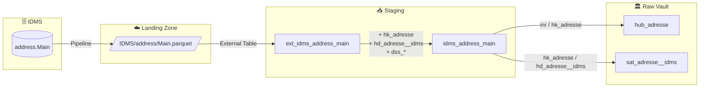

# Staging: idms_address_main

## Quellsystem

- **System:** IDMS
- **Schema:** address
- **Tabelle:** Main
- **Parquet:** `IDMS/address/Main.parquet`
- **Ladefrequenz:** daily
- **External Table:** `stg.ext_idms_address_main`
- **Staging View:** `stg.idms_address_main`
- **Target:** `vault.hub_adresse`, `vault.sat_adresse__idms`

## Datenfluss



## Business Key und Hashes

- **Original Business Key:** `id`
- **Harmonisierter Business Key:** `inr = CAST(id AS NVARCHAR(MAX))`
- **Hash Key:** `hk_adresse` — bewusst **nicht** `hk_idms_address`, da der Datensatz in den Multi-Source-Hub `hub_adresse` integriert wird
- **Hash Diff:** `hd_adresse__idms` über 21 fachliche Attribute
- **Record Source:** `ewb_idms`
- **Load Date:** `dss_load_date = COALESCE(TRY_CAST([timestamp_landing-zone] AS DATETIME2), GETDATE())`
- **Hashdiff-Ausnahme:** `ts` und `timestamp_landing-zone` werden nicht in den Hashdiff aufgenommen

```sql
inr                  = CAST(id AS NVARCHAR(MAX))
hk_adresse           = SHA2_256(inr)
hd_adresse__idms     = SHA2_256(anrede, cust_id, egid, emailaddr, fax, firma, flags,
                                free_field, mandate_id, nachname, plzort, postfach,
                                ref, status, strasse, strasse_nr, tel, telg, telm,
                                vorname, zusatz)
dss_record_source    = 'ewb_idms'
dss_load_date        = TRY_CAST([timestamp_landing-zone] AS DATETIME2)
```

## Spaltenübersicht

| Spalte | Typ | Kategorie | Kommentar |
|--------|-----|-----------|-----------|
| `hk_adresse` | `char(64)` | Hash Key | Gemeinsamer Hash Key für `hub_adresse` |
| `hd_adresse__idms` | `char(64)` | Hash Diff | Änderungserkennung für IDMS-Adressattribute |
| `inr` | `nvarchar(max)` | Business Key | Harmonisiertes BK-Alias für Cross-Source-Integration |
| `id` | `int` | Business Key | Originale IDMS-Adress-ID |
| `cust_id` | `int` | Referenz | Kunden-ID |
| `ref` | `nvarchar(4000)` | Referenz | Freie Referenz |
| `flags` | `int` | Referenz | Status-/Steuerflags |
| `mandate_id` | `int` | Referenz | Mandanten-ID |
| `free_field` | `nvarchar(4000)` | Attribut | Freitextfeld |
| `firma` | `nvarchar(4000)` | Identität | Firmenname |
| `anrede` | `int` | Identität | Anredecode |
| `nachname` | `nvarchar(4000)` | Identität | Nachname |
| `vorname` | `nvarchar(4000)` | Identität | Vorname |
| `zusatz` | `nvarchar(4000)` | Identität | Adresszusatz |
| `strasse` | `nvarchar(4000)` | Adresse | Strassenname |
| `strasse_nr` | `nvarchar(4000)` | Adresse | Hausnummer |
| `postfach` | `nvarchar(4000)` | Adresse | Postfach |
| `plzort` | `int` | Adresse | PLZ/Ort-Referenz |
| `tel` | `nvarchar(4000)` | Kontakt | Telefon |
| `fax` | `nvarchar(4000)` | Kontakt | Fax |
| `telg` | `nvarchar(4000)` | Kontakt | Geschäftstelefon |
| `telm` | `nvarchar(4000)` | Kontakt | Mobiltelefon |
| `emailaddr` | `nvarchar(4000)` | Kontakt | E-Mail-Adresse |
| `status` | `int` | Status | Fachlicher Status |
| `ts` | `nvarchar(4000)` | System | Systemzeitstempel, nur passthrough |
| `egid` | `int` | Referenz | Gebäudeidentifikator |
| `dss_record_source` | `varchar(100)` | Metadata | Konstant `ewb_idms` |
| `dss_load_date` | `datetime2(7)` | Metadata | Aus `timestamp_landing-zone` abgeleitet |
| `dss_create_datetime` | `datetime2(7)` | Metadata | dbt-Verarbeitungszeitpunkt |
| `dss_business_key` | `nvarchar(4000)` | Metadata | Konkatenierter BK-String für den Hub |

## Datenqualität

- [x] NOT NULL auf `id`, `inr`, `hk_adresse`, `hd_adresse__idms`
- [x] Cross-Source-BK harmonisiert (`id` → `inr`) für `hub_adresse`
- [x] `dss_record_source` fix auf `ewb_idms`
- [x] `dss_load_date` aus `timestamp_landing-zone`
- [ ] Referentielle Integrität von `cust_id` / `mandate_id` in nachgelagerten Modellen prüfen
