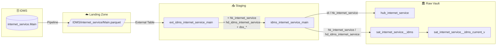

# Staging: idms_internet_service_main

## Quellsystem

- **System:** IDMS
- **Schema:** internet_service
- **Tabelle:** Main
- **Parquet:** `IDMS/internet_service/Main.parquet`
- **Ladefrequenz:** daily
- **External Table:** `stg.ext_idms_internet_service_main`
- **Staging View:** `stg.idms_internet_service_main`
- **Target:** `vault.hub_internet_service`, `vault.sat_internet_service__idms`, `vault.sat_internet_service__idms_current_v`

## Datenfluss



## Business Key und Hashes

- **Business Key:** `id`
- **Hash Key:** `hk_internet_service = SHA2_256(id)`
- **Hash Diff:** `hd_idms_internet_service`
- **Record Source:** `ewb_idms`
- **Reserved Keywords:** `start` und `end` werden per `_escape` für SQL Server escaped
- **Payload:** `timestamp_landing-zone`, `service_subscription_id`, `start`, `subscription_id`, `price_override`, `plusip`, `plusemail`, `managed_wlan`, `invoice_type`, `end`, `custom_attr`, `charge_add_mb`, `id`

```sql
hk_internet_service       = SHA2_256(id)
hd_idms_internet_service  = SHA2_256(charge_add_mb, custom_attr, end, id,
                                      invoice_type, managed_wlan, plusemail,
                                      plusip, price_override, service_subscription_id,
                                      start, subscription_id, timestamp_landing-zone)
dss_record_source         = 'ewb_idms'
dss_load_date             = COALESCE(TRY_CAST(dss_load_date AS DATETIME2), GETDATE())
```

## Spaltenübersicht

| Spalte | Typ | Kategorie | Kommentar |
|--------|-----|-----------|-----------|
| `hk_internet_service` | `char(64)` | Hash Key | Primärschlüssel für `hub_internet_service` |
| `id` | `int` | Business Key | IDMS Internet-Service-ID |
| `service_subscription_id` | `int` | Referenz | FK auf Service Subscription |
| `start` | `nvarchar(4000)` | Zeit | Startdatum/-zeitpunkt |
| `end` | `nvarchar(4000)` | Zeit | Enddatum/-zeitpunkt |
| `subscription_id` | `int` | Referenz | FK auf Subscription |
| `invoice_type` | `int` | Status | Rechnungstyp |
| `price_override` | `real` | Attribut | Individueller Preis |
| `charge_add_mb` | `int` | Attribut | Zusatzkosten pro MB |
| `plusemail` | `int` | Option | Plus-E-Mail aktiviert |
| `plusip` | `int` | Option | Plus-IP aktiviert |
| `custom_attr` | `nvarchar(4000)` | Attribut | Benutzerdefinierte Attribute |
| `managed_wlan` | `nvarchar(4000)` | Attribut | Managed-WLAN-Merkmal |
| `timestamp_landing-zone` | `nvarchar(4000)` | System | Landing-Zone-Zeitstempel |
| `dss_record_source` | `varchar(100)` | Metadata | Konstant `ewb_idms` |
| `dss_load_date` | `datetime2(7)` | Metadata | Gemäss Staging-Modell mit `TRY_CAST(..., GETDATE())` |
| `dss_create_datetime` | `datetime2(7)` | Metadata | dbt-Verarbeitungszeitpunkt |
| `dss_business_key` | `nvarchar(4000)` | Metadata | Konkatenierter BK-String für den Hub |

## Datenqualität

- [x] NOT NULL auf `id` und `hk_internet_service`
- [x] `dss_record_source` fix auf `ewb_idms`
- [x] SQL-Server-Escaping für `start` und `end` vorgesehen
- [x] Hashdiff deckt alle fachlichen Payload-Spalten ab
- [ ] Referentielle Integrität von `service_subscription_id` und `subscription_id` fachlich absichern
