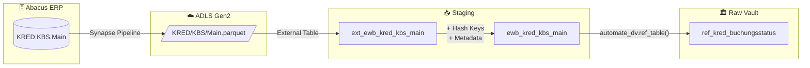

# Staging: kred_buchungsstatus

## Quellsystem

- **System:** Abacus ERP (EWB)
- **Schema:** KRED
- **Tabelle:** KBS.Main
- **Ladefrequenz:** daily

## Datenfluss



## Spalten-Mapping

| Quellspalte | Ziel-Spalte | Transformation | Kommentar |
|-------------|-------------|----------------|-----------|
| `STATID` | `STATID` | — | Business Key (Status-ID) |
| `STATDEF` | `STATDEF` | — | Status-Definition |
| `SWINAKT` | `SWINAKT` | — | Switch Inaktiv |
| `SWVORS` | `SWVORS` | — | Switch Vorsystem |
| `SWNOBLVAL` | `SWNOBLVAL` | — | Switch keine BL-Validierung |
| `SWNOPSVAL` | `SWNOPSVAL` | — | Switch keine PS-Validierung |
| `SWPBLDEL` | `SWPBLDEL` | — | Switch Public Delete |
| `VERSION` | `VERSION` | — | Versionskennung |
| — | `hk_kred_buchungsstatus` | `SHA2_256(STATID)` | Hash Key |
| — | `hd_kred_buchungsstatus` | `SHA2_256(STATDEF,SWINAKT,...)` | Hash Diff |
| — | `dss_load_date` | `COALESCE(TRY_CAST(...), GETDATE())` | Metadata |
| — | `dss_record_source` | `'ewb_abacus'` | Metadata |

## Business Keys

```sql
-- Hash Key Berechnung
CONVERT(CHAR(64), HASHBYTES('SHA2_256', 
    ISNULL(CAST(STATID AS NVARCHAR(MAX)), '')
), 2) AS hk_kred_buchungsstatus
```

## Datenqualität

- [x] NOT NULL Check auf Business Key (STATID)
- [x] Duplikat-Check auf Business Key (STATID)
- [x] NOT NULL Check auf Hash Key (hk_kred_buchungsstatus)
- [x] Unique Check auf Hash Key (hk_kred_buchungsstatus)
- [x] NOT NULL Check auf Hash Diff (hd_kred_buchungsstatus)

## Besonderheiten

- **Reference Table:** KBS ist eine Status-Konfigurationstabelle, kein Hub/Satellite.
  Nur 7 stabile Einträge. Wird als `ref_kred_buchungsstatus` im Vault materialisiert.
- **Mart-Bezug:** KBL.STATID → KBS.STATID für Status-Auflösung bei Kreditorenbelegen.
- **automate_dv.stage():** Verwendet das Standard-Pattern mit Hash Keys für Konsistenz,
  obwohl die Downstream-Verwendung eine Reference Table ist.
