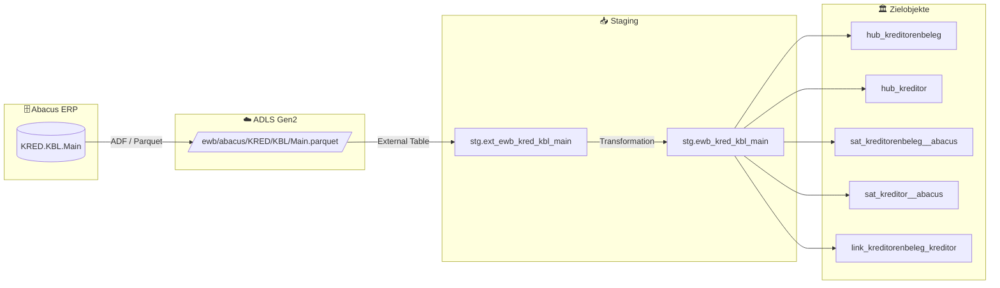

# Staging: kred_kbl_main

## Modell & Quelle

- **Modell:** `ewb_kred_kbl_main`
- **Quelle:** `KRED.KBL.Main`
- **Source Model:** `ext_ewb_kred_kbl_main`
- **Parquet:** `ewb/abacus/KRED/KBL/Main.parquet`
- **External Table:** `stg.ext_ewb_kred_kbl_main`
- **Staging View:** `stg.ewb_kred_kbl_main`
- **Pattern:** automate_dv.stage() mit Ghost-Hub-Ableitung

## Datenfluss

## Business Key(s)

- `BELNR`
- `KNR` als Ghost-Hub-BK fuer Kreditor
- `dss_business_key` wird aus `BELNR` gebildet

## Abgeleitete Spalten

- `dss_record_source = 'ewb_abacus'`
- `dss_load_date = COALESCE(TRY_CAST(dss_load_date AS DATETIME2), GETDATE())`
- `dss_create_datetime = GETDATE()`
- `dss_business_key = CONCAT_WS(...)` mit `BELNR`

## Hash Keys & Hash Diffs

| Name | Eingabespalten | Zweck / Ziel |
|------|-----------------|--------------|
| `hk_kreditorenbeleg` | `BELNR` | `hub_kreditorenbeleg` |
| `hk_kreditor` | `KNR` | `hub_kreditor` (Ghost Hub) |
| `hk_link_kreditorenbeleg_kreditor` | `BELNR`, `KNR` | `link_kreditorenbeleg_kreditor` |
| `hd_kreditorenbeleg` | `BELART`, `BELDEF`, `BELREF`, `BWBTR`, `BWOPBTR`, `BWWRC`, `ERFDAT`, `ERFUSER`, `FBELDAT`, `FRIST`, `GESPERRT`, `KBELDAT`, `KDSPDAT`, `KST1`, `KST2`, `LETZTEZLG`, `LWBTR`, `LWOPBTR`, `LWWRC`, `MUTDAT`, `MWSBWBTR`, `MWSLWBTR`, `PROJEKT`, `SKONTO1P`, `SKONTO1T`, `SKONTO2P`, `SKONTO2T`, `SKONTO3P`, `SKONTO3T`, `STATDEF`, `STATID`, `USER_F`, `ZLGWEG` | `sat_kreditorenbeleg__abacus` |
| `hd_kreditor` | `ADRID`, `FADRINR` | `sat_kreditor__abacus` |

## Payload-Spalten

### `sat_kreditorenbeleg__abacus` (33)

`BELART`, `BELDEF`, `BELREF`, `BWBTR`, `BWOPBTR`, `BWWRC`, `ERFDAT`, `ERFUSER`, `FBELDAT`, `FRIST`, `GESPERRT`, `KBELDAT`, `KDSPDAT`, `KST1`, `KST2`, `LETZTEZLG`, `LWBTR`, `LWOPBTR`, `LWWRC`, `MUTDAT`, `MWSBWBTR`, `MWSLWBTR`, `PROJEKT`, `SKONTO1P`, `SKONTO1T`, `SKONTO2P`, `SKONTO2T`, `SKONTO3P`, `SKONTO3T`, `STATDEF`, `STATID`, `USER_F`, `ZLGWEG`

### `sat_kreditor__abacus` (2)

`ADRID`, `FADRINR`

## Zielobjekte

- `hub_kreditorenbeleg` — Hub aus `hk_kreditorenbeleg`
- `hub_kreditor` — Ghost Hub aus `hk_kreditor`
- `sat_kreditorenbeleg__abacus` — Satellite aus `hd_kreditorenbeleg`
- `sat_kreditor__abacus` — Satellite aus `hd_kreditor`
- `link_kreditorenbeleg_kreditor` — Link aus `hk_link_kreditorenbeleg_kreditor`

## Besonderheiten

- Escaped Source Column: `timestamp_landing-zone`.
- Das Modell speist sowohl einen fachlichen Hub (`hub_kreditorenbeleg`) als auch einen Ghost Hub (`hub_kreditor`).
