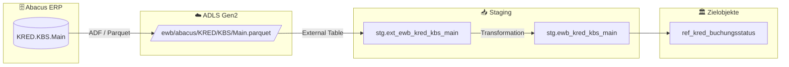

# Staging: kred_kbs_main

## Modell & Quelle

- **Modell:** `ewb_kred_kbs_main`
- **Quelle:** `KRED.KBS.Main`
- **Source Model:** `ext_ewb_kred_kbs_main`
- **Parquet:** `ewb/abacus/KRED/KBS/Main.parquet`
- **External Table:** `stg.ext_ewb_kred_kbs_main`
- **Staging View:** `stg.ewb_kred_kbs_main`
- **Pattern:** automate_dv.stage() fuer Referenzdaten

## Datenfluss

## Business Key(s)

- `STATID`
- `dss_business_key` wird aus `STATID` gebildet

## Abgeleitete Spalten

- `dss_record_source = 'ewb_abacus'`
- `dss_load_date = COALESCE(TRY_CAST(dss_load_date AS DATETIME2), GETDATE())`
- `dss_create_datetime = GETDATE()`
- `dss_business_key = CONCAT_WS(...)` mit `STATID`

## Hash Keys & Hash Diffs

| Name | Eingabespalten | Zweck / Ziel |
|------|-----------------|--------------|
| `hk_kred_buchungsstatus` | `STATID` | technischer Hash fuer Referenzsatz |
| `hd_kred_buchungsstatus` | `STATDEF`, `SWINAKT`, `SWNOBLVAL`, `SWNOPSVAL`, `SWPBLDEL`, `SWVORS`, `VERSION` | Aenderungserkennung fuer Referenzdaten |

## Payload-Spalten

### `ref_kred_buchungsstatus` (7)

`STATDEF`, `SWINAKT`, `SWNOBLVAL`, `SWNOPSVAL`, `SWPBLDEL`, `SWVORS`, `VERSION`

## Zielobjekte

- `ref_kred_buchungsstatus` — Reference Table aus Status-Konfiguration

## Besonderheiten

- Kleine Konfigurationstabelle mit stabilen Statuswerten; Ziel ist eine Reference Table, kein Hub/Satellite-Pattern.
- Escaped Source Column: `timestamp_landing-zone`.
