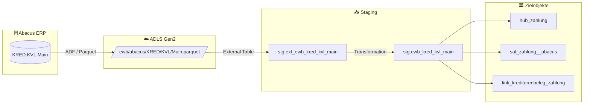

# Staging: kred_kvl_main

## Modell & Quelle

- **Modell:** `ewb_kred_kvl_main`
- **Quelle:** `KRED.KVL.Main`
- **Source Model:** `ext_ewb_kred_kvl_main`
- **Parquet:** `ewb/abacus/KRED/KVL/Main.parquet`
- **External Table:** `stg.ext_ewb_kred_kvl_main`
- **Staging View:** `stg.ewb_kred_kvl_main`
- **Pattern:** automate_dv.stage()

## Datenfluss

## Business Key(s)

- Composite BK: `DOCUMENTNR`, `POSITIONNR`, `ELEMENTTYP`, `INR`
- `dss_business_key` wird aus allen vier BK-Spalten gebildet

## Abgeleitete Spalten

- `dss_record_source = 'ewb_abacus'`
- `dss_load_date = COALESCE(TRY_CAST(dss_load_date AS DATETIME2), GETDATE())`
- `dss_create_datetime = GETDATE()`
- `dss_business_key = CONCAT_WS(...)` mit `DOCUMENTNR`, `POSITIONNR`, `ELEMENTTYP`, `INR`

## Hash Keys & Hash Diffs

| Name | Eingabespalten | Zweck / Ziel |
|------|-----------------|--------------|
| `hk_zahlung` | `DOCUMENTNR`, `POSITIONNR`, `ELEMENTTYP`, `INR` | `hub_zahlung` |
| `hk_kreditorenbeleg` | `DOCUMENTNR` | FK-Hash zu `hub_kreditorenbeleg` |
| `hk_link_kreditorenbeleg_zahlung` | `DOCUMENTNR`, `DOCUMENTNR`, `POSITIONNR`, `ELEMENTTYP`, `INR` | `link_kreditorenbeleg_zahlung` |
| `hd_zahlung` | `ABACUS_USR_GUID`, `ABACUS_USR_NAME`, `ABGELEHNT`, `AKTION_DATUM_ZEIT`, `BEMERKUNG`, `BENACH_GESANDT`, `DATUM_ZEIT`, `FREIGABEBETRAG`, `MSGTASKSTATUS`, `RGPRUEFUNG`, `STATUSID`, `STVVISA`, `SUBDOCUMENTNR`, `VALIDVISUM`, `VER`, `VISIERT`, `VISUMSTYP` | `sat_zahlung__abacus` |

## Payload-Spalten

### `sat_zahlung__abacus` (17)

`ABACUS_USR_GUID`, `ABACUS_USR_NAME`, `ABGELEHNT`, `AKTION_DATUM_ZEIT`, `BEMERKUNG`, `BENACH_GESANDT`, `DATUM_ZEIT`, `FREIGABEBETRAG`, `MSGTASKSTATUS`, `RGPRUEFUNG`, `STATUSID`, `STVVISA`, `SUBDOCUMENTNR`, `VALIDVISUM`, `VER`, `VISIERT`, `VISUMSTYP`

## Zielobjekte

- `hub_zahlung` — Hub aus `hk_zahlung`
- `sat_zahlung__abacus` — Satellite aus `hd_zahlung`
- `link_kreditorenbeleg_zahlung` — Link aus `hk_link_kreditorenbeleg_zahlung`

## Besonderheiten

- Composite BK mit vier Teilen; die Eindeutigkeit ist laut Modellkommentar verifiziert.
- Escaped Source Column: `timestamp_landing-zone`.
- Der Link-Hash wiederholt `DOCUMENTNR`, weil sowohl Beleg- als auch Zahlungsseite aus Source-Spalten aufgebaut werden.
