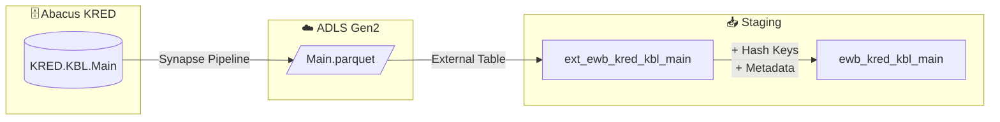

# Staging: kreditorenbeleg

## Quellsystem

- **System:** Abacus ERP (EWB)
- **Schema:** KRED
- **Tabelle:** KBL.Main
- **Ladefrequenz:** daily
- **Parquet:** `ewb/abacus/KRED/KBL/Main.parquet`

## Datenfluss



## Spalten-Mapping

| Quellspalte | Ziel-Spalte | Transformation | Kommentar |
|-------------|-------------|----------------|-----------|
| `BELNR` | `BELNR` | - | Business Key (Kreditorenbeleg) |
| `KNR` | `KNR` | - | Business Key (Ghost Hub Kreditor) |
| - | `hk_kreditorenbeleg` | `SHA2_256(BELNR)` | Hash Key |
| - | `hk_kreditor` | `SHA2_256(KNR)` | Hash Key (Ghost Hub) |
| - | `hk_link_kreditorenbeleg_kreditor` | `SHA2_256(BELNR, KNR)` | Link Hash Key |
| - | `hd_kreditorenbeleg` | `SHA2_256(116 cols)` | Hash Diff |
| - | `hd_kreditor` | `SHA2_256(ADRID)` | Hash Diff (Ghost Hub) |
| - | `dss_record_source` | `'ewb_abacus'` | Metadata |
| - | `dss_load_date` | `COALESCE(TRY_CAST(...))` | Metadata |
| - | `dss_business_key` | `CONCAT_WS('||', ...)` | Composite Key |

## Business Keys

```sql
-- Hash Key Berechnung: hub_kreditorenbeleg
CONVERT(CHAR(64), HASHBYTES('SHA2_256',
    ISNULL(CAST(BELNR AS NVARCHAR(MAX)), '')
), 2) AS hk_kreditorenbeleg

-- Hash Key Berechnung: hub_kreditor (Ghost Hub)
CONVERT(CHAR(64), HASHBYTES('SHA2_256',
    ISNULL(CAST(KNR AS NVARCHAR(MAX)), '')
), 2) AS hk_kreditor

-- Link Hash Key
CONVERT(CHAR(64), HASHBYTES('SHA2_256',
    ISNULL(CAST(BELNR AS NVARCHAR(MAX)), '') + '||' +
    ISNULL(CAST(KNR AS NVARCHAR(MAX)), '')
), 2) AS hk_link_kreditorenbeleg_kreditor
```

## Raw Vault Zielobjekte

| Objekt | Typ | Business Key | Quelle |
|--------|-----|-------------|--------|
| `hub_kreditorenbeleg` | Hub | BELNR | hk_kreditorenbeleg |
| `hub_kreditor` | Hub (Ghost) | KNR | hk_kreditor |
| `sat_kreditorenbeleg` | Satellite | hk_kreditorenbeleg | hd_kreditorenbeleg |
| `sat_kreditor` | Satellite (Ghost) | hk_kreditor | hd_kreditor |
| `link_kreditorenbeleg_kreditor` | Link | hk_kreditorenbeleg + hk_kreditor | hk_link_kreditorenbeleg_kreditor |

## Datenqualität

- [x] NOT NULL Check auf BELNR (Business Key)
- [x] NOT NULL Check auf KNR (Ghost Hub Business Key)
- [x] UNIQUE Check auf hk_kreditorenbeleg
- [x] NOT NULL Check auf hd_kreditorenbeleg, hd_kreditor
- [x] NOT NULL Check auf dss_record_source, dss_load_date
- [ ] Referentielle Integrität zu hub_kreditor (nach Vault-Erstellung)

## Besonderheiten

- **Ghost Hub:** `hub_kreditor` wird aus Transaktionsdaten (Belege) erstellt, da kein dedizierter Kreditorenstamm im Scope
- **Escaped Columns:** `timestamp_landing-zone` (Hyphen im Spaltennamen)
- **Keine APPSTR Spalten:** Alle Spalten sind hashbar (kein VARBINARY)
- **116 Spalten im Hashdiff:** Alle Payload-Spalten außer SYSKEY, RECNUM, DB (System), BKs und Metadata
- **Spaltenanzahl:** 127 Quellspalten total
