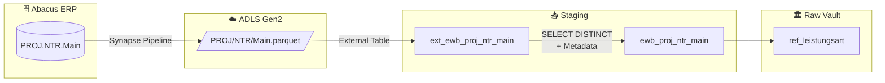

# Staging: Leistungsart (Reference Table)

## Quellsystem

- **System:** Abacus ERP (EWB)
- **Modul:** PROJ (Projektverwaltung)
- **Tabelle:** NTR.Main
- **Parquet:** `ewb/abacus/PROJ/NTR/Main.parquet`
- **Ladefrequenz:** Daily (Full Load)
- **External Table:** `ext_ewb_proj_ntr_main`
- **Staging View:** `ewb_proj_ntr_main`
- **Target:** `ref_leistungsart`

## Datenfluss

## Pattern: Reference Table

Dies ist eine **Reference Table** — kein Hub/Satellite-Pattern:
- **Kein Hash Key** (kein `hk_*`)
- **Kein Hash Diff** (kein `hd_*`)
- Nur die fachlichen Spalten + `dss_*` Metadata
- **Deduplizierung:** `SELECT DISTINCT` auf die Business-Spalten (NUMBER, DESCRIPTION, TYPE, INAKTIV)

### Warum Deduplizierung?

Die Quelltabelle `PROJ.NTR.Main` enthält ca. 1000 Zeilen, aber nur **29 distinct Leistungsarten** (NUMBER-Werte). Die Duplikate entstehen durch Zuordnungen pro Mitarbeiter. Für die Referenztabelle brauchen wir nur die eindeutigen Leistungsarten.

## Spalten-Mapping

| Quellspalte | Ziel-Spalte | Typ | Transformation | Kommentar |
|-------------|-------------|-----|----------------|-----------|
| `NUMBER` | `number` | `INT` | `CAST(... AS INT)` | Primary Key — Leistungsart-Code (1000, 1010, etc.) |
| `DESCRIPTION` | `description` | `NVARCHAR(4000)` | — | Bezeichnung der Leistungsart |
| `TYPE` | `type` | `INT` | `CAST(... AS INT)` | Typ (Reserved Keyword → `[TYPE]`) |
| `INAKTIV` | `inaktiv` | `INT` | `CAST(... AS INT)` | Inaktiv-Flag (0/1) |
| — | `dss_record_source` | `VARCHAR(100)` | `'ewb_abacus'` | Hardcoded (Deduplizierung) |
| — | `dss_load_date` | `DATETIME2` | `GETDATE()` | Hardcoded (Deduplizierung) |

## Datenqualität

- [x] NOT NULL + UNIQUE auf `number` (Primary Key)
- [x] NOT NULL auf `dss_record_source`, `dss_load_date`
- [x] SELECT DISTINCT eliminiert Mitarbeiter-Duplikate
- [ ] Referentielle Integrität zu Zeiterfassungs-Einträgen (Mart-Ebene)

## Nicht selektierte Quellspalten

Folgende Spalten der Quelle werden **nicht** in die Staging-View übernommen:

| Spalte | Grund |
|--------|-------|
| `RECNUM` | Technischer Datensatz-Key, nicht fachlich relevant |
| `DATASET` | Mandanten-ID, nicht benötigt |
| `CONDITION` | Bedingung, nicht relevant für Referenz |
| `VARIANT` / `NEXTVARIANT` | Varianten-Steuerung |
| `VISUM` | Visum-Flag |
| `RULESETTYPE` | Regelwerk-Typ |
| `VARDATA` | `VARBINARY(MAX)` — Binärdaten, nicht nutzbar |
