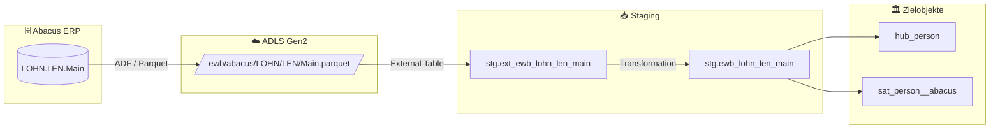

# Staging: lohn_len_main

## Modell & Quelle

- **Modell:** `ewb_lohn_len_main`
- **Quelle:** `LOHN.LEN.Main`
- **Source Model:** `ewb_lohn_len_dedup`
- **Parquet:** `ewb/abacus/LOHN/LEN/Main.parquet`
- **External Table:** `stg.ext_ewb_lohn_len_main`
- **Staging View:** `stg.ewb_lohn_len_main`
- **Pattern:** automate_dv.stage() auf Dedup-View

## Datenfluss

## Business Key(s)

- `EMPL_NR`
- `dss_business_key` wird aus `EMPL_NR` gebildet

## Abgeleitete Spalten

- `dss_record_source = 'ewb_abacus'`
- `dss_load_date = COALESCE(TRY_CAST(dss_load_date AS DATETIME2), GETDATE())`
- `dss_create_datetime = GETDATE()`
- `dss_business_key = CONCAT_WS(...)` mit `EMPL_NR`

## Hash Keys & Hash Diffs

| Name | Eingabespalten | Zweck / Ziel |
|------|-----------------|--------------|
| `hk_person` | `EMPL_NR` | `hub_person` |
| `hd_person` | `ABRV`, `ADR_INR`, `BADGE_ID`, `BIRTH_PLACE`, `BIRTHDAY`, `DATE_IN`, `DATE_OUT`, `EMPL_ID`, `FIRST_NAME`, `HOME_DEPT_NR`, `LAST_NAME`, `MUTATION_DATE`, `NATIONALITY`, `RELEVANT_FOR_LOGIB`, `SEX`, `SOC_INSURANCE_NR`, `TYPE`, `ZEMIS_NR` | `sat_person__abacus` |

## Payload-Spalten

### `sat_person__abacus` (18)

`ABRV`, `ADR_INR`, `BADGE_ID`, `BIRTH_PLACE`, `BIRTHDAY`, `DATE_IN`, `DATE_OUT`, `EMPL_ID`, `FIRST_NAME`, `HOME_DEPT_NR`, `LAST_NAME`, `MUTATION_DATE`, `NATIONALITY`, `RELEVANT_FOR_LOGIB`, `SEX`, `SOC_INSURANCE_NR`, `TYPE`, `ZEMIS_NR`

## Zielobjekte

- `hub_person` — Hub aus `hk_person`
- `sat_person__abacus` — Satellite aus `hd_person`

## Besonderheiten

- Quelle ist das bereinigte Zwischenmodell `ewb_lohn_len_dedup`, nicht direkt die External Table.
- `LPE_YEAR` und `LPE_MONTH` sind bewusst nicht im Hashdiff, damit Periodenwechsel keine Pseudo-SCD2-Versionen erzeugen.
- Escaped Source Columns: `TYPE`, `timestamp_landing-zone`.
