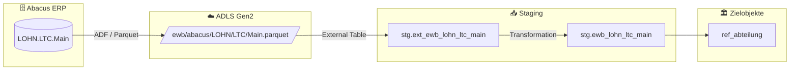

# Staging: lohn_ltc_main

## Modell & Quelle

- **Modell:** `ewb_lohn_ltc_main`
- **Quelle:** `LOHN.LTC.Main`
- **Source Model:** `ext_ewb_lohn_ltc_main`
- **Parquet:** `ewb/abacus/LOHN/LTC/Main.parquet`
- **External Table:** `stg.ext_ewb_lohn_ltc_main`
- **Staging View:** `stg.ewb_lohn_ltc_main`
- **Pattern:** Custom SQL fuer Reference Table

## Datenfluss

## Business Key(s)

- `NR`

## Abgeleitete Spalten

- `nr = NR`
- `description = TEXT`
- `group_nr = [GROUP]`
- `dss_record_source = COALESCE(dss_record_source, 'ewb_abacus')`
- `dss_load_date = COALESCE(TRY_CAST(dss_load_date AS DATETIME2), GETDATE())`

## Hash Keys & Hash Diffs

| Name | Eingabespalten | Zweck / Ziel |
|------|-----------------|--------------|
| — | — | Keine Hash Keys oder Hash Diffs in diesem Modell |

## Payload-Spalten

### `ref_abteilung` (3)

`NR`, `TEXT`, `[GROUP] -> group_nr`

## Zielobjekte

- `ref_abteilung` — Reference Table fuer Abteilungen

## Besonderheiten

- Keine `hk_*` / `hd_*`; das Modell bereitet Referenzdaten direkt fuer `ref_abteilung` auf.
- Reserved Keyword: `[GROUP]` wird explizit escaped und auf `group_nr` umbenannt.
- Filter `WHERE [GROUP] = 1` laesst nur echte Abteilungszeilen durch.
