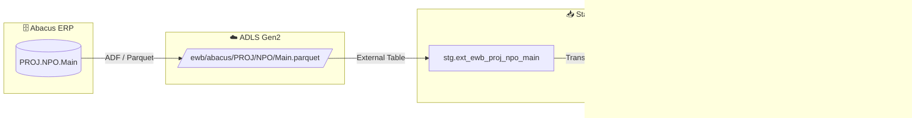

# Staging: proj_npo_main

## Modell & Quelle

- **Modell:** `ewb_proj_npo_main`
- **Quelle:** `PROJ.NPO.Main`
- **Source Model:** `ext_ewb_proj_npo_main`
- **Parquet:** `ewb/abacus/PROJ/NPO/Main.parquet`
- **External Table:** `stg.ext_ewb_proj_npo_main`
- **Staging View:** `stg.ewb_proj_npo_main`
- **Pattern:** automate_dv.stage()

## Datenfluss

## Business Key(s)

- `PROJNR`
- `dss_business_key` wird aus `PROJNR` gebildet

## Abgeleitete Spalten

- `dss_record_source = 'ewb_abacus'`
- `dss_load_date = COALESCE(TRY_CAST(dss_load_date AS DATETIME2), GETDATE())`
- `dss_create_datetime = GETDATE()`
- `dss_business_key = CONCAT_WS(...)` mit `PROJNR`

## Hash Keys & Hash Diffs

| Name | Eingabespalten | Zweck / Ziel |
|------|-----------------|--------------|
| `hk_projekt` | `PROJNR` | `hub_projekt` |
| `hd_projekt` | `CREATION`, `INAKTIV`, `PROJGROUP`, `PROJNAME`, `REFPROJNR`, `STATUS`, `STATUS1`, `STATUSDEF` | `sat_projekt__abacus` |

## Payload-Spalten

### `sat_projekt__abacus` (8)

`CREATION`, `INAKTIV`, `PROJGROUP`, `PROJNAME`, `REFPROJNR`, `STATUS`, `STATUS1`, `STATUSDEF`

## Zielobjekte

- `hub_projekt` — Hub aus `hk_projekt`
- `sat_projekt__abacus` — Satellite aus `hd_projekt`

## Besonderheiten

- Escaped Source Columns: `STATUS`, `timestamp_landing-zone`.
- Das Modell liefert sowohl den Projektstamm als auch Statusattribute fuer spaetere Anreicherung mit `ref_projektstatus`.
