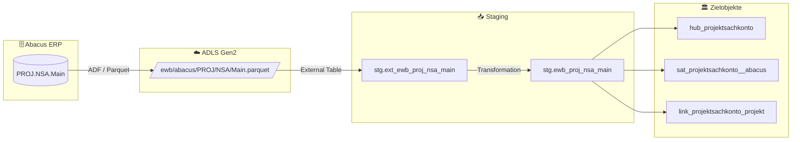

# Staging: proj_nsa_main

## Modell & Quelle

- **Modell:** `ewb_proj_nsa_main`
- **Quelle:** `PROJ.NSA.Main`
- **Source Model:** `ext_ewb_proj_nsa_main`
- **Parquet:** `ewb/abacus/PROJ/NSA/Main.parquet`
- **External Table:** `stg.ext_ewb_proj_nsa_main`
- **Staging View:** `stg.ewb_proj_nsa_main`
- **Pattern:** automate_dv.stage()

## Datenfluss

## Business Key(s)

- Composite BK: `PROJNR`, `CODE`, `PERIYEAR`, `PERIMONTH`, `GB`, `DATASET`
- `dss_business_key` wird aus allen sechs BK-Spalten gebildet

## Abgeleitete Spalten

- `dss_record_source = 'ewb_abacus'`
- `dss_load_date = COALESCE(TRY_CAST(dss_load_date AS DATETIME2), GETDATE())`
- `dss_create_datetime = GETDATE()`
- `dss_business_key = CONCAT_WS(...)` mit `PROJNR`, `CODE`, `PERIYEAR`, `PERIMONTH`, `GB`, `DATASET`

## Hash Keys & Hash Diffs

| Name | Eingabespalten | Zweck / Ziel |
|------|-----------------|--------------|
| `hk_projektsachkonto` | `PROJNR`, `CODE`, `PERIYEAR`, `PERIMONTH`, `GB`, `DATASET` | `hub_projektsachkonto` |
| `hk_projekt` | `PROJNR` | FK-Hash zu `hub_projekt` |
| `hk_link_projektsachkonto_projekt` | `PROJNR`, `CODE`, `PERIYEAR`, `PERIMONTH`, `GB`, `DATASET`, `PROJNR` | `link_projektsachkonto_projekt` |
| `hd_projektsachkonto` | `AZBETEXT`, `AZBETINT`, `AZBUTEXT`, `AZBUTINT`, `AZVORTEXT`, `AZVORTINT`, `BETRAGEXT`, `BETRAGINT`, `BUDGETEXT`, `BUDGETINT`, `VORTRAGEXT`, `VORTRAGINT` | `sat_projektsachkonto__abacus` |

## Payload-Spalten

### `sat_projektsachkonto__abacus` (12)

`AZBETEXT`, `AZBETINT`, `AZBUTEXT`, `AZBUTINT`, `AZVORTEXT`, `AZVORTINT`, `BETRAGEXT`, `BETRAGINT`, `BUDGETEXT`, `BUDGETINT`, `VORTRAGEXT`, `VORTRAGINT`

## Zielobjekte

- `hub_projektsachkonto` — Hub aus `hk_projektsachkonto`
- `sat_projektsachkonto__abacus` — Satellite aus `hd_projektsachkonto`
- `link_projektsachkonto_projekt` — Link aus `hk_link_projektsachkonto_projekt`

## Besonderheiten

- Composite BK enthaelt im SQL explizit auch `DATASET`.
- Escaped Source Column: `timestamp_landing-zone`.
- Der Link-Hash wiederholt `PROJNR`, weil sowohl Hub-1- als auch Hub-2-Anteile aus Source-Spalten gebildet werden.
