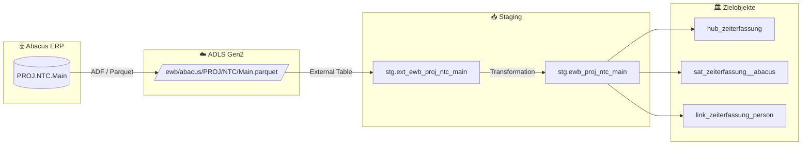

# Staging: proj_ntc_main

## Modell & Quelle

- **Modell:** `ewb_proj_ntc_main`
- **Quelle:** `PROJ.NTC.Main`
- **Source Model:** `ext_ewb_proj_ntc_main`
- **Parquet:** `ewb/abacus/PROJ/NTC/Main.parquet`
- **External Table:** `stg.ext_ewb_proj_ntc_main`
- **Staging View:** `stg.ewb_proj_ntc_main`
- **Pattern:** automate_dv.stage()

## Datenfluss

## Business Key(s)

- Composite BK: `EMPLNR`, `PROJDAT`
- `PROJDAT` wird fuer das Hashing zu `PROJDAT_KEY = CONVERT(NVARCHAR(30), PROJDAT, 126)` normalisiert.
- `dss_business_key` wird aus `EMPLNR` und `PROJDAT` gebildet

## Abgeleitete Spalten

- `dss_record_source = 'ewb_abacus'`
- `dss_load_date = COALESCE(TRY_CAST(dss_load_date AS DATETIME2), GETDATE())`
- `dss_create_datetime = GETDATE()`
- `PROJDAT_KEY = CONVERT(NVARCHAR(30), PROJDAT, 126)`
- `dss_business_key = CONCAT_WS(...)` mit `EMPLNR` und `PROJDAT`

## Hash Keys & Hash Diffs

| Name | Eingabespalten | Zweck / Ziel |
|------|-----------------|--------------|
| `hk_zeiterfassung` | `EMPLNR`, `PROJDAT_KEY` | `hub_zeiterfassung` |
| `hk_person` | `EMPLNR` | FK-Hash zu `hub_person` |
| `hk_link_zeiterfassung_person` | `EMPLNR`, `PROJDAT_KEY`, `EMPLNR` | `link_zeiterfassung_person` |
| `hd_zeiterfassung` | `ANZAHL`, `DATASET`, `FROM1`, `FROM10`, `FROM2`, `FROM3`, `FROM4`, `FROM5`, `FROM6`, `FROM7`, `FROM8`, `FROM9`, `MUTDAT`, `TO1`, `TO10`, `TO2`, `TO3`, `TO4`, `TO5`, `TO6`, `TO7`, `TO8`, `TO9`, `USER_F` | `sat_zeiterfassung__abacus` |

## Payload-Spalten

### `sat_zeiterfassung__abacus` (24)

`ANZAHL`, `DATASET`, `FROM1`, `FROM10`, `FROM2`, `FROM3`, `FROM4`, `FROM5`, `FROM6`, `FROM7`, `FROM8`, `FROM9`, `MUTDAT`, `TO1`, `TO10`, `TO2`, `TO3`, `TO4`, `TO5`, `TO6`, `TO7`, `TO8`, `TO9`, `USER_F`

## Zielobjekte

- `hub_zeiterfassung` — Hub aus `hk_zeiterfassung`
- `sat_zeiterfassung__abacus` — Satellite aus `hd_zeiterfassung`
- `link_zeiterfassung_person` — Link aus `hk_link_zeiterfassung_person`

## Besonderheiten

- Deterministisches Date-Hashing ueber `PROJDAT_KEY` verhindert Unterschiede durch DATETIME-Serialisierung.
- Escaped Source Column: `timestamp_landing-zone`.
- Der Link zu `hub_person` wird direkt aus `EMPLNR` abgeleitet.
