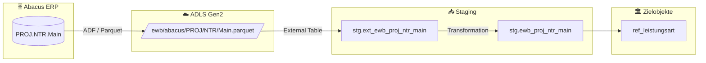

# Staging: proj_ntr_main

## Modell & Quelle

- **Modell:** `ewb_proj_ntr_main`
- **Quelle:** `PROJ.NTR.Main`
- **Source Model:** `ext_ewb_proj_ntr_main`
- **Parquet:** `ewb/abacus/PROJ/NTR/Main.parquet`
- **External Table:** `stg.ext_ewb_proj_ntr_main`
- **Staging View:** `stg.ewb_proj_ntr_main`
- **Pattern:** Custom SQL fuer Reference Table

## Datenfluss

## Business Key(s)

- `NUMBER`

## Abgeleitete Spalten

- `number = CAST(NUMBER AS INT)`
- `description = DESCRIPTION`
- `type = CAST([TYPE] AS INT)`
- `inaktiv = CAST(INAKTIV AS INT)`
- `dss_record_source = 'ewb_abacus'`
- `dss_load_date = GETDATE()`

## Hash Keys & Hash Diffs

| Name | Eingabespalten | Zweck / Ziel |
|------|-----------------|--------------|
| — | — | Keine Hash Keys oder Hash Diffs in diesem Modell |

## Payload-Spalten

### `ref_leistungsart` (4)

`NUMBER`, `DESCRIPTION`, `[TYPE]`, `INAKTIV`

## Zielobjekte

- `ref_leistungsart` — Reference Table fuer Leistungsarten

## Besonderheiten

- Keine `hk_*` / `hd_*`; das Modell bereitet Referenzdaten direkt fuer `ref_leistungsart` auf.
- Reserved Keyword: `[TYPE]` wird escaped und als `type` ausgegeben.
- `SELECT DISTINCT` plus `WHERE DATASET = 2` dedupliziert die Quelle auf die fachlich gueltigen Leistungsarten.
