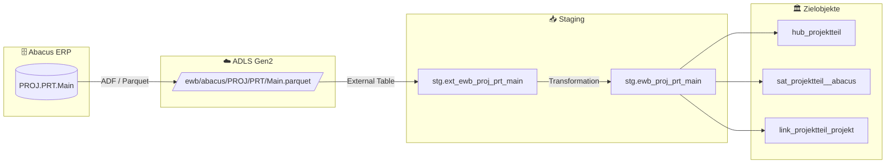

# Staging: proj_prt_main

## Modell & Quelle

- **Modell:** `ewb_proj_prt_main`
- **Quelle:** `PROJ.PRT.Main`
- **Source Model:** `ext_ewb_proj_prt_main`
- **Parquet:** `ewb/abacus/PROJ/PRT/Main.parquet`
- **External Table:** `stg.ext_ewb_proj_prt_main`
- **Staging View:** `stg.ewb_proj_prt_main`
- **Pattern:** automate_dv.stage()

## Datenfluss

## Business Key(s)

- `RECNUM`
- `dss_business_key` wird aus `RECNUM` gebildet

## Abgeleitete Spalten

- `dss_record_source = 'ewb_abacus'`
- `dss_load_date = COALESCE(TRY_CAST(dss_load_date AS DATETIME2), GETDATE())`
- `dss_create_datetime = GETDATE()`
- `dss_business_key = CONCAT_WS(...)` mit `RECNUM`

## Hash Keys & Hash Diffs

| Name | Eingabespalten | Zweck / Ziel |
|------|-----------------|--------------|
| `hk_projektteil` | `RECNUM` | `hub_projektteil` |
| `hk_projekt` | `PROJNR` | FK-Hash zu `hub_projekt` |
| `hk_link_projektteil_projekt` | `RECNUM`, `PROJNR` | `link_projektteil_projekt` |
| `hd_projektteil` | `DATE`, `STAT1`, `STAT2`, `USER_F` | `sat_projektteil__abacus` |

## Payload-Spalten

### `sat_projektteil__abacus` (4)

`DATE`, `STAT1`, `STAT2`, `USER_F`

## Zielobjekte

- `hub_projektteil` — Hub aus `hk_projektteil`
- `sat_projektteil__abacus` — Satellite aus `hd_projektteil`
- `link_projektteil_projekt` — Link aus `hk_link_projektteil_projekt`

## Besonderheiten

- `RECNUM` ist eindeutig; `PROJNR` ist laut Modellkommentar nicht eindeutig und reicht daher nicht als Hub-BK.
- Escaped Source Columns: `DATE`, `timestamp_landing-zone`.
- Das Modell bildet einen eigenen Hub fuer Verlaufseintraege und verlinkt danach zum Projekt.
