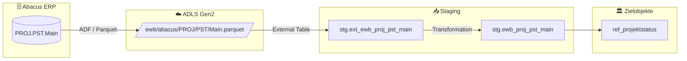

# Staging: proj_pst_main

## Modell & Quelle

- **Modell:** `ewb_proj_pst_main`
- **Quelle:** `PROJ.PST.Main`
- **Source Model:** `ext_ewb_proj_pst_main`
- **Parquet:** `ewb/abacus/PROJ/PST/Main.parquet`
- **External Table:** `stg.ext_ewb_proj_pst_main`
- **Staging View:** `stg.ewb_proj_pst_main`
- **Pattern:** Custom SQL fuer Reference Table

## Datenfluss

## Business Key(s)

- `STATUS`

## Abgeleitete Spalten

- `status = CAST(STATUS AS INT)`
- `bezeichn = BEZEICHN`
- `langcode = LANGCODE`
- `dss_record_source = COALESCE(dss_record_source, 'ewb_abacus')`
- `dss_load_date = COALESCE(TRY_CAST(dss_load_date AS DATETIME2), GETDATE())`

## Hash Keys & Hash Diffs

| Name | Eingabespalten | Zweck / Ziel |
|------|-----------------|--------------|
| — | — | Keine Hash Keys oder Hash Diffs in diesem Modell |

## Payload-Spalten

### `ref_projektstatus` (3)

`STATUS`, `BEZEICHN`, `LANGCODE`

## Zielobjekte

- `ref_projektstatus` — Reference Table fuer Projektstatus

## Besonderheiten

- Keine `hk_*` / `hd_*`; das Modell bereitet Referenzdaten direkt fuer `ref_projektstatus` auf.
- Filter `WHERE DATASET = 2` laesst nur die Datensaetze mit gepflegten Bezeichnungen durch.
- Die Synapse-Logik `LEN(TRIM(BEZEICHN)) > 2` wird bewusst nicht im Staging nachgebaut.
