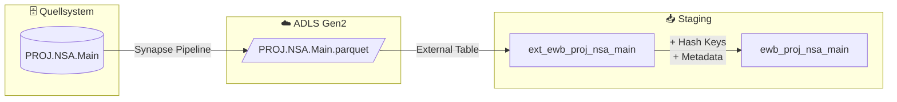

# Staging: projektsachkonto

## Quellsystem

- **System:** Abacus EWB
- **Schema:** PROJ
- **Tabelle:** NSA.Main
- **Ladefrequenz:** daily

## Datenfluss



## Spalten-Mapping

| Quellspalte | Ziel-Spalte | Transformation | Kommentar |
|-------------|-------------|----------------|-----------|
| `PROJNR` | `PROJNR` | - | Business Key (Teil 1) |
| `CODE` | `CODE` | - | Business Key (Teil 2) |
| `PERIYEAR` | `PERIYEAR` | - | Business Key (Teil 3) |
| `PERIMONTH` | `PERIMONTH` | - | Business Key (Teil 4) |
| `GB` | `GB` | - | Business Key (Teil 5) |
| - | `hk_projektsachkonto` | `SHA2_256(PROJNR^^CODE^^PERIYEAR^^PERIMONTH^^GB)` | Hash Key |
| - | `hk_projekt` | `SHA2_256(PROJNR)` | FK → hub_projekt |
| - | `hd_projektsachkonto` | `SHA2_256(BUDGETINT,...,AZVORTEXT)` | Hash Diff |
| `BUDGETINT` | `BUDGETINT` | - | Budget intern |
| `BETRAGINT` | `BETRAGINT` | - | Betrag intern |
| `VORTRAGINT` | `VORTRAGINT` | - | Vortrag intern |
| `BUDGETEXT` | `BUDGETEXT` | - | Budget extern |
| `BETRAGEXT` | `BETRAGEXT` | - | Betrag extern |
| `VORTRAGEXT` | `VORTRAGEXT` | - | Vortrag extern |
| `AZBUTINT` | `AZBUTINT` | - | AZ Budget intern |
| `AZBETINT` | `AZBETINT` | - | AZ Betrag intern |
| `AZVORTINT` | `AZVORTINT` | - | AZ Vortrag intern |
| `AZBUTEXT` | `AZBUTEXT` | - | AZ Budget extern |
| `AZBETEXT` | `AZBETEXT` | - | AZ Betrag extern |
| `AZVORTEXT` | `AZVORTEXT` | - | AZ Vortrag extern |
| `RESERVE` | - | nicht übernommen | Leer (verifiziert) |
| `RESERVE2` | - | nicht übernommen | Leer (verifiziert) |
| - | `dss_record_source` | `COALESCE(src, 'ewb_abacus')` | Metadata |
| - | `dss_load_date` | `COALESCE(TRY_CAST(...), GETDATE())` | Metadata |
| - | `dss_run_id` | passthrough | Metadata |

## Business Keys

```sql
-- Composite Hash Key Berechnung
CONVERT(CHAR(64), HASHBYTES('SHA2_256', 
    CONCAT(
        ISNULL(CAST(PROJNR AS NVARCHAR(MAX)), ''), '^^',
        ISNULL(CAST(CODE AS NVARCHAR(MAX)), ''), '^^',
        ISNULL(CAST(PERIYEAR AS NVARCHAR(MAX)), ''), '^^',
        ISNULL(CAST(PERIMONTH AS NVARCHAR(MAX)), ''), '^^',
        ISNULL(CAST(GB AS NVARCHAR(MAX)), '')
    )
), 2) AS hk_projektsachkonto
```

## Foreign Keys

| FK Hash Key | Quellspalte | Ziel-Hub | Link |
|-------------|-------------|----------|------|
| `hk_projekt` | `PROJNR` | `hub_projekt` | `link_projektsachkonto_projekt` |

## Datenqualität

- [x] NOT NULL Check auf Business Keys (PROJNR, CODE, PERIYEAR, PERIMONTH, GB)
- [x] Unique Check auf hk_projektsachkonto
- [x] NOT NULL Check auf hk_projektsachkonto, hd_projektsachkonto
- [x] NOT NULL Check auf hk_projekt (FK)
- [x] NOT NULL Check auf dss_record_source, dss_load_date
- [ ] Referentielle Integrität zu hub_projekt
