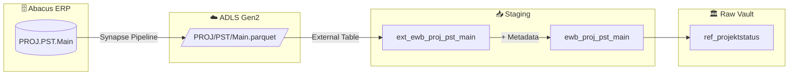

# Staging: Projektstatus (Reference Table)

## Quellsystem

- **System:** Abacus ERP (EWB)
- **Modul:** PROJ (Projektverwaltung)
- **Tabelle:** PST.Main
- **Parquet:** `ewb/abacus/PROJ/PST/Main.parquet`
- **Ladefrequenz:** Daily (Full Load)
- **External Table:** `ext_ewb_proj_pst_main`
- **Staging View:** `ewb_proj_pst_main`
- **Target:** `ref_projektstatus`

## Datenfluss

## Pattern: Reference Table

Dies ist eine **Reference Table** — kein Hub/Satellite-Pattern:
- **Kein Hash Key** (kein `hk_*`)
- **Kein Hash Diff** (kein `hd_*`)
- Nur die fachlichen Spalten + `dss_*` Metadata
- **7 Einträge** — keine Deduplizierung nötig

### Synapse-Filterlogik

Die bestehende Synapse-Implementierung filtert mit `WHERE LEN(TRIM(BEZEICHN)) > 2`. Diese Geschäftslogik gehört in den **Mart**, NICHT ins Staging. Das Staging liefert alle Zeilen unverändert.

## Spalten-Mapping

| Quellspalte | Ziel-Spalte | Typ | Transformation | Kommentar |
|-------------|-------------|-----|----------------|-----------|
| `STATUS` | `status` | `INT` | `CAST(... AS INT)` | Primary Key — Statuscode |
| `BEZEICHN` | `bezeichn` | `NVARCHAR(4000)` | — | Bezeichnung des Projektstatus |
| `LANGCODE` | `langcode` | `NVARCHAR(4000)` | — | Sprachcode |
| `dss_record_source` | `dss_record_source` | `VARCHAR(100)` | `COALESCE(..., 'ewb_abacus')` | Metadata |
| `dss_load_date` | `dss_load_date` | `DATETIME2` | `COALESCE(TRY_CAST(...), GETDATE())` | Metadata |

## Datenqualität

- [x] NOT NULL + UNIQUE auf `status` (Primary Key)
- [x] NOT NULL auf `dss_record_source`, `dss_load_date`
- [ ] Referentielle Integrität zu Projekt-Einträgen (Mart-Ebene)

## Nicht selektierte Quellspalten

Folgende Spalten der Quelle werden **nicht** in die Staging-View übernommen:

| Spalte | Grund |
|--------|-------|
| `RECNUM` | Technischer Datensatz-Key |
| `KSTTYP` | Kostenstellentyp, nicht relevant für Referenz |
| `DATASET` | Mandanten-ID |
| `STATUSDEF` | Status-Definition (intern) |
| `DATUM` | Datum (Systemspalte) |
| `GROB`, `BUDGET`, `ANLAGE` | Steuerungsflags |
| `KRED`, `DEBI`, `FIBU`, `ABEA` | Modul-Flags |
| `RAPORT` | Rapport-Flag |
| `MUTDAT`, `USER_F` | Mutations-Metadaten |
| `REFERENZED` | Referenz-Flag |
| `LOHN`, `PROJLOESC` | Lohn-/Lösch-Flags |
