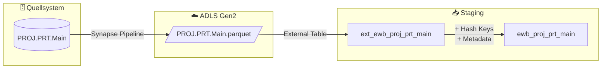

# Staging: projektteil

## Quellsystem

- **System:** Abacus EWB
- **Schema:** PROJ
- **Tabelle:** PRT.Main
- **Ladefrequenz:** daily

## Datenfluss



## Datenanalyse

- **Zeilen:** 8124
- **RECNUM:** 8124 distinct → **eindeutig** → Business Key
- **PROJNR:** 6292 distinct → **nicht eindeutig** → FK zu hub_projekt
- **Typ:** Verlaufstabelle (Projektteil-Einträge mit Statustransitionen)

## Spalten-Mapping

| Quellspalte | Ziel-Spalte | Transformation | Kommentar |
|-------------|-------------|----------------|-----------|
| `RECNUM` | `RECNUM` | - | Business Key — eindeutige Record-Nummer |
| `PROJNR` | `PROJNR` | - | FK → hub_projekt |
| - | `hk_projektteil` | `SHA2_256(RECNUM)` | Hash Key (eigener Hub) |
| - | `hk_projekt` | `SHA2_256(PROJNR)` | FK Hash Key → hub_projekt |
| - | `hk_link_projektteil_projekt` | `SHA2_256(RECNUM^^PROJNR)` | Link Hash Key |
| - | `hd_projektteil` | `SHA2_256(DATE^^STAT1^^STAT2^^USER_F)` | Hash Diff |
| `DATE` | `DATE` | - | Datum (Reserved Keyword → escaped) |
| `STAT1` | `STAT1` | - | Status 1 |
| `STAT2` | `STAT2` | - | Status 2 |
| `USER_F` | `USER_F` | - | Benutzer-GUID |
| `DATASET` | `DATASET` | - | Dataset-Nummer (technisch, nicht im Hashdiff) |
| - | `dss_record_source` | `'ewb_abacus'` | Metadata |
| - | `dss_load_date` | `COALESCE(TRY_CAST(...), GETDATE())` | Metadata |
| - | `dss_run_id` | passthrough | Metadata |

## Business Keys

```sql
-- Hash Key Berechnung (eigener Hub für Projektteile)
CONVERT(CHAR(64), HASHBYTES('SHA2_256', 
    ISNULL(CAST(RECNUM AS NVARCHAR(MAX)), '')
), 2) AS hk_projektteil
```

## Vault-Zuordnung

- **Hub:** `hub_projektteil` (neu, BK=RECNUM)
- **Satellite:** `sat_projektteil__abacus` (DATE, STAT1, STAT2, USER_F)
- **Link:** `link_projektteil_projekt` (hub_projektteil ↔ hub_projekt via PROJNR)

## Foreign Keys

| FK Hash Key | Quellspalte | Ziel-Hub | Link |
|-------------|-------------|----------|------|
| `hk_projekt` | `PROJNR` | `hub_projekt` | `link_projektteil_projekt` |

## Reserved Keywords

| Spalte | Grund | Behandlung |
|--------|-------|------------|
| `DATE` | SQL Reserved Keyword | `_escape` derived column |
| `timestamp_landing-zone` | Sonderzeichen im Namen | `_escape` derived column |

## Datenqualität

- [x] NOT NULL Check auf Business Key (RECNUM)
- [x] Unique Check auf hk_projektteil
- [x] NOT NULL Check auf hk_projektteil, hk_projekt, hk_link_projektteil_projekt, hd_projektteil
- [x] NOT NULL Check auf PROJNR (FK)
- [x] NOT NULL Check auf dss_record_source, dss_load_date
- [ ] Referentielle Integrität zu hub_projekt
