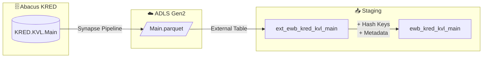

# Staging: zahlung

## Quellsystem

- **System:** Abacus ERP (EWB)
- **Schema:** KRED
- **Tabelle:** KVL.Main
- **Ladefrequenz:** daily
- **Parquet:** `ewb/abacus/KRED/KVL/Main.parquet`

## Datenfluss



## Spalten-Mapping

| Quellspalte | Ziel-Spalte | Transformation | Kommentar |
|-------------|-------------|----------------|-----------|
| `DOCUMENTNR` | `DOCUMENTNR` | - | Business Key (= BELNR in KBL) |
| `POSITIONNR` | `POSITIONNR` | - | Business Key (Zahlungsposition) |
| `ELEMENTTYP` | `ELEMENTTYP` | - | Business Key (Elementtyp) |
| `INR` | `INR` | - | Business Key (Visierer-ID) |
| - | `hk_zahlung` | `SHA2_256(DOCUMENTNR, POSITIONNR, ELEMENTTYP, INR)` | Hash Key (4-part Composite) |
| - | `hk_kreditorenbeleg` | `SHA2_256(DOCUMENTNR)` | Hash Key (FK → hub_kreditorenbeleg) |
| - | `hk_link_kreditorenbeleg_zahlung` | `SHA2_256(DOCUMENTNR, DOCUMENTNR, POSITIONNR, ELEMENTTYP, INR)` | Link Hash Key |
| - | `hd_zahlung` | `SHA2_256(17 cols)` | Hash Diff |
| - | `dss_record_source` | `'ewb_abacus'` | Metadata |
| - | `dss_load_date` | `COALESCE(TRY_CAST(...))` | Metadata |
| - | `dss_business_key` | `CONCAT_WS('||', ...)` | Composite Key |

## Business Keys

```sql
-- Hash Key Berechnung: hub_zahlung (4-part Composite)
CONVERT(CHAR(64), HASHBYTES('SHA2_256',
    ISNULL(CAST(DOCUMENTNR AS NVARCHAR(MAX)), '') + '||' +
    ISNULL(CAST(POSITIONNR AS NVARCHAR(MAX)), '') + '||' +
    ISNULL(CAST(ELEMENTTYP AS NVARCHAR(MAX)), '') + '||' +
    ISNULL(CAST(INR AS NVARCHAR(MAX)), '')
), 2) AS hk_zahlung

-- Hash Key Berechnung: hub_kreditorenbeleg (FK)
CONVERT(CHAR(64), HASHBYTES('SHA2_256',
    ISNULL(CAST(DOCUMENTNR AS NVARCHAR(MAX)), '')
), 2) AS hk_kreditorenbeleg

-- Link Hash Key (Source-Spalten beider Hubs)
CONVERT(CHAR(64), HASHBYTES('SHA2_256',
    ISNULL(CAST(DOCUMENTNR AS NVARCHAR(MAX)), '') + '||' +
    ISNULL(CAST(DOCUMENTNR AS NVARCHAR(MAX)), '') + '||' +
    ISNULL(CAST(POSITIONNR AS NVARCHAR(MAX)), '') + '||' +
    ISNULL(CAST(ELEMENTTYP AS NVARCHAR(MAX)), '') + '||' +
    ISNULL(CAST(INR AS NVARCHAR(MAX)), '')
), 2) AS hk_link_kreditorenbeleg_zahlung
```

## Raw Vault Zielobjekte

| Objekt | Typ | Business Key | Quelle |
|--------|-----|-------------|--------|
| `hub_zahlung` | Hub | DOCUMENTNR + POSITIONNR + ELEMENTTYP + INR | hk_zahlung |
| `sat_zahlung__abacus` | Satellite | hk_zahlung | hd_zahlung |
| `link_kreditorenbeleg_zahlung` | Link | hk_kreditorenbeleg + hk_zahlung | hk_link_kreditorenbeleg_zahlung |

## Hashdiff Spalten (17)

Alphabetisch sortiert (automate_dv Standard):
ABACUS_USR_GUID, ABACUS_USR_NAME, ABGELEHNT, AKTION_DATUM_ZEIT, BEMERKUNG,
BENACH_GESANDT, DATUM_ZEIT, FREIGABEBETRAG, MSGTASKSTATUS,
RGPRUEFUNG, STATUSID, STVVISA, SUBDOCUMENTNR, VALIDVISUM, VER, VISIERT,
VISUMSTYP

### Ausgeschlossen vom Hashdiff
- **Technisch:** RECNUM, DB (System-Spalten)
- **Business Keys:** DOCUMENTNR, POSITIONNR, ELEMENTTYP, INR (Teil des Hash Keys)
- **Interne Flags:** VER_UEBERST, SIGN_VER, VISPOOLID, VISPOOLGRPNR, VISSTRUCTNR, SUBPOSITIONNR, EXTSUBPOSITIONNR
- **Redundant:** ABACUS_USR_FULL_NAME (bereits ABACUS_USR_NAME vorhanden)
- **Metadata:** timestamp_landing-zone, dss_*

## Datenqualität

- [x] NOT NULL Check auf DOCUMENTNR (Business Key)
- [x] NOT NULL Check auf POSITIONNR (Business Key)
- [x] NOT NULL Check auf ELEMENTTYP (Business Key)
- [x] NOT NULL Check auf INR (Business Key)
- [x] UNIQUE Check auf hk_zahlung (4-part Composite)
- [x] NOT NULL Check auf hk_zahlung, hk_kreditorenbeleg, hk_link_kreditorenbeleg_zahlung
- [x] NOT NULL Check auf hd_zahlung
- [x] NOT NULL Check auf dss_record_source, dss_load_date
- [ ] Referentielle Integrität zu hub_kreditorenbeleg (nach Vault-Erstellung)

## Besonderheiten

- **Composite BK:** DOCUMENTNR + POSITIONNR + ELEMENTTYP + INR identifizieren eine Visierungsposition eindeutig (283.094 Zeilen verifiziert)
- **DOCUMENTNR + POSITIONNR allein NICHT eindeutig:** Nur 87.419 distinct Kombinationen bei 283.094 Zeilen
- **FK zu KBL:** DOCUMENTNR = KBL.BELNR — natürlicher Link `link_kreditorenbeleg_zahlung`
- **Link Hash Key aus Source-Spalten:** hk_link = SHA256(DOCUMENTNR || DOCUMENTNR || POSITIONNR || ELEMENTTYP || INR) — Pattern wie NSA
- **Escaped Columns:** `timestamp_landing-zone` (Hyphen im Spaltennamen)
- **Keine APPSTR Spalten:** Alle Spalten sind hashbar (kein VARBINARY)
- **Spaltenanzahl:** 31 Quellspalten + 6 Metadata = 37 total
- **Namens-Mapping:** Implementierungsplan nutzt BELEGNR/ZAHLNR, Parquet hat DOCUMENTNR/POSITIONNR
