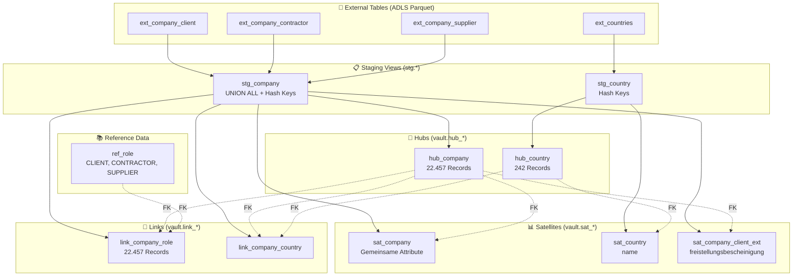
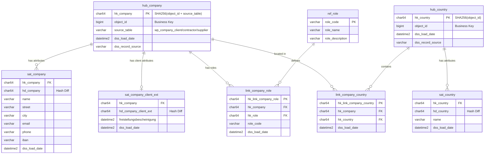
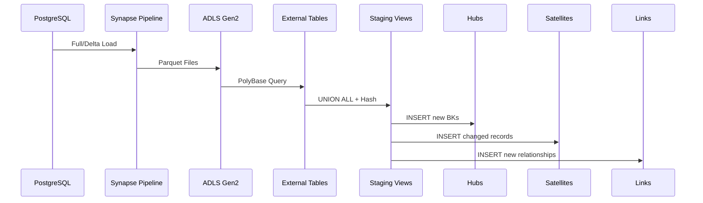

# Data Vault 2.1 - Model Architecture

## Übersicht



## Entity Relationship Diagram



## Datenfluss



## Datenzählung

| Objekt | Records | Beschreibung |
|--------|---------|--------------|
| `hub_company` | 22.457 | 7.501 Client + 7.610 Contractor + 7.346 Supplier |
| `hub_country` | 242 | Alle Länder |
| `sat_company` | 22.457 | Attribute aller Unternehmen |
| `sat_company_client_ext` | ~ | Nur Clients mit freistellungsbescheinigung |
| `sat_country` | 242 | Länder-Attribute |
| `link_company_role` | 22.457 | Verknüpfung Company↔Role |
| `link_company_country` | ~ | Verknüpfung Company↔Country |
| `ref_role` | 3 | CLIENT, CONTRACTOR, SUPPLIER |

## Hash Key Berechnung

```sql
-- hub_company: Composite Key (object_id nicht global unique)
-- Separator '^^' gemäß DV 2.1 Best Practice
CONVERT(CHAR(64), HASHBYTES('SHA2_256', 
    CONCAT(
        ISNULL(CAST(object_id AS NVARCHAR(MAX)), ''),
        '^^',
        ISNULL(source_table, '')
    )
), 2) AS hk_company

-- hub_country: Simple Key
CONVERT(CHAR(64), HASHBYTES('SHA2_256', 
    ISNULL(CAST(object_id AS NVARCHAR(MAX)), '')
), 2) AS hk_country
```

## DV 2.1 Compliance Features

### Ghost Records (Platzhalter für fehlende Daten)
```sql
-- Zero Key: Für unbekannte Business Keys (NULL)
{{ zero_key() }}  -- Ergibt: 0000000000000000000000000000000000000000000000000000000000000000

-- Error Key: Für fehlerhafte Daten
{{ error_key() }}  -- Ergibt: FFFFFFFFFFFFFFFFFFFFFFFFFFFFFFFFFFFFFFFFFFFFFFFFFFFFFFFFFFFFFFFF
```

### Current Flag & End-Dating
Alle Satellites haben:
- `dss_is_current` (CHAR(1)): 'Y' = aktueller Stand, 'N' = historisch
- `dss_end_date` (DATETIME2): Wann dieser Stand abgelöst wurde

### PIT-Tabelle (Point-in-Time)
`pit_company` ermöglicht effiziente Zeitreise-Abfragen:
```sql
SELECT * FROM vault.pit_company
WHERE snapshot_date = '2024-06-01'
```

### Effectivity Satellite
`eff_sat_company_country` trackt Gültigkeitszeiträume von Beziehungen:
- `dss_start_date`: Beginn der Beziehung
- `dss_end_date`: Ende der Beziehung (NULL = noch aktiv)
- `dss_is_active`: 'Y' = aktiv, 'N' = beendet
