# Data Vault 2.1 - Model Architecture

## Übersicht

```mermaid
flowchart TB
    subgraph Sources["📁 External Tables (ADLS Parquet)"]
        ext_client[ext_company_client]
        ext_contractor[ext_company_contractor]
        ext_supplier[ext_company_supplier]
        ext_countries[ext_countries]
    end

    subgraph Staging["📋 Staging Views (stg.*)"]
        stg_company[stg_company<br/>UNION ALL + Hash Keys]
        stg_country[stg_country<br/>Hash Keys]
    end

    subgraph Hubs["🔑 Hubs (vault.hub_*)"]
        hub_company[hub_company<br/>22.457 Records]
        hub_country[hub_country<br/>242 Records]
    end

    subgraph Satellites["📊 Satellites (vault.sat_*)"]
        sat_company[sat_company<br/>Gemeinsame Attribute]
        sat_country[sat_country<br/>name]
        sat_client_ext[sat_company_client_ext<br/>freistellungsbescheinigung]
    end

    subgraph Links["🔗 Links (vault.link_*)"]
        link_role[link_company_role<br/>22.457 Records]
        link_country[link_company_country]
    end

    subgraph Reference["📚 Reference Data"]
        ref_role[ref_role<br/>CLIENT, CONTRACTOR, SUPPLIER]
    end

    %% Source to Staging
    ext_client --> stg_company
    ext_contractor --> stg_company
    ext_supplier --> stg_company
    ext_countries --> stg_country

    %% Staging to Hubs
    stg_company --> hub_company
    stg_country --> hub_country

    %% Staging to Satellites
    stg_company --> sat_company
    stg_company --> sat_client_ext
    stg_country --> sat_country

    %% Staging to Links
    stg_company --> link_role
    stg_company --> link_country

    %% Hub relationships
    hub_company -.->|FK| sat_company
    hub_company -.->|FK| sat_client_ext
    hub_company -.->|FK| link_role
    hub_company -.->|FK| link_country
    hub_country -.->|FK| sat_country
    hub_country -.->|FK| link_country
    ref_role -.->|FK| link_role
```



## Entity Relationship Diagram


## Datenfluss


## Datenzählung

| Objekt | Records | Beschreibung |
|--------|---------|--------------|
| `hub_company` | 22.457 | 7.501 Client + 7.610 Contractor + 7.346 Supplier |
| `hub_country` | 242 | Alle Länder |
| `sat_company` | 22.457 | Attribute aller Unternehmen |
| `sat_company_client_ext` | ~ | Nur Clients mit freistellungsbescheinigung |
| `sat_country` | 242 | Länder-Attribute |
| `link_company_role` | 22.457 | Verknüpfung Company↔Role |
| `link_company_country` | ~ | Verknüpfung Company↔Country |
| `ref_role` | 3 | CLIENT, CONTRACTOR, SUPPLIER |

## Hash Key Berechnung

```sql
-- hub_company: Composite Key (object_id nicht global unique)
CONVERT(CHAR(64), HASHBYTES('SHA2_256', 
    CONCAT(
        ISNULL(CAST(object_id AS NVARCHAR(MAX)), ''),
        '||',
        ISNULL(source_table, '')
    )
), 2) AS hk_company

-- hub_country: Simple Key
CONVERT(CHAR(64), HASHBYTES('SHA2_256', 
    ISNULL(CAST(object_id AS NVARCHAR(MAX)), '')
), 2) AS hk_country
```
