# EWB Analytics Platform — Projektdokumentation

| | |
|---|---|
| **Kunde** | EWB Energie Wasser Buchs |
| **Projekt** | EWB Analytics Platform (Data Vault 2.1) |
| **Erstellt** | 27. Februar 2026 |
| **Stand** | 5. Mai 2026 |
| **Verfasser** | PPMC AG |

---

## 0. Offene Punkte & Klärungsbedarf

> Diese Punkte sind mit EWB zu besprechen und zu koordinieren, bevor der Produktivbetrieb aufgenommen werden kann.

### 0.1 ACA (Azure Container Apps) im EWB-Tenant

Der dbt-Runner läuft aktuell im PPMC-Tenant als Azure Container App Job. Für den Produktivbetrieb muss dieser in den EWB Azure-Tenant migriert werden.

**Voraussetzungen / Requirements:**

| Anforderung | Detail | Status |
|---|---|---|
| Azure-Subscription mit Container Apps | Resource Group für CI/CD-Infrastruktur | ⬜ Klären |
| Container Apps Environment | Dedicated Environment mit Outbound-Konnektivität zu `sql-analytics-ewb-001` | ⬜ Klären |
| Container Registry Zugriff | Pull-Rechte auf das dbt-Runner-Image (PPMC ACR oder eigene ACR in EWB) | ⬜ Klären |
| Service Principal / Managed Identity | Für Azure SQL-Authentifizierung (Entra ID / CLI-Auth) | ⬜ Klären |
| Netzwerk | VNet-Integration oder Public Endpoint auf Azure SQL Server | ⬜ Klären |
| Secrets Management | Key Vault für GitHub PAT + DB-Credentials | ⬜ Klären |
| **Ressourcen-Empfehlung** | Consumption-Profil, 2 vCPU, 4 Gi RAM, Timeout 7200s | Bewährt (PPMC) |

### 0.2 Git-Integration (lokales Git-Repo bei EWB)

Ein Git-Account wurde bereits via VPN bereitgestellt. Für die vollständige CI/CD-Integration sind ggf. erweiterte Berechtigungen erforderlich.

**Voraussetzungen / Requirements:**

| Anforderung | Detail | Status |
|---|---|---|
| Git-Server Zugang (VPN) | Benutzer mit Read/Write-Zugriff auf das dbt-Repo | ✅ Bereitgestellt |
| **Webhook / CI-Trigger** | Möglichkeit, bei Push auf `main`/`prod` einen HTTP-Webhook auszulösen (→ ACA Job starten) | ⬜ Admin-Berechtigung prüfen |
| **Service Account** | Dedizierter technischer Benutzer (kein persönlicher Account) für ACA-Trigger | ⬜ Klären |
| Branch-Schutzregeln | `main`/`prod` Branch gegen direkte Pushes sperren (Review-Pflicht) | ⬜ Empfehlung EWB-Git-Admin |
| **PAT / Deploy Key** | Personal Access Token oder SSH Deploy Key für ACA → Git-Pull | ⬜ Klären |
| Repository Mirror | Optionaler Mirror PPMC GitHub ↔ EWB Git für Übergabe | ⬜ Klären |

> **Hinweis:** Falls EWB ein Azure DevOps Server (on-premise) oder GitLab betreibt, unterscheidet sich die Webhook-Konfiguration. Bitte Plattform bestätigen.

### 0.3 ADF → dbt Automatisierung

ADF-Pipelines sind deployed und via `Master_ewb_load` orchestriert. Der automatisierte Tageslauf läuft über eine SQL-basierte Load-Status-Tabelle.

| Aufgabe | Detail | Status |
|---|---|---|
| `Master_ewb_load` Pipeline | Orchestriert: `Copy_LandingZone_to_LoadFS_ewb` → `Copy_Stage_ewb` → SP `vault.usp_log_adf_load_status` | ✅ Deployed |
| `vault.load_status` Tabelle | Audit-Log für ADF- und dbt-Runs — ADF schreibt nach Stage-Lauf, dbt nach `dbt run` | ✅ Erstellt |
| GitLab Scheduled Job | Prüft via `sqlcmd`: "ADF heute fertig, dbt noch nicht?" → löst `dbt run` aus | ⬜ Offen |
| Produktions-Deploy | `dbt run --target ewb` auf `datavault` (Prod-DB) — einmaliger initialer Load | ⬜ Offen |

### 0.4 Delete-Erkennung (Effectivity Satellite)

Abacus liefert **Vollabzüge** Die aktuelle Architektur erkennt **keine Löschungen**: Wenn ein Abacus-Datensatz im nächsten Parquet-File fehlt, bleibt der letzte Satellite-Record auf `dss_is_current = 'Y'` stehen.

| Entity | Löschung realistisch? | Business-Relevanz |
|--------|----------------------|-------------------|
| `hub_hauptbuch` (FIBU.GL/FHE) | ❌ Buchungen unveränderlich | kein Problem |
| `hub_konto`, `hub_kostenstelle` | ⚠️ Inaktivierungen möglich | mittel |
| `hub_kreditor` | ⚠️ Lieferant kann inaktiviert werden | mittel |
| `hub_person` (LOHN.LEN) | ✅ Austritte kommen vor | relevant |
| `hub_projekt` (PROJ.NPO) | ✅ Projekte werden abgeschlossen/gelöscht | relevant |

**DV2.1-konformer Ansatz:** Effectivity Satellite (`sat_*_eff`) — vergleicht nach jedem Full-Load die geladenen Hub-Keys mit dem Vorbestand und schreibt einen Tombstone-Record wenn ein Key fehlt. Kein `dss_deleted`-Flag (nicht DV2.1-konform).

| Aufgabe | Status |
|---------|--------|
| Effectivity Satellites für `hub_person` + `hub_projekt` | ⬜ Out of scope (Phase 3/4) — für Produktivbetrieb klären |

---

### 0.5 Hub Business Key Spalten-Refactoring

**Hintergrund:** Bei der Modellierung der CDR-Domain (Phase CDR) wurde festgestellt, dass die bestehenden Hub-BK-Spalten source-spezifische Namen tragen (`empl_nr`, `projnr`, etc.). Dies widerspricht dem DV2.1-Prinzip, dass Hubs source-agnostische Business-Konzept-Namen verwenden sollen.

**Problem:** Wenn ein zweites Quellsystem in denselben Hub lädt, muss es seine BK in die source-spezifisch benannte Spalte mappen — das ist irreführend und erschwert Multi-Source-Integration.

**DV2.1-konformer Ansatz:** BK-Spalten im Hub tragen den generalisierten Business-Konzept-Namen. Das Mapping von Quell-Spaltenname → Hub-BK-Name erfolgt im Staging via `derived_columns`.

| Hub | BK-Spalte (aktuell) | BK-Spalte (soll) | Staging-Mapping |
|-----|---------------------|------------------|-----------------|
| `hub_person` | `empl_nr` | `person_id` | `EMPL_NR` → `person_id` |
| `hub_projekt` | `projnr` | `projekt_id` | `PROJNR` → `projekt_id` |
| `hub_hauptbuch` | `recnum` | `hauptbuch_id` | `RECNUM` → `hauptbuch_id` |
| `hub_buchungskopf` | `recnum` | `buchungskopf_id` | `RECNUM` → `buchungskopf_id` |
| `hub_kreditorenbeleg` | `belnr` | `kreditorenbeleg_id` | `BELNR` → `kreditorenbeleg_id` |
| `hub_kreditor` | `knr` | `kreditor_id` | `KNR` → `kreditor_id` |
| `hub_kostenstelle` | `kst` | `kostenstelle_id` | `KST` → `kostenstelle_id` |
| `hub_konto` | `kto` | `konto_id` | `KTO` → `konto_id` |
| `hub_adresse` | `adressnr` | `adresse_id` | `ADRESSNR` → `adresse_id` |
| `hub_projekt` | `projnr` | `projekt_id` | `PROJNR` → `projekt_id` |

> **Neue CDR-Hubs** (`hub_vertrag`, `hub_kunde`, `hub_sim`) werden von Anfang an mit generalisierten BK-Namen (`vertrag_id`, `kunde_id`, `icc`) erstellt.

| Aufgabe | Status |
|---------|--------|
| Hub BK Refactoring (alle bestehenden Abacus-Hubs) | ⬜ Technische Schuld — vor Multi-Source-Integration umsetzen |

---

### 0.6 Lohnperioden-Satellit (sat_person_lohn_ma__abacus)

**Hintergrund:** `LOHN.LEN.Main` liefert eine Zeile pro Mitarbeiter × Lohnperiode (`LPE_YEAR` × `LPE_MONTH`). Aktuell wird in `ewb_lohn_len_dedup` auf die **aktuellste Periode pro EMPL_NR** dedupliziert, damit `sat_person__abacus` keine Pseudo-SCD2-Versionen erzeugt.

**Folge:** `LPE_YEAR` und `LPE_MONTH` sind weder im Hashdiff noch im Payload von `sat_person__abacus`. Perioden-Informationen (z. B. "Wann war Person X in welcher Lohnperiode aktiv?") sind **nicht im Vault** verfügbar.

**DV2.1-konformer Ansatz:** Multi-Active Satellite auf `hub_person`:

```
hub_person
  ├── sat_person__abacus           ← Personenstamm, deduped (aktuell deployed)
  └── sat_person_lohn_ma__abacus   ← Lohnperioden, CDK = LPE_YEAR || LPE_MONTH
                                      Source: ext_ewb_lohn_len_main (NICHT deduped)
                                      Payload: lohnperiodenbezogene Felder
```

Naming-Konvention: `_ma` vor `__<source>` → `sat_person_lohn_ma__abacus`

| Aufgabe | Status |
|---------|--------|
| `sat_person_lohn_ma__abacus` erstellen (MA-Satellite, CDK = LPE_YEAR+LPE_MONTH) | ⬜ Backlog — klären ob EWB Perioden-Analyse benötigt |
| Staging `ewb_lohn_len_main` für MA-Sat anpassen (src_cdk) | ⬜ Backlog |

## 1. Projektziel

Aufbau einer modernen, skalierbaren Datenplattform auf Basis des **Data Vault 2.1**-Standards im EWB Azure-Tenant. Alle relevanten Quellsysteme (Abacus ERP, IDMS, ISE u.a.) werden täglich in eine zentrale Datenbasis geladen, historisch gesichert und für Power BI-Berichte bereitgestellt.

Der gewählte Ansatz stellt sicher, dass Rohdaten unveränderlich erhalten bleiben, jede Transformation nachvollziehbar und testbar ist, und die Plattform schrittweise um weitere Domänen erweiterbar bleibt.

---

## 2. Phasenübersicht

| Phase | Bezeichnung | Status |
|---|---|---|
| 1 | Analyse der bestehenden Azure-Umgebung | Abgeschlossen |
| 2 | Infrastruktur: SQL Server + Datenbankinitialisierung | Abgeschlossen |
| 3 | Raw Vault: Staging, Hubs, Satellites, Links | Abgeschlossen (Wave 1+2+3 + CDR/Telecom-Domain deployed ✅, Mai 2026) |
| 4 | Orchestrierung & Automatisierung (ADF → dbt) | In Bearbeitung (`Master_ewb_load` Pipeline + `vault.load_status` deployed ✅, GitLab Scheduled Trigger ⬜ offen) |
| 5 | Reporting Layer & Power BI | Abgeschlossen (Projekt-Domain + Finance-Domain + Telecom-Domain `mart_telecom` deployed ✅) |

---

## 3. Phase 1 — Analyse der bestehenden Azure-Umgebung

### 3.1 Ergebnisübersicht

| Bereich | Ergebnis |
|---|---|
| Azure Data Factory Pipelines | 26 Pipelines vollständig inventarisiert |
| Angebundene Quellsysteme | 9 Systeme (Abacus, IDMS, ISE, SharePoint, ServiceNow, Messerli, Starface u.a.) |
| Synapse Serverless SQL Pool | 2 Datenbanken mit 900+ virtuellen Tabellen kartiert |
| ADLS Gen2 Container | 4 Container identifiziert und in Architektur eingeordnet |

---

### 3.2 Bestehende Datenarchitektur

```
Quellsysteme (Abacus ERP, IDMS, ISE, ServiceNow, ...)
        │
        ▼  täglich via Azure Data Factory (SHIR: EWBSBI01)
  landing-zone        Rohdaten als Parquet-Dateien
        │             1:1 aus Quellsystem, unverändert
        ▼  SQL-Transformation (ADF Finance- & Projekt-Pipelines)
  structured-tables   vorverarbeitete Tabellen (Finance, Projekte)
        │
        ▼
   Power BI
```

**`landing-zone`** ist der primäre Eingangspuffer: Alle Quelldaten landen hier täglich als Parquet-Dateien in ihrem Originalzustand. Die Views im Synapse Serverless SQL Pool sind reine Abfrage-Wrapper — keine physischen Tabellen.

**`structured-tables`** enthält transformierte und zusammengeführte Tabellen für das heutige Power BI-Reporting (mit Filtern, Joins und Business-Logik). Diese Schicht bleibt für das bestehende Reporting aktiv, dient aber **nicht** als Quelle für den neuen Data Vault.

---

### 3.3 Quellsysteme und Ladehäufigkeit

| Quellsystem | Inhalt | Ladehäufigkeit |
|---|---|---|
| Abacus ERP | FIBU, KRED, DEBI, PROJ, LOHN, ADRE | Täglich |
| IDMS | Internet-/Kabelkunden-Vertragsmanagement | Täglich |
| ISE Kernsystem | Kundenstamm, Objekte, Faktura (~600 Tabellen) | Täglich |
| SharePoint | Budget, Forecast, Kostenstellen, Zugangsrechte | Täglich (WebHook) |
| ServiceNow | CRM-Kundenanfragen | Täglich |
| Messerli | Fakturierung | Laufend |
| Starface | Telefonie-Rohdaten (CDR) | Laufend |

---

### 3.4 Datenpipeline-Inventar (26 Pipelines)

| Pipeline | Typ | Ziel | Betrieb |
|---|---|---|---|
| FIBU_GL_daily | Landing | `landing-zone/FIBU/GL` (E22–E26) | Täglich |
| FIBU_GL_monthly | Landing | `landing-zone/FIBU/GL` (E21) | Monatlich |
| FIBU_daily | Landing | `landing-zone/FIBU/FHE` | Täglich |
| KRED | Landing | `landing-zone/KRED/*` (22 Tabellen) | Täglich |
| DEBI | Landing | `landing-zone/DEBI/*` | Täglich |
| ADRE | Landing | `landing-zone/ADRE/*` | Täglich |
| LOHN | Landing | `landing-zone/LOHN/*` | Täglich |
| PROJ | Landing | `landing-zone/PROJ/*` (23 Tabellen) | Täglich |
| PUBL | Landing | `landing-zone/PUBL/*` | Täglich |
| SHOP | Landing | `landing-zone/SHOP/*` | Täglich |
| IDMS_bulk_daily | Landing | `landing-zone/IDMS/*` | Täglich |
| ISE_Prod_bulk_daily | Landing | `landing-zone/ISE_Prod_*` (~600 Tabellen) | Täglich |
| Messerli | Landing | `landing-zone/Messerli/*` | Laufend |
| ServiceNowProdV2 | Landing | `landing-zone/ServiceNowProd/*` | Täglich |
| starface / starface_Users | Landing | `landing-zone/starface/*` | Laufend |
| Manual Data Sharepoint_daily | Landing (WebHook) | `landing-zone/Sharepoint/*` | Täglich |
| Manual Data landingzone | Transform (Copy) | `structured-tables/Finance/*` | Orchestriert |
| Finance | Transform (SQL) | `structured-tables/Finance/Buchungen, Belege, Kunden` | Orchestriert |
| Projekt | Transform (SQL) | `structured-tables/Projekt/*` | Orchestriert |
| **structured-tables Daily** | **Master-Orchestrator** | ruft Finance, Manual Data, Projekt auf | Täglich |
| FIBU_GL_full-manually, FIBU_full-manually, IDMS_manual_run | Manuell | landing-zone | Bei Bedarf |
| IDMS_SOAP_Test, z_test_* | Test | — | Inaktiv |

---

### 3.5 Pilot-Scope: Finance & Projects

**Finance:**

| Tabelle | Inhalt |
|---|---|
| FIBU.GL (E22–E26) | Hauptbucheinträge (Sachkonten-Journale) |
| FIBU.FHE | Buchungsköpfe |
| KRED.KBL | Kreditorenbelege |
| KRED.KVL | Kreditorenzahlungen |
| KRED.KBS | Kreditoren-Buchungsstatus (Status-Konfiguration) |

**Projects:**

| Tabelle | Inhalt |
|---|---|
| PROJ.NPO | Projektpositionen |
| PROJ.NTC / NTCA / NTCE / NTB | Zeitstempelung, Budgets |
| PROJ.NSA / NTR | Projektsachkonto, Leistungsarten |
| PROJ.PST / PRT | Projektstatus, Projektteile |
| LOHN.LEN / LTC | Mitarbeiterstamm, Abteilung |
| PUBL.ADR | Adressstamm (Personal-Join) |

---

### 3.6 Architektur-Entscheidung: dbt Source-Layer

Der neue Data Vault liest ausschliesslich aus **`landing-zone`** — nicht aus `structured-tables`.

| Kriterium | Begründung |
|---|---|
| Rohdatenkonformität | `landing-zone` enthält unveränderliche Quelldaten ohne eingebettete Business-Logik |
| DV 2.1-Standard | Transformationen (Joins, Filter) werden im Vault explizit modelliert — nicht in der Quelle vorweggenommen |
| Nachvollziehbarkeit | Jede Ableitung ist im dbt-Modell sichtbar, versioniert und testbar |
| Entkopplung | Änderungen an `structured-tables` (Power BI) beeinflussen den Vault nicht |

`structured-tables` bleibt für das bestehende Power BI-Reporting unverändert aktiv.

---

## 4. Phase 2 — Infrastruktur

### 4.1 Erledigte Schritte

| Aufgabe | Detail | Status |
|---|---|---|
| Azure SQL Server | `sql-analytics-ewb-001.database.windows.net`, Region Switzerland North | Erstellt (4. März 2026) |
| Datenbank `datavault` (prod) | Serverless, General Purpose Gen5, Auto-Pause 60 min | Erstellt |
| Datenbank `datavault-dev` | Serverless, General Purpose Gen5, Auto-Pause 60 min | Erstellt (7. März 2026) |
| Datenbank `datavault-test` | Serverless, General Purpose Gen5, Auto-Pause 60 min | Erstellt (7. März 2026) |
| Managed Identity | System-Assigned, OID `9ebe7156-…` | Aktiviert |
| ADF Dataset `GenericParquetDataset_ewb` | 3-Parameter Parquet-Dataset (fileSystem, folderPath, fileName) | Deployed |
| ADF Dataset `ParquetFolderDataset_ewb` | 2-Parameter Parquet-Dataset ohne Dateiname (für Bulk-Copy) | Deployed |
| ADF Pipeline `Copy_LandingZone_to_LoadFS_ewb` | 19 Pilot-Tabellen, ForEach, historisierter Pfad in `load-fs` | Deployed (9. März 2026) |
| ADF Pipeline `Copy_Stage_ewb` | Bulk-Copy mit DSS-Metadatenspalten nach `stage-fs`, idempotent | Deployed (9. März 2026) |
| dbt Targets | `ewb`, `ewb-dev`, `ewb-test` in `~/.dbt/profiles.yml` konfiguriert | Erstellt (9. März 2026) |
| dbt Projektkonfiguration | EWB-Modelle in `_common` (Schema: `vault`), `as_columnstore: false` | Erstellt (9. März 2026) |
| SQL Firewall-Regel | Zugriff für lokalen Dev-Rechner | Eingerichtet (9. März 2026) |
| Datenbankschemas | `stg`, `vault`, `bv`, `mart` in allen 3 DBs | Erstellt (9. März 2026) |
| Database Scoped Credential | `managed_identity` (Managed Service Identity) in allen 3 DBs | Erstellt / umgestellt (12. März 2026) |
| External Data Source | `StageFileSystem` → `adls://analyticsstoraccount001.dfs.core.windows.net/stage-fs` in allen 3 DBs | Erstellt (12. März 2026) |
| External File Format | `ParquetFormat` (Snappy Parquet) in allen 3 DBs | Erstellt (12. März 2026) |
| RBAC Storage Blob Data Reader | MI-Zugriff auf Container `landing-zone`, `load-fs`, `stage-fs` | Eingerichtet (12. März 2026) |
| SAS Token abgelöst | `ewb_stage_fs_sas` durch `managed_identity` ersetzt, alle 3 DBs | Erledigt (12. März 2026) |

### 4.2 Ausstehende Schritte

| Aufgabe | Detail | Status |
|---|---|---|
| Key Vault Secret | `sql-analytics-ewb-001-admin-password` in `analytics-keyvault001` | EWB-Admin (Key Vault Secrets Officer) erforderlich |

---

## 5. Phase 3 — Raw Vault

### 5.1 Implementierungsfortschritt (Stand 5. Mai 2026)

| Schicht | Implementiert | Pilot-Scope | Fortschritt |
|---|---|---|---|
| External Tables | 27 | 27 | 100% ✅ (datavault-dev) |
| Staging-Views (Abacus) | 14 | 15 | 93% (NTB out of scope) |
| Staging-Views (Sharepoint) | 8 | 8 | 100% ✅ |
| Staging-Views (CDR/Telecom) | 4 | 4 | 100% ✅ |
| Hubs | 16 (+2 Ghost) | 16 (+2 Ghost) | 100% ✅ |
| Satellites | 17 (+14 current_v) | 17 | 100% ✅ |
| Links | 15 | 15 | 100% ✅ |
| Reference Tables | 8 | 8 | 100% ✅ |
| **Mart-Views** | **24** | **24** | **100% ✅** |

**Wave 1 (Stammdaten): ✅ DEPLOYED** auf `datavault-dev` (28. März 2026, 27 Modelle, 0 Fehler)

**Wave 2 (Finance-Transaktionen): ✅ DEPLOYED** auf `datavault-dev` (29. März 2026) — Hub/Sat Buchungskopf + Hauptbuch + Kreditorenbeleg + Kreditor. Row Counts korrigiert nach ADF-Bug-Fix (31. März 2026): hub_hauptbuch=433.076, sat_hauptbuch=943.844.

**Wave 3 (GL-Links + Zahlungen + Projektteile): ✅ DEPLOYED** auf `datavault-dev` (31. März 2026) — hub_zahlung (283.094), sat_zahlung__abacus, hub_projektteil, sat_projektteil__abacus, 6 GL-Links (KST/Kreditor/Projekt/Konto/Buchungskopf/Zahlung).

**Wave 4 (structured-tables Gap Close): ✅ IMPLEMENTIERT** (15. April 2026) — Budget/Forecast/ActualForecast Mart-Views + dim_projekt Sharepoint-Erweiterung + dim_person Fix. 13/13 structured-tables abgedeckt (1 out of scope: Zugangsrechte).

**CDR / Telecom Wave (Mai 2026): ✅ DEPLOYED** auf `datavault-dev` — Compax RSN Mobile Staging + CDR-Raw-Vault + `mart_telecom` deployed; CDR-Tests vollständig PASS; `fakt_datenvolumen__base` + `fakt_anrufe__base` via `--full-refresh` erfolgreich aufgebaut.

**Finance Mart: ✅ DEPLOYED** (31. März 2026) — fakt_buchungen (892.713), fakt_belege (287.784), dim_kreditor.

**Implementierungsplan:** `design/raw-vault/_common/implementierungsplan.md` (erstellt 12. März 2026, basierend auf Synapse-Analyse)

**CDR-Implementierungsplan:** `design/raw-vault/_common/cdr-implementierungsplan.md`

### 5.2 Staging-Layer (stg.ewb_*)

| Tabelle | External Table | Staging-View | Status |
|---|---|---|---|
| FIBU.FHE | `stg.ext_ewb_fibu_fhe_main` | `stg.ewb_fibu_fhe_main` | ✅ Deployed (Referenz-Modell) |
| FIBU.GL.E22-E26 | `stg.ext_ewb_fibu_gl` | `stg.ewb_fibu_gl` | ✅ Deployed (Folder-Scan, BK=RECNUM) |
| KRED.KBL | `stg.ext_ewb_kred_kbl_main` | `stg.ewb_kred_kbl_main` | ✅ Deployed (Wave 2) |
| KRED.KVL | `stg.ext_ewb_kred_kvl_main` | `stg.ewb_kred_kvl_main` | ✅ Deployed (Wave 3) |
| KRED.KBS | `stg.ext_ewb_kred_kbs_main` | `stg.ewb_kred_kbs_main` | ✅ Deployed (Wave 2, ref_kred_buchungsstatus) |
| PROJ.NPO | `stg.ext_ewb_proj_npo_main` | `stg.ewb_proj_npo_main` | ✅ Deployed |
| PROJ.NTC | `stg.ext_ewb_proj_ntc_main` | `stg.ewb_proj_ntc_main` | ✅ Deployed |
| PROJ.NTB | — | — | Out of scope (Wave 1, kein Hub) |
| PROJ.NSA | `stg.ext_ewb_proj_nsa_main` | `stg.ewb_proj_nsa_main` | ✅ Deployed |
| PROJ.NTR | `stg.ext_ewb_proj_ntr_main` | `stg.ewb_proj_ntr_main` | ✅ Deployed |
| PROJ.PST | `stg.ext_ewb_proj_pst_main` | `stg.ewb_proj_pst_main` | ✅ Deployed |
| PROJ.PRT | `stg.ext_ewb_proj_prt_main` | `stg.ewb_proj_prt_main` | ✅ Deployed (Wave 3) |
| LOHN.LEN | `stg.ext_ewb_lohn_len_main` | `stg.ewb_lohn_len_main` | ✅ Deployed |
| LOHN.LTC | `stg.ext_ewb_lohn_ltc_main` | `stg.ewb_lohn_ltc_main` | ✅ Deployed |
| PUBL.ADR | `stg.ext_ewb_publ_adr_main` | `stg.ewb_publ_adr_main` | ✅ Deployed |

### 5.3 Raw Vault — Objekte

| Entität | Typ | Basiert auf | Status |
|---|---|---|---|
| `hub_person` | Hub | LOHN.LEN | ✅ Deployed |
| `hub_adresse` | Hub | PUBL.ADR | ✅ Deployed |
| `hub_projekt` | Hub | PROJ.NPO | ✅ Deployed |
| `hub_projektsachkonto` | Hub | PROJ.NSA | ✅ Deployed |
| `hub_zeiterfassung` | Hub | PROJ.NTC | ✅ Deployed |
| `hub_buchungskopf` | Hub | FIBU.FHE | ✅ Deployed (Wave 2) |
| `hub_hauptbuch` | Hub | FIBU.GL | ✅ Deployed (Wave 2, BK=RECNUM) |
| `hub_kreditorenbeleg` | Hub | KRED.KBL | ✅ Deployed (Wave 2) |
| `hub_kreditor` | Hub (Ghost) | KRED.KBL (KNR) | ✅ Deployed (Wave 2) |
| `hub_zahlung` | Hub | KRED.KVL | ✅ Deployed (Wave 3) |
| `hub_projektteil` | Hub | PROJ.PRT | ✅ Deployed (Wave 3) |
| `hub_konto` | Hub (Ghost) | FIBU.GL | ✅ Deployed (Wave 3, Ghost) |
| `hub_kostenstelle` | Hub (Ghost) | FIBU.GL | ✅ Deployed (Wave 3, Ghost) |
| `sat_person__abacus` | Satellite | LOHN.LEN | ✅ Deployed |
| `sat_person_adresse__abacus` | Satellite | PUBL.ADR | ✅ Deployed |
| `sat_adresse_kontakt__abacus` | Satellite | PUBL.ADR | ✅ Deployed |
| `sat_projekt__abacus` | Satellite | PROJ.NPO | ✅ Deployed |
| `sat_projektsachkonto__abacus` | Satellite | PROJ.NSA | ✅ Deployed |
| `sat_zeiterfassung__abacus` | Satellite | PROJ.NTC | ✅ Deployed |
| `sat_buchungskopf__abacus` | Satellite | FIBU.FHE | ✅ Deployed (Wave 2) |
| `sat_hauptbuch__abacus` | Satellite | FIBU.GL | ✅ Deployed (Wave 2) |
| `sat_kreditorenbeleg__abacus` | Satellite | KRED.KBL | ✅ Deployed (Wave 2) |
| `sat_kreditor__abacus` | Satellite | KRED.KBL (Ghost) | ✅ Deployed (Wave 2) |
| `sat_zahlung__abacus` | Satellite | KRED.KVL | ✅ Deployed (Wave 3) |
| `sat_projektteil__abacus` | Satellite | PROJ.PRT | ✅ Deployed (Wave 3) |
| `link_adresse_person` | Link | PUBL.ADR | ✅ Deployed |
| `link_zeiterfassung_person` | Link | PROJ.NTC | ✅ Deployed |
| `link_projektsachkonto_projekt` | Link | PROJ.NSA | ✅ Deployed |
| `link_hauptbuch_buchungskopf` | Link | FIBU.GL | ✅ Deployed (Wave 2) |
| `link_kreditorenbeleg_kreditor` | Link | KRED.KBL | ✅ Deployed (Wave 2) |
| `link_kreditorenbeleg_zahlung` | Link | KRED.KVL | ✅ Deployed (Wave 3) |
| `link_hauptbuch_kreditor` | Link | FIBU.GL | ✅ Deployed (Wave 3) |
| `link_hauptbuch_projekt` | Link | FIBU.GL | ✅ Deployed (Wave 3) |
| `link_hauptbuch_konto` | Link | FIBU.GL | ✅ Deployed (Wave 3) |
| `link_hauptbuch_kostenstelle` | Link | FIBU.GL | ✅ Deployed (Wave 3) |
| `link_projektteil_projekt` | Link | PROJ.PRT | ✅ Deployed (Wave 3) |
| `ref_abteilung` | Reference | LOHN.LTC | ✅ Deployed |
| `ref_leistungsart` | Reference | PROJ.NTR | ✅ Deployed |
| `ref_projektstatus` | Reference | PROJ.PST | ✅ Deployed |
| `ref_kred_buchungsstatus` | Reference | KRED.KBS | ✅ Deployed (Wave 2) |
| `ref_konto` | Reference | Sharepoint | ✅ Deployed |
| `ref_kostenstelle` | Reference | Sharepoint | ✅ Deployed |

#### CDR / Telecom Domain (Mai 2026)

| Objekt | Schema | Typ | Basiert auf | Status |
|---|---|---|---|---|
| `hub_vertrag` | `vault` | Hub | `rsn_mobile_services_main` | ✅ Deployed |
| `hub_kunde` | `vault` | Hub | `rsn_mobile_services_main` | ✅ Deployed |
| `sat_kunde__compax` | `vault` | Satellite | `rsn_mobile_services_kunde_dedup` | ✅ Deployed |
| `sat_vertrag_eff__compax` | `vault` | Satellite (Effectivity) | `rsn_mobile_services_main` | ✅ Deployed |
| `sat_vertrag_optionen_ma__compax` | `vault` | MA Satellite | `rsn_mobile_services_optionen_dedup` | ✅ Deployed |
| `link_vertrag_kunde` | `vault` | Link | `rsn_mobile_services_main` | ✅ Deployed |
| `link_kunde_adresse` | `vault` | Link | `rsn_mobile_services_kunde_dedup` | ✅ Deployed (61% Match via `external_customer_id` = INR) |
| `hub_sim` | `vault_telecom` | Hub | `rsn_mobile_services_main` | ✅ Deployed |
| `sat_cdr_event__compax` | `vault_telecom` | Transaction Satellite | `rsn_mobile_cdr_main` | ✅ Deployed |
| `link_cdr_event_tl` | `vault_telecom` | Transaction Link | `rsn_mobile_cdr_main` | ✅ Deployed |
| `link_vertrag_sim` | `vault_telecom` | Link | `rsn_mobile_services_main` | ✅ Deployed |
| `ref_abo_option_v` | `vault_telecom` | Reference View | `rsn_mobile_services_main` | ✅ Deployed |
| `ref_tarif_v` | `vault_telecom` | Reference View | `rsn_mobile_cdr_main` | ✅ Deployed |

### 5.4 Bereits erstellte dbt-Infrastruktur

| Artefakt | Detail | Status |
|---|---|---|
| `models/raw_vault/_common/` | Zielordner für EWB Vault-Modelle (hubs/, satellites/, links/) | Konfiguriert |
| `models/raw_vault/telecom/` | Zielordner für Telecom-spezifische Vault-Objekte im Schema `vault_telecom` | Konfiguriert (Mai 2026) |
| `models/mart/telecom/` | Zielordner für `mart_telecom` Star-Schema-Views | Konfiguriert (Mai 2026) |
| `dbt_project.yml` | EWB-Modelle nutzen `_common` (Schema: `vault`, `as_columnstore: false`) | Erstellt (9. März 2026) |
| `models/staging/ewb_fibu_fhe_main.sql` | Referenz-Staging-View (automate_dv.stage() Pattern, VARBINARY-Pattern) | Erstellt |
| `models/staging/sources.yml` | 27 External Tables konfiguriert (`ext_ewb_*` + `ext_rsn_*`) | Aktualisiert (Mai 2026) |

---

### 5.5 Gelöste Design-Fragen

Alle drei Design-Fragen wurden durch Datenanalyse gelöst. Vollständige technische Analyse: `design/raw-vault/_common/implementierungsplan.md` Abschnitt 7.

| # | Frage | Ergebnis | Status |
|---|---|---|---|
| F1 | FIBU.GL Business Key: Composite oder einfach? | BK-Korrektur: RECNUM (unique) statt `DKBELEGNUMMER\|\|KTO` (62% Nullen, 96 Dupes). Datenanalyse bestätigt. | ✅ Gelöst |
| F2 | NSA.PROJNR-Semantik und Personenbezug? | PROJNR = **ProjektNr** (97.5% Match zu NPO). Synapse `PROJNR=LOHNNR` ist ein Bug | ✅ Gelöst |
| F3 | NTR: Hub oder Reference Table? | Reference Table — nur 29 stabile Leistungsarten | ✅ Gelöst |

### 5.6 Erkenntnisse aus der Implementierung

| Erkenntnis | Detail |
|---|---|
| KBS ≠ Kreditorensalden | `KRED.KBS` ist eine Status-Konfigurationstabelle (18 Spalten: STATID, STATDEF, etc.), nicht Kreditoren-Stamm. Kein LIEFNR/SALDO/KONTO vorhanden. |
| hub_kreditor = Ghost Hub | Wird aus `KBL.KNR` abgeleitet (Wave 2), da keine dedizierte Kreditoren-Stammdatentabelle existiert |
| NTC = Zeitstempelung | PROJ.NTC enthält Stempeluhr-Daten (EMPLNR+PROJDAT+FROM1-TO10), keine Projekttätigkeiten. Kein PRONR/POSNR vorhanden. |
| Synapse-Bugs | Zwei Fehler in Synapse Views identifiziert: (1) `PROJNR=LOHNNR` Join, (2) `CODE=RECNUM` statt `CODE=NUMBER` |


### 5.7 Artefakt-Sync-Status (Stand 5. Mai 2026)

Konsistenzprüfung zwischen dbt-Modellen, YAML-Dokumentation, Entity-Designer und ER-Diagramm.

#### Staging Layer
| Staging-Modell (SQL) | _staging__models.yml | sources.yml (ext_ewb_) | stg-View DB | Status |
|---|---|---|---|---|
| `ewb_fibu_fhe_main` | ✅ | ✅ | ✅ | Synchron |
| `ewb_fibu_gl` | ✅ | ✅ | ✅ | Synchron |
| `ewb_kred_kbl_main` | ✅ | ✅ | ✅ | Synchron |
| `ewb_kred_kbs_main` | ✅ | ✅ | ✅ | Synchron |
| `ewb_kred_kvl_main` | ✅ | ✅ | ✅ | Synchron |
| `ewb_lohn_len_main` | ✅ | ✅ | ✅ | Synchron |
| `ewb_lohn_ltc_main` | ✅ | ✅ | ✅ | Synchron |
| `ewb_proj_npo_main` | ✅ | ✅ | ✅ | Synchron |
| `ewb_proj_nsa_main` | ✅ | ✅ | ✅ | Synchron |
| `ewb_proj_ntc_main` | ✅ | ✅ | ✅ | Synchron |
| `ewb_proj_ntr_main` | ✅ | ✅ | ✅ | Synchron |
| `ewb_proj_prt_main` | ✅ | ✅ | ✅ | Synchron |
| `ewb_proj_pst_main` | ✅ | ✅ | ✅ | Synchron |
| `ewb_publ_adr_main` | ✅ | ✅ | ✅ | Synchron |
| `ewb_sp_konten` | ✅ | ✅ (`_json`) | ✅ | Synchron (SP-JSON-Format) |
| `ewb_sp_kostenstellen` | ✅ | ✅ (`_json`) | ✅ | Synchron |
| `ewb_sp_budget` | ✅ | ✅ (`_json`) | ✅ | Synchron |
| `ewb_sp_forecast` | ✅ | ✅ (`_json`) | ✅ | Synchron |
| `ewb_sp_actualforecast` | ✅ | ✅ (`_json`) | ✅ | Synchron |
| `ewb_sp_zugangsrechte` | ✅ | ✅ (`_json`) | ✅ | Synchron |
| `ewb_sp_kategorisierungprojekte` | ✅ | ✅ (`_json`) | ✅ | Synchron |
| `ewb_sp_projektekategorien` | ✅ | ✅ (`_json`) | ✅ | Synchron |
| *(kein SQL)* | ❌ | ✅ `ext_ewb_proj_ntb_main` | ✅ ET in DB | ⚠️ Out-of-scope ET ohne Staging-View |

> **Hinweis:** Sharepoint External Tables nutzen den Suffix `_json` in sources.yml (z. B. `ext_ewb_sp_konten_json`), was dem effektiven DB-Tabellennamen entspricht.

#### CDR / Telecom Staging Layer (Mai 2026)
| Staging-Modell (SQL) | _staging__models.yml | sources.yml | stg-View DB | Status |
|---|---|---|---|---|
| `rsn_mobile_services_main` | ✅ | ✅ `ext_rsn_mobile_services_main` | ✅ | Synchron |
| `rsn_mobile_services_optionen_dedup` | ✅ | n/a (basiert auf `rsn_mobile_services_main`) | ✅ | Synchron |
| `rsn_mobile_services_kunde_dedup` | ✅ | n/a (basiert auf `rsn_mobile_services_main`) | ✅ | Synchron |
| `psa_rsn_mobile_cdr_main` | ✅ | ✅ `ext_rsn_mobile_cdr_main` | ✅ | Synchron |
| `rsn_mobile_cdr_main` | ✅ | ✅ `ext_rsn_mobile_cdr_main` | ✅ | Synchron |

#### Raw Vault Layer (_common__models.yml vs. SQL-Dateien)
| Objekt | SQL-Datei | _common__models.yml | DB (datavault-dev) | Status |
|---|---|---|---|---|
| **13 Hubs** (inkl. 2 Ghost) | ✅ 13 Dateien | ✅ 13 Einträge | ✅ 13 Tabellen | Synchron |
| **12 Satellites** | ✅ 12 Dateien | ✅ 12 Einträge | ✅ 12 Tabellen | Synchron |
| **12 current_v Views** | ✅ 12 Dateien | ✅ 12 Einträge | ✅ 12 Views | Synchron |
| **11 Links** | ✅ 11 Dateien | ✅ 11 Einträge | ✅ 11 Tabellen | Synchron |
| **6 References** | ✅ 6 Dateien | ✅ 6 Einträge | ✅ 6 Views | Synchron |

> **Hinweis (Stand 5.4.2026):** `hub_konto`, `hub_kostenstelle`, `link_hauptbuch_konto`, `link_hauptbuch_kostenstelle` sind vollständig in `_common__models.yml` dokumentiert — bekannte Lücke aus vorheriger Session **behoben** ✅.

#### CDR / Telecom Vault Layer (Mai 2026)
| Bereich | SQL-Dateien | YAML-Doku | DB (datavault-dev) | Status |
|---|---|---|---|---|
| `vault` CDR-Hubs (`hub_vertrag`, `hub_kunde`) | ✅ 2 Dateien | ✅ 2 Einträge | ✅ 2 Tabellen | Synchron |
| `vault` CDR-Satellites (`sat_kunde__compax`, `sat_vertrag_eff__compax`, `sat_vertrag_optionen_ma__compax`) | ✅ 3 Dateien | ✅ 3 Einträge | ✅ 3 Tabellen | Synchron |
| `vault` CDR current_v (`sat_kunde_current_v`, `sat_vertrag_eff_current_v`) | ✅ 2 Dateien | ✅ 2 Einträge | ✅ 2 Views | Synchron |
| `vault` CDR-Links (`link_vertrag_kunde`, `link_kunde_adresse`) | ✅ 2 Dateien | ✅ 2 Einträge | ✅ 2 Tabellen | Synchron |
| `vault_telecom` CDR-Objekte (`hub_sim`, `sat_cdr_event__compax`, `link_vertrag_sim`, `link_cdr_event_tl`) | ✅ 4 Dateien | ✅ 4 Einträge | ✅ 4 Objekte | Synchron |

> **Hinweis (Stand 5.5.2026):** Die publizierten Telecom-Reference-Views `ref_abo_option_v` und `ref_tarif_v` sind auf `datavault-dev` deployed; ihre vollständige Repo-/YAML-Synchronisierung wird mit dem nächsten Artefakt-Sync nachgezogen.

#### ER-Diagramm vs. Vault-Modelle
| Bereich | ER-Header | Tatsächlich | Status |
|---|---|---|---|
| Hubs | 13 | 13 SQL-Dateien | ✅ Korrekt |
| Satellites | 12 | 12 SQL-Dateien | ✅ Korrekt (behoben 8.4.2026) |
| Links | 11 | 11 SQL-Dateien | ✅ Korrekt — `LINK_BUCHUNGSKOPF_KREDITORENBELEG` aus Diagramm entfernt |
| References | 6 | 6 SQL-Dateien | ✅ Korrekt — `ref_kred_buchungsstatus` im Diagramm vorhanden |
| Link-Name | `LINK_ADRESSE_PERSON` | `link_adresse_person` | ✅ Korrekt (behoben) |

#### Entity-Designer JSONs vs. Vault-Entitäten
| Entität | Entity-Designer JSON | Status |
|---|---|---|
| adresse, buchungskopf, hauptbuch, kreditor, kreditorenbeleg, person, projekt, projektsachkonto, projektteil, zahlung, zeiterfassung | ✅ vorhanden | Synchron |
| leistungsart, projektstatus, kred_buchungsstatus | ✅ vorhanden (Refs) | Synchron |
| **konto** (Ghost Hub) | ❌ kein `_common_konto.json` | ⚠️ Ghost Hub ohne Entity-Designer JSON |
| **kostenstelle** (Ghost Hub) | ❌ kein `_common_kostenstelle.json` | ⚠️ Ghost Hub ohne Entity-Designer JSON |

#### Bekannte Cleanup-Tasks (DB)
| Objekt | Schema | Problem | Priorität |
|---|---|---|---|
| ~~`testview_29e1c7320897c0e96f3dca80df756f0e_10548`~~ | `stg` | ✅ Bereinigt (8.4.2026) | — |
| ~~`ext_ewb_sp_zugangsrechte_main`~~ | `stg` | ✅ Bereinigt (8.4.2026) | — |
| `dv` Schema | DB | Leeres Schema in datavault-dev vorhanden, nicht dokumentiert | Niedrig |

---

## 6. Phase 4 — Orchestrierung & Automatisierung

### 6.1 ADF-Datenpipelines (neu erstellt)

Zwei neue Pipelines wurden im Azure Data Factory `analytics-datafactory001` eingerichtet. Sie bilden die Brücke zwischen den bestehenden Roh-Parquets und dem künftigen dbt-Vault.

#### Pipeline 1: `Copy_LandingZone_to_LoadFS_ewb`

Kopiert täglich 19 Pilot-Tabellen aus `landing-zone` nach `load-fs` und legt sie datumsbezogen und nach Run-ID strukturiert ab (historisierter Pfad).

| Eigenschaft | Wert |
|---|---|
| Quelle | `landing-zone/{MODULE}/{TABLE}/{FILE}.parquet` |
| Ziel | `load-fs/ewb/abacus/historized/yyyy/MM/dd/{RunId}/{fileName}` |
| Methode | ForEach (5 parallele Kopien) |
| Pilot-Tabellen | 19 (FIBU.GL.E22–E26, FIBU.FHE, KRED.KBL/KVL/KBS, PROJ.NPO/NTC/NTB/NSA/NTR/PST/PRT, LOHN.LEN/LTC, PUBL.ADR) |

#### Pipeline 2: `Copy_Stage_ewb`

Stellt den aktuellen Tagesstand im `stage-fs` Container bereit: löscht zuerst den bisherigen Staging-Ordner, dann lädt sie einen vollständigen Run-Snapshot aus `load-fs` nach `stage-fs`. Alle Parquet-Dateien erhalten automatisch 5 DSS-Metadatenspalten (Data Vault 2.1 Standard).

| Eigenschaft | Wert |
|---|---|
| Quelle | `load-fs/ewb/abacus/historized/{Datum}/{RunId}/` |
| Ziel | `stage-fs/ewb/abacus/` |
| Methode | Bulk-Copy (rekursiv, Ordnerhierarchie erhalten) |
| Idempotenz | Staging-Ordner wird vor jeder Ausführung gelöscht und neu befüllt |

**DSS-Metadatenspalten (automatisch hinzugefügt):**

| Spalte | Inhalt |
|---|---|
| `dss_record_source` | Herkunft (`ewb/abacus`) |
| `dss_load_date` | Ladedatum (`yyyy-MM-dd`) |
| `dss_run_id` | Eindeutige Run-ID der ADF-Pipeline |
| `dss_stage_timestamp` | Zeitstempel der Stage-Ausführung (UTC) |
| `dss_source_file_name` | Ursprünglicher Dateiname in `load-fs` |

### 6.2 Gesamtfluss (Soll-Zustand)

| Schritt | Technologie | Detail | Status |
|---|---|---|---|
| 1. Rohdaten laden | ADF (bestehend) | täglich in `landing-zone` | Aktiv |
| 2a. Pilot-Tabellen historisieren | ADF `Copy_LandingZone_to_LoadFS_ewb` | `landing-zone` → `load-fs/{Datum}/{RunId}` | Deployed |
| 2b. Staging bereitstellen | ADF `Copy_Stage_ewb` | `load-fs/{RunId}` → `stage-fs` (+ DSS-Spalten) | Deployed |
| 3. Vault transformieren | dbt (GitHub Actions Runner via ACA) | `stage-fs` → stg → hub/sat/link → bv → mart | ✅ Aktiv (ACA + GitHub Actions) |
| 4. Auslösung | GitHub `repository_dispatch` | ADF Web Activity → GitHub Actions Workflow | Ausstehend |

### 6.3 CI/CD (GitHub Actions + ACA)

Der dbt-Runner läuft als **Azure Container App Job** (`caj-dbt-runner`, Consumption-Profil).

| Parameter | Wert |
|---|---|
| ACA-Job | `caj-dbt-runner` in `cae-ewb-cicd` (RG: `arg-analytics-cicd`) |
| Workload Profile | Consumption (2 vCPU, 4 Gi RAM) |
| Replica Timeout | 7200s (2h) |
| Retry Limit | 1 |
| GitHub Actions Timeout | 90 Min |
| query_timeout (dbt) | 7200s |

**Workflows:** `deploy-dev.yml`, `deploy-test.yml`, `deploy-prod.yml` (branch-triggered + manual dispatch)

**GitLab CI/CD (on-prem, `.gitlab-ci.yml`):** Zusätzlich 4 CDR-spezifische Jobs — integriert in die bestehende Pipeline (kein separater Scheduler):

| Job | Trigger | Beschreibung |
|---|---|---|
| `deploy:dev:cdr-load` | manuell / API | Inkrementeller CDR-Lauf auf `datavault-dev` |
| `deploy:dev:cdr-full-refresh` | manuell | Full-Refresh CDR auf `datavault-dev` |
| `deploy:test:cdr-load` | manuell / API | Inkrementeller CDR-Lauf auf `datavault-test` |
| `deploy:test:cdr-full-refresh` | manuell | Full-Refresh CDR auf `datavault-test` |

Reihenfolge: 1. Services-Stammdaten (hub_vertrag, hub_kunde, Satellites, Effectivity) → 2. CDR-Events (PSA + vault_telecom + mart)

**Performance-Fix GL:** `psa_ewb_fibu_gl` (PSA incremental TABLE) → `ewb_fibu_gl` (Staging TABLE) eliminiert 3× PolyBase-Scan. sat_hauptbuch 869s → 102s.

### 6.4 Ausstehend

| Aufgabe | Detail |
|---|---|
| ADF → GitHub Trigger | `repository_dispatch` Event: ADF Web Activity → `deploy-prod.yml` |
| GitHub PAT in Key Vault | Secret `github-pat-dbt-dispatch` für ADF Web Activity |
| Produktion deployen | `dbt run --target ewb` auf `datavault` (Prod-DB) |

---

## 7. Phase 5 — Reporting Layer & Power BI

Mart-Tabellen im Schema `mart_project` / `mart_finance` / `mart_telecom` werden als **Star Schema** auf dem Vault-Fundament erstellt. Power BI verbindet sich direkt mit `sql-analytics-ewb-001` und liest aus Dimensionen (`dim_*`) und Faktentabellen (`fakt_*`).

### 7.0 Mart ER-Diagramm (Star Schema Übersicht)

```mermaid
erDiagram

    %% ── SHARED ──────────────────────────────────────────────────────────────
    dim_date {
        int date_key PK
        date full_date
        int year
        int quarter
        int month
        nvarchar month_name
        nvarchar year_month
        int iso_week
        char is_weekend
        char is_last_day_of_month
    }

    %% ── PROJECT DOMAIN (mart_project) ───────────────────────────────────────
    dim_person {
        bigint person_key PK
        nvarchar person_id
        nvarchar person_code "Initialen (ABRV)"
        nvarchar person_name
        nvarchar abteilung
        date eintritt
        date austritt
    }

    dim_projekt {
        bigint projekt_key PK
        nvarchar projekt_id
        nvarchar projekt_code
        nvarchar projekt_name
        nvarchar status
        nvarchar hauptgruppe_name
        nvarchar gruppe_name
    }

    dim_leistungsart {
        bigint leistungsart_key PK
        nvarchar leistungsart_id
        nvarchar leistungsart_code
        nvarchar leistungsart_name
    }

    dim_abteilung {
        bigint abteilung_key
        bigint person_key FK
        nvarchar abteilung_nr
        nvarchar abteilung_name
        date mutation_date
    }

    fakt_stunden {
        bigint projekt_key FK
        bigint leistungsart_key FK
        int perioden_date_key FK
        decimal betrag
        int sachkonto_code
        nvarchar gb
    }

    %% ── FINANCE DOMAIN (mart_finance) ───────────────────────────────────────
    dim_kreditor {
        bigint kreditor_key PK
        nvarchar kreditor_id
        nvarchar kreditor_name
    }

    dim_konto {
        bigint konto_key PK
        nvarchar konto_id
        nvarchar konto_code
        nvarchar konto_name
        nvarchar konto_gruppe
        nvarchar konto_subgruppe
    }

    dim_kostenstelle {
        bigint kostenstelle_key PK
        nvarchar kostenstelle_id
        nvarchar kostenstelle_code
        nvarchar kostenstelle_name
        nvarchar bereich
        nvarchar bereich_neu
    }

    dim_buchungsstatus {
        bigint buchungsstatus_key PK
        nvarchar buchungsstatus_id
        nvarchar buchungsstatus_name
    }

    fakt_buchungen {
        int buchungsdatum_date_key FK
        bigint konto_key FK
        bigint kostenstelle_key FK
        decimal betrag
        nvarchar soll_haben
        int belegnummer
        nvarchar umschreibung
    }

    fakt_belege {
        bigint kreditor_key FK
        bigint buchungsstatus_key FK
        int belegdatum_date_key FK
        int valuta_datum_date_key FK
        decimal betrag
        decimal zahlbetrag
        nvarchar belegnummer
    }

    fakt_budget {
        int datum_date_key FK
        bigint konto_key FK
        bigint kostenstelle_key FK
        decimal betrag
        nvarchar szenario
    }

    fakt_forecast {
        int datum_date_key FK
        bigint konto_key FK
        bigint kostenstelle_key FK
        decimal betrag
        nvarchar szenario
    }

    ref_actual_forecast {
        nvarchar y_month PK "Jahr-Monat YYYY-MM (z.B. 2022-01)"
        nvarchar actual_forecast "Actual oder Forecast"
    }

    %% ── BEZIEHUNGEN ─────────────────────────────────────────────────────────
    fakt_stunden       }o--||  dim_projekt       : projekt_key
    fakt_stunden       }o--o|  dim_leistungsart  : "leistungsart_key (nullable)"
    fakt_stunden       }o--||  dim_date          : perioden_date_key
    dim_abteilung      }o--||  dim_person        : person_key
    dim_person         }o--o|  dim_date          : eintritt_date_key
    dim_person         }o--o|  dim_date          : austritt_date_key
    dim_projekt        }o--o|  dim_date          : erstellt_date_key
    fakt_buchungen     }o--||  dim_date          : buchungsdatum_date_key
    fakt_buchungen     }o--||  dim_konto         : konto_key
    fakt_buchungen     }o--||  dim_kostenstelle  : kostenstelle_key
    fakt_belege        }o--||  dim_kreditor      : kreditor_key
    fakt_belege        }o--||  dim_buchungsstatus: buchungsstatus_key
    fakt_belege        }o--||  dim_date          : belegdatum_date_key
    fakt_belege        }o--o|  dim_date          : valuta_datum_date_key
    fakt_budget        }o--||  dim_date          : datum_date_key
    fakt_budget        }o--||  dim_konto         : konto_key
    fakt_budget        }o--||  dim_kostenstelle  : kostenstelle_key
    fakt_forecast      }o--||  dim_date          : datum_date_key
    fakt_forecast      }o--||  dim_konto         : konto_key
    fakt_forecast      }o--||  dim_kostenstelle  : kostenstelle_key
    dim_date           ||--o{  ref_actual_forecast : "year_month = y_month (Power BI Slicer)"
```



> **Legende:** `}o--||` = Many-to-one (Pflicht), `}o--o|` = Many-to-one (optional/nullable). `dim_date` ist shared zwischen den Domains (`mart._common`). Alle Surrogate Keys via `MD5(BK) → BIGINT`. Detaillierte Diagramme: `design/mart/er-mart-project.mmd`, `design/mart/er-mart-finance.mmd`, `design/mart/er-mart-telecom.mmd`. `mart_telecom` ist zusätzlich als separates ER-Diagramm dokumentiert.

### 7.1 Projekt-Domain — Star Schema (DEPLOYED ✅)

| Mart-Objekt | Typ | Synapse-Äquivalent | Zeilen | Tests |
|---|---|---|---|---|
| `mart_project.dim_person` | Dimension | [Projekt].[Personal]+[Abteilung] | 502 | ✅ 5/5 |
| `mart_project.dim_projekt` | Dimension | [Projekt].[Projekt] | 14.168 | ✅ 4/4 |
| `mart_project.dim_leistungsart` | Dimension | NTR-Lookup | 15 | ✅ 3/3 |
| `mart_project.fakt_stunden` | Fakt | [Projekt].[Stunden] | 199.206 | ✅ 4/4 (2 WARN) |
| `mart.dim_date` | Dimension | (generiert) | 5.844 | ✅ 2/2 |

**ER-Diagramm:** `design/mart/er-mart-project.mmd`

**Validierungs-Ergebnis (15.4.2026):**
- dim_person: Erweitert Synapse Personal um Abteilungs-Attribute. NULLIF-Fix fuer person_code.
- dim_projekt: ✅ Vollständig — inkl. 3 Sharepoint-Spalten (GruppeName, HauptgruppeNr, HauptgruppeName)
- fakt_stunden: PROJNR-Korrektur bestätigt (ProjektNr statt PersonalNr)
- LeistungsartNr: NSA.CODE ist Sachkonto (389 Werte), nicht 1:1 NTR — entspricht Synapse LEFT JOIN

### 7.2 Finance-Domain — Star Schema (DEPLOYED ✅)

| Mart-Objekt | Typ | Synapse-Äquivalent | Zeilen | Status |
|---|---|---|---|---|
| `mart_finance.fakt_buchungen` | Fakt | [Finance].[Buchungen] | 892.713 | ✅ Deployed (Wave 3) |
| `mart_finance.fakt_belege` | Fakt | [Finance].[Belege] | 287.784 | ✅ Deployed (KBL × KVL) |
| `mart_finance.dim_kreditor` | Dimension | [Finance].[Kunden] | 3.159 | ✅ Deployed (hub-Granularität) |
| `mart_project.dim_abteilung` | Dimension | [Projekt].[Abteilung] | ~2.027 | ✅ Deployed (Wave 3) |
| `mart_finance.fakt_budget` | Fakt | [Finance].[Budget] | 52.693 | ✅ Wave 4 (Sharepoint-Planungsdaten) |
| `mart_finance.fakt_forecast` | Fakt | [Finance].[Forecast] | 13.163 | ✅ Wave 4 (Sharepoint-Planungsdaten) |
| `mart_finance.ref_actual_forecast` | Reference | [Finance].[ActualForecast] | 24 | ✅ Wave 4 (Lookup Monat→Actual/Forecast) |

**Bekannte Abweichungen:**
- `dim_kreditor`: 3.159 (Hubs, DISTINCT) vs. Synapse 93.288 (alle KBL-Zeilen, no DISTINCT). DV-Granularität ist korrekt — Synapse ist denormalisiert.
- `fakt_buchungen`: 892.713 vs. Synapse 890.449 (+0.25%). Akzeptable Abweichung durch unterschiedliche Filterlogik.
- `fakt_stunden`: 199.209 vs. Synapse 63.755. Synapse hat bekannten Bug (`PROJNR=LOHNNR`, nur 2.5% Match). EWB-Wert ist korrekt.

**ER-Diagramm:** `design/mart/er-mart-finance.mmd`

### 7.3 Telecom-Domain — Star Schema (DEPLOYED ✅)

| Mart-Objekt | Typ | Beschreibung | Status |
|---|---|---|---|
| `mart_telecom.dim_mobilvertrag_v` | Dimension | Verträge, is_active, abo_name | ✅ Deployed |
| `mart_telecom.dim_mobilkunde_v` | Dimension | Kundenstamm aus Compax | ✅ Deployed |
| `mart_telecom.dim_sim_v` | Dimension | SIM-Karten (ICCID) | ✅ Deployed |
| `mart_telecom.fakt_cdr_v` | Fakt (View) | Atomarer CDR-Grain, rolling 30 Tage | ✅ Deployed |
| `mart_telecom.fakt_datenvolumen_v` | Fakt (Aggregat) | Datenvolumen pro Vertrag×Tag | ✅ Full-Refresh durchgeführt |
| `mart_telecom.fakt_anrufe_v` | Fakt (Aggregat) | Anrufe/SMS pro Vertrag×Tag | ✅ Full-Refresh durchgeführt |

ER-Diagramm: `design/mart/er-mart-telecom.mmd`
Implementierungsplan: `design/raw-vault/_common/cdr-implementierungsplan.md`

Retention-Strategie: Rolling 30 Tage Rohevents (`fakt_cdr_v`), dauerhaft akkumulierte Aggregate (`fakt_datenvolumen_v` / `fakt_anrufe_v`). `fakt_datenvolumen` + `fakt_anrufe` sind incremental Tables (kein `__base`-Suffix), `_v` Wrapper-Views publizieren den Inhalt. Full-Refresh auf `datavault-dev` durchgeführt (5.5.2026).

---

## 8. Entscheidungslogbuch

| Datum | Entscheidung | Begründung |
|---|---|---|
| Mai 2026 | CDR CI/CD in bestehende Pipeline integriert (kein separater Scheduled Job) | Deploy:dev/test:cdr-load/full-refresh Jobs in `.gitlab-ci.yml` ergänzt — Reihenfolge: Services → Events. Kein separater Scheduler nötig; manuelle/API-Auslösung reicht bis ADF-Trigger automatisiert ist |
| Mai 2026 | `fakt_cdr` als plain View (kein incremental Table) | fakt_cdr hat zu wenig stabile Aggregate für Table-Materialisierung — rolling 30 Tage direkt im View. `fakt_datenvolumen` + `fakt_anrufe` bleiben incremental Tables (kein `__base`-Suffix) mit `_v` Wrapper-View |
| Mai 2026 | `dss_eff_date` als Alias für `src_eff` in sat_vertrag_eff__compax | `automate_dv.eff_sat()` generiert separate SELECT-Einträge für `src_eff` und `src_ldts` — bei gleichem Spaltenname (`dss_load_date`) entsteht im Incremental-Modus ein SQL Server Fehler (8156: Spalte mehrfach angegeben). Fix: Derived Column `dss_eff_date` in rsn_mobile_services_main mit identischem Wert aber anderem Namen |
| Mai 2026 | `external_customer_id` = Abacus INR, nicht Personalnummer | DB-Analyse: 61% Match zu `hub_adresse.inr`, nur 1.4% zu `hub_person.empl_nr` (Zufallsüberschneidung). `link_kunde_adresse` implementiert |
| Mai 2026 | Retention: Rolling 30 Tage Rohevents + dauerhaft Aggregate | `fakt_cdr_v` zeigt immer den aktuellen Vault-Stand (nach Purge: 30 Tage). `fakt_datenvolumen_v` / `fakt_anrufe_v` akkumulieren dauerhaft → historische Analyse ohne voluminöse Rohevents |
| Mai 2026 | `kundigungs_datum = ''` (leerer String) = aktiver Vertrag in Compax | Compax liefert `''` für offene Verträge, nicht `NULL` oder `9999-12-31`. `is_active='Y'` wenn `NULL` oder `''` |
| Mai 2026 | `CXL_`-Prefix = stornierte Compax-Kunden | `external_customer_id LIKE 'CXL_%'` → Zahl nach Prefix = Abacus INR. Im Link normalisiert via `SUBSTRING` |
| Mai 2026 | `mart_mobile` → `mart_telecom` umbenannt | Konsistenz mit `vault_telecom` Schema |
| März 2026 | dim_abteilung (mart_project) deployed | DISTINCT (EMPL_NR, HOME_DEPT_NR, MUTATION_DATE) aus sat_person__abacus LEFT JOIN ref_abteilung. Matching Synapse Projekt.Abteilung (~2.027 Zeilen) |
| März 2026 | fakt_belege Granularität auf Beleg×Zahlung geändert | KBL LEFT JOIN KVL via link_kreditorenbeleg_zahlung → 287.784 Zeilen matching Synapse Finance.Belege |
| März 2026 | hub_hauptbuch BK-Korrektur: DKBELEGNUMMER||KTO → RECNUM | DKBELEGNUMMER hat 62% Nullen, bis zu 96 Duplikate pro Kombination. RECNUM ist der einzig unique Zeilenidentifier in FIBU.GL |
| März 2026 | ADF Bug gefixt: PreserveHierarchy + leerer fileName (9a46c031) | hub_hauptbuch wuchs von 9.868 auf 433.076 Rows. FIBU.GL E22-E26 werden nun korrekt als Folder-Scan (5 Jahresscheiben) geladen |
| März 2026 | link_buchungskopf_kreditorenbeleg entfernt | FK-Match = 0.08% (FHE.RECNUM = KBL.BELNR) — kein valider fachlicher Join. Link wurde aus dem Vault entfernt |
| März 2026 | Finance Mart deployed (31.3.) | fakt_buchungen (892.713), fakt_belege (287.784), dim_kreditor (3.159) auf `datavault-dev` |
| März 2026 | Star Schema für Projekt-Domain deployed (29.3.) | 3 Dimensionen + 1 Faktentabelle auf `datavault-dev`: dim_person, dim_projekt, dim_leistungsart, fakt_stunden. 173 Tests PASS (2 WARN) |
| März 2026 | NSA.CODE = Sachkonto, nicht Leistungsart | Synapse JOIN `CODE=RECNUM` war ebenfalls fehlerhaft. LEFT JOIN beibehalten (NULL für nicht-matchende Codes) |
| März 2026 | Wave 1 Stammdaten deployed (28.3.) | 27 Modelle auf `datavault-dev`: 5 Hubs, 6 Sats, 3 Links, 3 Refs, 10 Staging Views |
| März 2026 | hub_kreditor als Ghost Hub (aus KBL.KNR) | KRED.KBS enthält keine Kreditoren-Stammdaten — ist Status-Konfiguration. Verschoben nach Wave 2 |
| März 2026 | NTR/PST/LTC als Reference Tables (nicht Hubs) | Kleine, stabile Lookup-Tabellen (29/7/109 Einträge) ohne Historisierungsbedarf |
| März 2026 | EWB Vault-Objekte in `_common` (nicht separater Concept) | EWB ist das einzige Quellsystem auf dieser Instanz — kein `vault_ewb` Schema nötig |
| Feb 2026 | dbt Sources aus `landing-zone` (nicht `structured-tables`) | `structured-tables` enthält Business-Logik; DV 2.1 erfordert Rohdaten als Quelle |
| Feb 2026 | Neuer SQL Server `sql-analytics-ewb-001` im EWB-Tenant | Mandantentrennung von PPMC-Shared-Infrastruktur (`sql-datavault-weu-001`) |
| Feb 2026 | Managed Identity für Storage-Zugriff | Kein statisches Passwort / kein SAS-Token — Zero-Credential-Prinzip |
| Feb 2026 | ADF → dbt via GitHub `repository_dispatch` | Nutzung bestehender GitHub Actions Runner-Infrastruktur |
| Feb 2026 | Snappy Parquet als External File Format | ADF schreibt alle Parquet-Dateien mit Snappy-Komprimierung |
| März 2026 | Neue Container `load-fs` + `stage-fs` statt direkter Lesung aus `landing-zone` | Saubere Trennung: `landing-zone` bleibt unberührt; `stage-fs` ist stabiler, nicht-historisierter dbt-Quellpfad |
| März 2026 | `Copy_Stage_ewb` mit Delete-before-Copy-Ansatz (Idempotenz) | Stage-Ordner wird vollständig ersetzt — kein Datenmix zwischen unterschiedlichen Runs |
| März 2026 | `cw_load_date` als expliziter Pipeline-Parameter (kein AutoExpression) | ADF-Parameter-Defaults unterstützen keine Expressions (`@formatDateTime`) — Trigger übergibt das Datum zur Laufzeit |
| März 2026 | DSS-Metadatenspalten in der Stage-Pipeline (nicht in dbt) | Dateiherkunft und Ladezeit werden beim Kopiervorgang eingeprägt — dbt-Modelle erhalten vollständige Audit-Informationen ohne zusätzliche Logik |
| März 2026 | SAS Token als interim-Credential für `StageFileSystem` | Managed Identity (Zero-Credential) ist bevorzugt — solange RBAC Storage Blob Data Reader nicht gewährt wurde, ermöglicht ein SAS Token die Entwicklung in `datavault-dev`. SAS wird nach MI-Freischaltung abgelöst. |
| März 2026 | dbt Multi-Target (`ewb`, `ewb-dev`, `ewb-test`) | Saubere Trennung Dev/Test/Prod — gleiche Modelle, verschiedene Datenbanken |
| April 2026 | Wave 4 — Budget/Forecast als Mart-Views (nicht Raw Vault) | Sharepoint-Daten ohne Historisierungsbedarf. Staging vorhanden, Mart-Level JOIN reicht |
| April 2026 | dim_projekt um 3 Sharepoint-Spalten erweitert | GruppeName, HauptgruppeNr, HauptgruppeName per LEFT JOIN auf SP-Staging. ~260/14'198 Projekte kategorisiert |
| April 2026 | Zugangsrechte out of scope | 27 Zeilen, operativ/RLS — nicht analytisch. Staging `ewb_sp_zugangsrechte` vorhanden falls später nötig |
| April 2026 | SQL Load-Status-Tabelle (`vault.load_status`) statt ADLS Marker-Files | GitLab on-prem ist von ADF nicht direkt erreichbar — SQL-Tabelle als Kommunikationskanal: ADF schreibt nach Stage-Lauf, dbt nach `dbt run`, GitLab Schedule prüft ob neuer ADF-Load ohne dbt-Verarbeitung existiert |
| April 2026 | `Master_ewb_load` ADF-Pipeline | Orchestriert `Copy_LandingZone_to_LoadFS_ewb` → `Copy_Stage_ewb` sequenziell. RunId der ersten Pipeline wird als `cw_runId` an zweite übergeben |
| April 2026 | PROJ.NTB out of scope | Abacus-internes Budget-System. Kein Synapse-View verwendet es |

---

## 9. Glossar

| Begriff | Bedeutung |
|---|---|
| **Data Vault 2.1** | Modellierungsstandard für Enterprise Data Warehouses — historisch, auditierbar, erweiterbar |
| **Hub** | Kern-Entität mit eindeutigen Business-Schlüsseln (z.B. alle Projektnummern) |
| **Satellite** | Beschreibende Attribute zu einem Hub, historisch versioniert |
| **Link** | Beziehungstabelle zwischen zwei oder mehr Hubs |
| **dbt** | Open-Source SQL-Transformations-Framework mit Versionierung und automatisierten Tests |
| **datavault** | Produktionsdatenbank auf `sql-analytics-ewb-001` — beinhaltet die produktiven Vault-Schemas (`stg`, `vault`, `bv`, `mart`) |
| **datavault-dev** | Entwicklungsdatenbank — dbt-Entwickler können hier frei modellieren ohne Produktionsdaten zu beeinflussen |
| **datavault-test** | Testdatenbank — für automatisierte dbt-Tests (CI/CD via GitHub Actions) |
| **Azure Data Factory (ADF)** | Microsoft-Dienst für Datenpipelines (ETL/ELT) |
| **landing-zone** | ADLS Gen2 Container für unveränderliche Rohdaten aus den Quellsystemen |
| **load-fs** | ADLS Gen2 Container für historisierte ADF-Kopien — Pfadstruktur: `{context}/{source}/historized/yyyy/MM/dd/{RunId}/` |
| **stage-fs** | ADLS Gen2 Container für den aktuellen Tagesstand — stabiler, nicht-historisierter Quellpfad für dbt External Tables |
| **structured-tables** | ADLS Gen2 Container mit transformierten Daten für das heutige Power BI-Reporting |
| **DSS-Spalten** | Data Vault 2.1 Standard-Metadatenspalten — werden automatisch beim Stage-Lauf hinzugefügt: `dss_record_source`, `dss_load_date`, `dss_run_id`, `dss_stage_timestamp`, `dss_source_file_name` |
| **Synapse Serverless** | Virtuelle SQL-Abfrageschicht über Parquet-Dateien (keine physischen Tabellen) |
| **ADLS Gen2** | Azure Data Lake Storage Generation 2 — zentraler Datenspeicher im EWB-Tenant |
| **SHIR** | Self-Hosted Integration Runtime — On-Premises-Brücke für ADF (VM `EWBSBI01`) |

---

*EWB Analytics Platform | PPMC AG | Stand: 19. Mai 2026 — Wave 1+2+3+4 + CDR/Telecom-Domain deployed. 13/13 structured-tables abgedeckt. GitLab CI/CD aktiv (inkl. 4 CDR-Jobs). `Master_ewb_load` ADF-Pipeline + `vault.load_status` deployed. `mart_telecom` auf `datavault-dev` aktiv; CDR-Tests PASS; `fakt_datenvolumen` + `fakt_anrufe` (incremental Tables, kein `__base`-Suffix) + `_v` Wrapper-Views auf `datavault-dev` deployed.*

> Letztes Update (19. Mai 2026): CDR CI/CD-Jobs in GitLab integriert; `fakt_cdr` als plain View reverted; `__base`-Suffix aus Mart-Tabellen entfernt; `dss_eff_date`-Fix für `sat_vertrag_eff__compax` (automate_dv eff_sat Incremental-Bug); `deploy:test:cdr-*` Jobs ergänzt — `datavault-test` CDR Full-Refresh (mit `dss_eff_date`) noch ausstehend. Nächste Schritte: Power BI Zugang (Roger), ADF→dbt Trigger automatisieren, CDR Delta Load, Produktion deployen.
