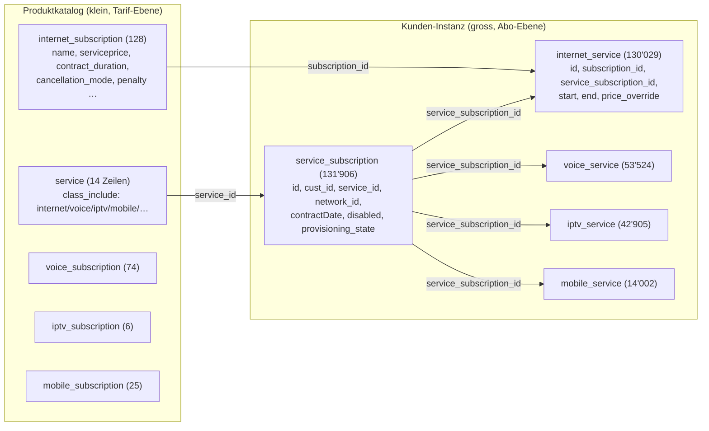

# IDMS-Exploration: Telecom-Abos (UC3)

> Bezug: [`2026-09-02_schulungscase-telecom-abos-analyse_1.md`](2026-09-02_schulungscase-telecom-abos-analyse_1.md),
> Abschnitt 3 „Offene Fragen". Read-only Exploration via `adf-explore` (`IDMS_Explore`,
> MySQL 8.4, Datenbank `gga`) am 02.09.2026. Beantwortet primär Frage 1 (Datenstruktur),
> teilweise Fragen 2–6 und 8.

## 1. Kernstruktur: kein gemeinsames «Abo», sondern Produkt-Familien um zwei generische Tabellen

Es gibt **keine einzelne generische Subscription-Tabelle**, die alle vier Produkte
(Internet/Festnetz/IPTV/Mobile) abdeckt. Stattdessen folgt IDMS pro Produkt demselben
dreistufigen Muster, verankert über zwei produktübergreifende Tabellen:



**Lesart pro Kunde und Produkt:**
- `service_subscription` = 1 Zeile pro Kunde × Produktinstanz („dieser Kunde hat ein
  Internet-Abo, referenziert über `service_id` auf den Produkttyp in `service`").
  Trägt `cust_id`, `network_id`, `contractDate`, `disabled`, `provisioning_state`.
- `<produkt>_service` (z.B. `internet_service`) = die **Zeitreihe** dazu: `start`/`end`
  je Abschnitt, `subscription_id` (Tarif/Katalog-FK), `service_subscription_id` (FK auf
  die Instanz oben), plus Produkt-spezifische Attribute (`price_override`,
  `charge_add_mb`, `plusip`, `plusemail`, `managed_wlan` bei Internet). **Das ist die
  Tabelle, die schon als `idms_internet_service_main` gestaged ist** — sie deckt aber
  nur die Zeitreihe, nicht den Tarif-Katalog und nicht `service_subscription` ab.
- `<produkt>_subscription` (z.B. `internet_subscription`) = der **Tarif-Katalog**:
  `name` (Abo-Bezeichnung!), `serviceprice`, `contract_duration`,
  `contract_cancellation_period`, `cancellation_mode`, `penalty`, `wlan`. Klein (6–128
  Zeilen je Produkt).

Row-Counts pro Produktfamilie (Tabellenname-Präfix `internet_`/`voice_`/`iptv_`/
`mobile_`), zusätzlich `basic_household_connection_*`, `conax_*`, `zattoo_*`,
`lanconnect_*` nach demselben Muster (letztere vier vermutlich Zusatz-/Legacy-Dienste,
nicht Teil der vier Kernprodukte).

Aktive (`disabled = 0`) `service_subscription`-Zeilen nach `service.class_include`:

| class_include | aktive service_subscriptions | distinkte Kunden |
|---|---|---|
| internet | 42'084 | 42'083 |
| conax | 28'713 | 23'772 |
| voice | 17'578 | 17'578 |
| basic_household_connection | 14'911 | 12'046 |
| iptv | 13'553 | 13'551 |
| mobile | 8'998 | 6'596 |
| zattoo | 5'910 | 5'910 |
| lanconnect | 6 | 6 |

→ Antwort auf Frage 1: **je Produkt eine eigene Tabellenfamilie**, nicht eine
gemeinsame Subscription-Tabelle. Für Festnetz/IPTV/Mobile existieren die Quellen
(`voice_service`/`voice_subscription`, `iptv_service`/`iptv_subscription`,
`mobile_service`/`mobile_subscription`) bereits in IDMS — sie sind nur noch nicht
gestaged.

## 2. KNP-Zuordnung: `network`-Tabelle statt PLZ-Excel? (Frage 4/5)

`service_subscription.network_id` referenziert die Tabelle `network` (27 Zeilen).
Deren `name`-Spalte enthält **direkt die KNP-Namen aus Rogers Liste** — dedupliziert
über die Technologie-Varianten (`type`: `hf` vs. `ftth`) ergeben sich die 20 KNP fast
exakt:

```
Buchs, Bad Ragaz, Fläsch, Pfäfers, Sargans, Oberriet, Altstätten, Diepoldsau, Flums,
Flumserberg, Gams, Maienfeld, Mels, Sennwald, Sevelen, Walenstadt, Wartau, Widnau,
Grabs (+ „Grabs (alt)" als Altbestand), Swisscom (kein KNP, sondern externer
Reseller/BBCS-Anschluss)
```

Alle mit `mandate_id = 2` (EWBUCHS) — `mandate` selbst hat nur 3 Zeilen (`Mitglied
aller Mandate`, `EWBUCHS`, `Maienfeld`), ist also die grobe Mandanten-Trennung, nicht
die KNP-Ebene.

**Vorläufige Einschätzung:** Der `network_id`-Link auf `service_subscription` könnte
die manuell gepflegte PLZ→KNP-Excel **ersetzen oder validieren** — die Zuordnung wäre
dann pro Abo direkt aus IDMS ableitbar statt über eine externe Datei. Zu prüfen bleibt:
ob `network_id` zuverlässig befüllt ist (Fill-Rate nicht geprüft), ob „Sennwald" bei
Roger fehlt (er nennt 20 Partner ohne Sennwald, `network` hat einen Sennwald-Eintrag —
ggf. Abgrenzung klären), und ob „Grabs (alt)" Datenqualitätsrauschen ist. Sauberer Weg
für Freitag: Rogers 20er-Liste 1:1 gegen `SELECT DISTINCT name FROM network` abgleichen.

## 3. Business-Flag (Frage 2): noch nicht eindeutig identifiziert

Kein Feld heisst `business` oder ähnlich in `service`, `service_subscription` oder
`internet_subscription` (`internet_subscription.category` ist durchgängig `0` — nicht
das gesuchte Flag). Zwei Kandidaten aus der Kundenseite, beide nicht abschliessend
geprüft:

- `contract_request.company_name` — nur 7 von 89 Zeilen gefüllt (≈8 %). Könnte ein
  Proxy sein (gefüllt = Firmenkunde), ist aber eine Bestellungs-Tabelle mit wenigen
  Zeilen, nicht die laufende Vertragsbasis.
- `fl1_contracts.contract_type` (enum) — bei allen 6905 Zeilen konstant `private`. Der
  Enum hat also mindestens einen weiteren Wert, der hier nie vorkommt — entweder wird
  `fl1_contracts` nur für Privatkunden geführt, oder Business läuft komplett über
  einen anderen Pfad.

→ Für Freitag als offene Frage an Roger/Fachbereich markieren: evtl. sitzt das
Business-Flag gar nicht in IDMS, sondern wird in Abacus/Kundenstamm geführt
(vgl. `idms_address_main.firma`, das Firmenfeld der Adresse — aber Adresse ≠
Vertragsart).

## 4. Kombi-Abo-Mechanik (Frage 3/8): Bestellung bündelt Produkte

`contract_request` (Bestellkopf, 89 Zeilen, `product` als Freitext/mediumtext) →
`product_request` (Bestellzeilen, 43 Zeilen, `contract_request_ref` FK,
`class_include`) zeigt die Bündelung **zum Bestellzeitpunkt** sehr klar:

| contract_request_ref | Anzahl Produkte | Produkte |
|---|---|---|
| 96 | 3 | internet, iptv, voice |
| 95 | 3 | internet, iptv, voice |
| 82, 70, 93, 76–81 | 2 | internet, voice |
| 27, 87 | 2 | internet, mobile |
| 85 | 2 | internet, iptv |

Das bestätigt die im Analyse-Dokument vermutete Hypothese: Ein Kombi-Abo sind **mehrere
`service_subscription`-Zeilen desselben `cust_id`** (eine je Produkt), nicht ein
eigenes Bündel-Objekt. Für die Datamart-Logik „Kombi-Abo zählt als 1" heisst das:
Gruppierung über `cust_id` (+ ggf. überlappender Gültigkeitszeitraum), nicht über ein
technisches Bündel-Merkmal — `contract_request`/`product_request` sind nur die
Bestell-Historie, nicht die laufende Vertragsbasis, und vermutlich zu klein/lückenhaft
(nur 89 bzw. 43 Zeilen) um dafür als Live-Quelle zu dienen.

## 5. Preis (Frage 6): Basispreis existiert bereits in IDMS

`internet_subscription.serviceprice` (decimal) trägt den Katalogpreis je Tarif,
`internet_service.price_override` erlaubt einen kundenindividuellen Override. Die von
Roger erwähnte externe Preis-Excel ist damit vermutlich **nicht die einzige
Preisquelle** — zu klären, ob sie den IDMS-Katalogpreis dupliziert/überschreibt oder
zusätzliche Dimensionen (z. B. rabattierte Business-Preise) abbildet, die in IDMS
fehlen.

## 6. Nicht gefunden / weiterhin offen

- **Bewegungshistorie (Frage 9):** `service_state` (152 Zeilen) verknüpft
  `service_subscription_id` nur mit einem statischen `state` (`fin`/`tech`/`user`,
  keine Zeitachse) — keine Kündigungs-/Neuanlage-Log-Tabelle gefunden. Bewegungen
  müssten also aus der Satellite-Historie (SCD2 über `start`/`end` in `*_service`)
  abgeleitet werden, nicht aus einer eigenen Transaktionstabelle — sofern nicht doch
  noch eine Audit-/Log-Tabelle existiert, die hier nicht im Suchraster
  (`%subscri%`/`%service%`/`%contract%`/…) auftauchte.
- **Geodaten (Frage 13):** nicht durchsucht, ausserhalb Zeitrahmen.
- **Preisverknüpfung im Detail (Frage 6):** Format/Historisierung der externen
  Preis-Excel weiterhin unbekannt (liegt ausserhalb IDMS).

## 7. Empfehlung für die Vorbereitung Freitag

1. `network`-Tabelle als möglichen KNP-Ersatz/-Cross-Check mit Roger besprechen, bevor
   die PLZ-Excel ins Projekt übernommen wird.
2. Business-Flag-Frage explizit an Fachbereich: sitzt es in IDMS überhaupt, oder ist
   es eine Abacus/Kundenstamm-Eigenschaft?
3. Kombi-Abo-Definition für „Gesamtübersicht Gesamt" mit Roger verifizieren: reicht
   „gleicher `cust_id`, überlappender Zeitraum" über `service_subscription`, oder gibt
   es einen Fall, den das nicht abdeckt?
4. Vault-Modellierungs-Implikation (nicht Teil der Fragen, aber relevant fürs Design):
   die Struktur legt **vier Hub/Sat-Paare** nahe (`hub_abo_internet`,
   `hub_abo_voice`, `hub_abo_iptv`, `hub_abo_mobile` o. ä.), gespeist aus
   `<produkt>_service` (Zeitreihe) + `service_subscription` (Kunden-/Netz-Zuordnung) +
   `<produkt>_subscription` (Tarif-Referenz) — analog zum bestehenden
   `hub_internet_service`-Muster, aber erweitert um `service_subscription` als
   zusätzliche Satellite/Link-Quelle (bisher nicht gestaged).
